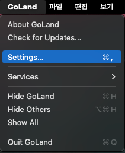
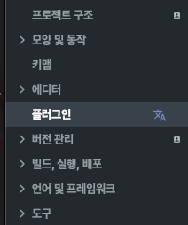
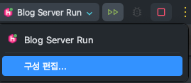

# Hello Project 555 Github Blog 👋
안녕하세요! 해당 Repository는 Project 555에서 개발한 Plog서비스의 개발 여정을 담기 위해 만들어진 Github Blog입니다.

해당 블로그는 [Hugo](https://gohugo.io/)를 통해 만들어졌으며, 대략적인 Plog의 정보, 아키텍처, 구현 사항 및 구현을 하면서 생겼던 고민 등이 담겨있습니다.

- [✅ Project 555 블로그 바로가기](https://project-555.github.io/)

# Getting Started with Hugo
해당 블로그는 Hugo를 통해 만들어졌으며, 로컬에서 실행하기 위해서는 다음과 같은 과정을 거쳐야 합니다.

## 1. Go 설치
Hugo는 Go로 만들어진 정적 사이트 생성기입니다. 따라서 Hugo를 사용하기 위해서는 Go가 설치되어 있어야 합니다.
> 상세한 설치 방법은 [Go 공식 문서](https://go.dev/dl/)를 참고해주세요.

### Windows
Windows에서는 [Chocolatey](https://chocolatey.org/)를 통해 Go를 설치할 수 있습니다.
```bash
choco install golang
```

### Linux
Linux에서는 다음과 같이 설치할 수 있습니다.
```bash
sudo apt-get install golang
```

### Mac
Mac에서는 다음과 같이 설치할 수 있습니다.
```bash
brew install golang
```

## 2. Install Hugo
Go가 설치되었다면 다음은 Hugo를 설치해야 합니다.
> 상세한 설치 방법은 [Hugo 공식 문서](https://gohugo.io/installation/)를 참고해주세요.

### [Windows](https://gohugo.io/installation/windows/)
```bash
choco install hugo-extended
```

### [Linux](https://gohugo.io/installation/linux/)
```bash
sudo apt install hugo
```

### [Mac](https://gohugo.io/installation/mac/)
```bash
brew install hugo
```


## 3. Run Hugo
Hugo가 설치되었다면 다음 커맨드를 통해 로컬에서 실행할 수 있습니다.
```bash
hugo server --logLevel debug --disableFastRender -p 1313
```

## + With Jetbrains Plugin
- 매번 명령어를 치는 것이 번거롭다면, 다음과 같은 지시사항에 따라 해당 부분을 자동화 할 수 있습니다. (Goland 기준으로 설명합니다.)

1. `Settings` - `Plugins` - `Marketplace`에서 Hugo를 검색합니다.





2. `Hugo Integration` 플러그인을 설치합니다.
3. 우측 상단 `Edit Configurations...`을 클릭합니다.



4. `+` 버튼 클릭 후 리스트에서 Hugo 를 찾아 선택합니다.


5. `Name`은 적절히 지정하고, `Arguments`는 `--logLevel debug --disableFastRender -p 1313`를 입력, `Project directory`는 해당 프로젝트의 최상위 폴더 경로를 입력합니다. (예시: `C:\Users\Taeyoung\Documents\project-555.github.io`)


6. `OK` 버튼을 클릭합니다.

7. 이후 새롭게 생긴 재생 버튼을 클릭하면, 자동으로 Hugo 서버가 구동됩니다.

