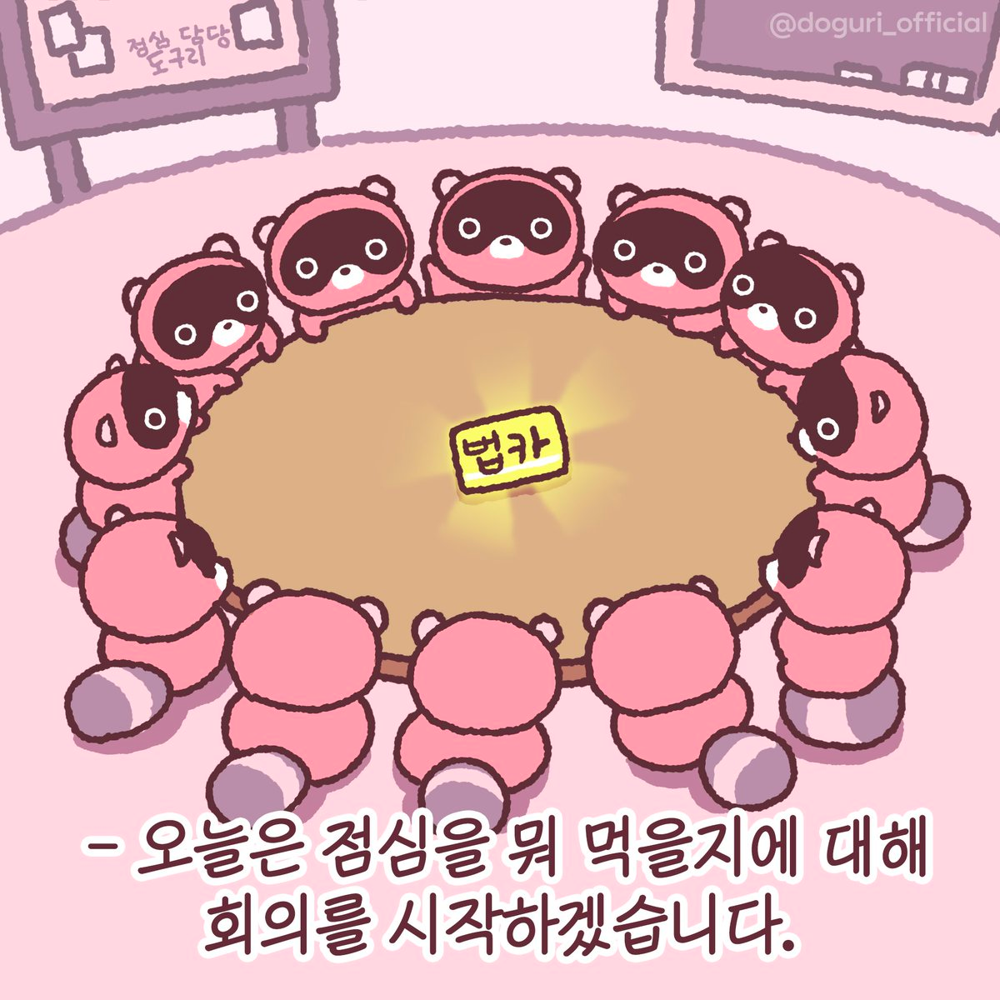

Project 555 팀원이 개발 기간 중 준수했던 스크럼에 관련한 규칙은 아래와 같습니다.

## 스크럼?
스크럼은 애자일 방법론 중 하나로, 개발자들이 프로젝트를 진행하면서 겪는 문제들을 해결하기 위해 만들어진 방법론입니다.

- 짧은 주기의 개발을 통해, 빠르게 개발을 진행할 수 있습니다.
- 개발자들이 서로의 진행 상황을 공유하고, 문제를 해결하기 위해 만들어진 방법론입니다.

## Plog's 스크럼 규칙
1. 스크럼은 매주 수, 일 21:00 에 위클리 스크럼을 진행합니다. 🌙
2. 각 팀원은 본인의 진행사항 및 문제점 및 이슈를 10~15분 내외로 공유합니다. 🧐
   - 각 팀원의 이해도 향상을 위해 본인의 진행사항을 화면 공유 등을 통해 설명할 수 있습니다. 🖥️
3. 각 팀원의 공유사항이 끝나면 다음 스크럼까지 해결해야할 이슈를 할당합니다. 🙋🏼‍🙋🏻🙋🏻‍♀️
4. 스크럼 간 팀원들은 서로 존댓말을 사용하며, 서로의 의견을 존중합니다. 🙂
5. 스크럼 이후 자율적으로 각코(=각자 코딩)를 자율적으로 진행합니다. _(일이 있으면 먼저 들어가보세요)_
