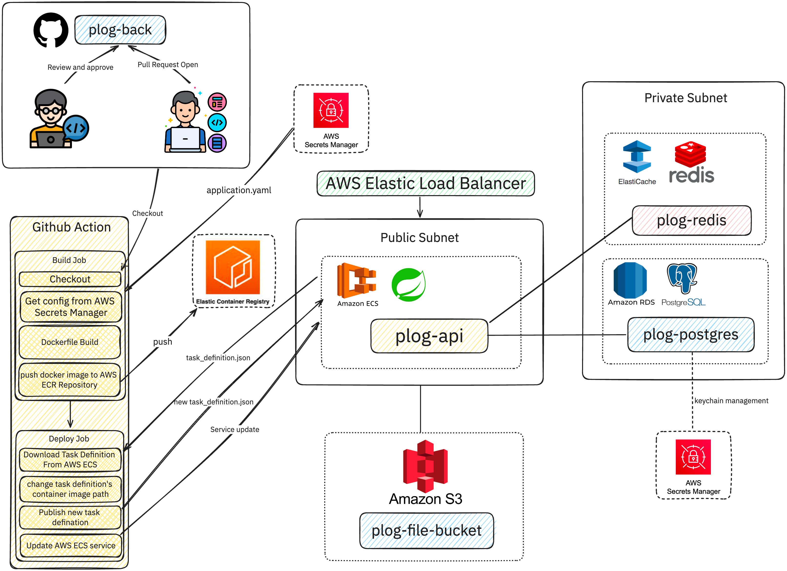

해당 페이지에서는 Plog의 백엔드를 구성하는 각 요소 및 개발에 대한 내용을 간략하게 담고 있습니다.

## Backend Architecture Overview
전체적인 plog의 백엔드 아키텍처는 아래 구성을 따릅니다

### plog-back
- plog의 [백엔드 소스 코드를 저장하는 github 저장소](https://github.com/project-555/plog-back)입니다.
- 인증은 [Spring Security](https://spring.io/projects/spring-security/)를 사용하여 구현하였으며, [JWT](https://jwt.io/)를 사용하여 구현하였습니다.
  - 좀 더 자세히 알고 싶으시다면 [_"Plog의 인증은 어떻게 구현되었을까?"_](/docs/plog-back/authorization/) 문서를 참고 부탁드립니다.
- 3가지의 대표적인 레이어로 구성되어 있으며, Controller, Service, Repository Layer로 구성되어 있습니다.
  - 좀 더 자세히 알고 싶으시다면 [_"Plog의 뼈대, Layered Architecture"_](#) 문서를 참고 부탁드립니다.
- 데이터베이스는 PostgreSQL을 사용하였으며, [Sprint Data JPA](https://spring.io/projects/spring-data-jpa/), [QueryDSL](http://querydsl.com/)을 사용하여 구현하였습니다.
   - 좀 더 자세히 알고 싶으시다면 [_"Plog의 데이터베이스와 서버의 연결 구성 살펴보기"_](/docs/plog-back/db_server_design/) 문서를 참고 부탁드립니다.
- Spring을 사용하여 구현되었으며, 각 레이어 별로 에러 추적을 위해 로깅 AOP, Filter를 구현하였습니다.
   - 좀 더 자세히 알고 싶으시다면 [_"Plog가 로깅을 시작한 이유"_](/docs/plog-back/observability/) 문서를 참고 부탁드립니다.
- 테스트 코드는 JUnit5를 사용하여 구현하였고 Service Layer, QueryDSL을 사용한 Repository Layer가 문서화되었습니다.
   - Repository Test에 대해 궁금하다면 [_"Plog의 Repository Test 도입을 위한 힘겨운 여정"_](/docs/plog-back/testing/) 문서를 참고 부탁드립니다.
   - Service Test에 대해 궁금하다면 [_"Plog의 Service Test에 도달하기 위한 한 발자국"_](#) 문서를 참고 부탁드립니다.
- Github Pull Request에서 테스트 커버리지를 확인할 수 있도록 액션도 설정하여 팀원 간에 본인의 코드에 테스트 코드가 얼마나 작성되었는지 가시적으로 확인할 수 있도록 하였습니다.
   - 좀 더 자세히 알고 싶으시다면 [_"Spring 테스트 커버리지, 모두 볼 수 있도록 리포트를 공유해보자"_](/docs/plog-back/testing_report/) 문서를 참고 부탁드립니다.

### plog-api
- Spring을 사용하여 배포된 ECS 테스크, 서비스명 입니다.
- API 서버는 AWS ECS를 통해 배포되며, AWS RDS와 AWS ElasticCache를 통해 데이터베이스를 관리하는 형태로 구성되었습니다.
- 배포에 대해 좀 더 자세히 알고 싶다면 ["_Plog의 백엔드 서버 배포 시퀀스 읽어보기_"](/docs/plog-back/backend_deploy_sequence/) 문서를 참고 부탁드립니다.

### plog-file-bucket
- AWS S3에 위치한 파일 저장소입니다.
- 블로그에 업로드 되는 파일, 사진 등은 해당 저장소에 저장되며, 업로드 시 Pre-Signed URL을 통해 업로드가 진행됩니다.
- Plog에서 구현한 파일 업로드에 좀 더 자세히 알고 싶다면 [_"S3 Pre-signed URL로 구현한 파일 업로드 읽어보기"_](/docs/plog-back/file_upload_with_s3/) 문서를 참고 부탁드립니다.

### plog-postgres
- AWS RDS에 위치한 PostgreSQL 데이터베이스입니다.
- Plog에서 사용되는 모든 데이터는 해당 데이터베이스에 저장됩니다.
- Plog에서 구현한 데이터베이스에 좀 더 자세히 알고 싶다면 [_"Project-555가 PostgreSQL를 사용하게 된 사연"_](/docs/plog-back/postgres/) 문서를 참고 부탁드립니다.

### plog-redis
- AWS ElasticCache에 위치한 Redis 데이터베이스입니다.
- Plog에서 사용되는 모든 캐시는 해당 데이터베이스에 저장됩니다.
- Plog에서는 이메일 인증을 위한 키 및 토큰을 저장하기 위해 사용됩니다.
- Project-555에서 구현한 이메일 인증에 대해 좀 더 자세히 알고 싶다면 [_"Plog의 이메일 인증 Redis와 함께 이렇게 구현했습니다!"_](/docs/plog-back/email_verification) 문서를 참고 부탁드립니다

