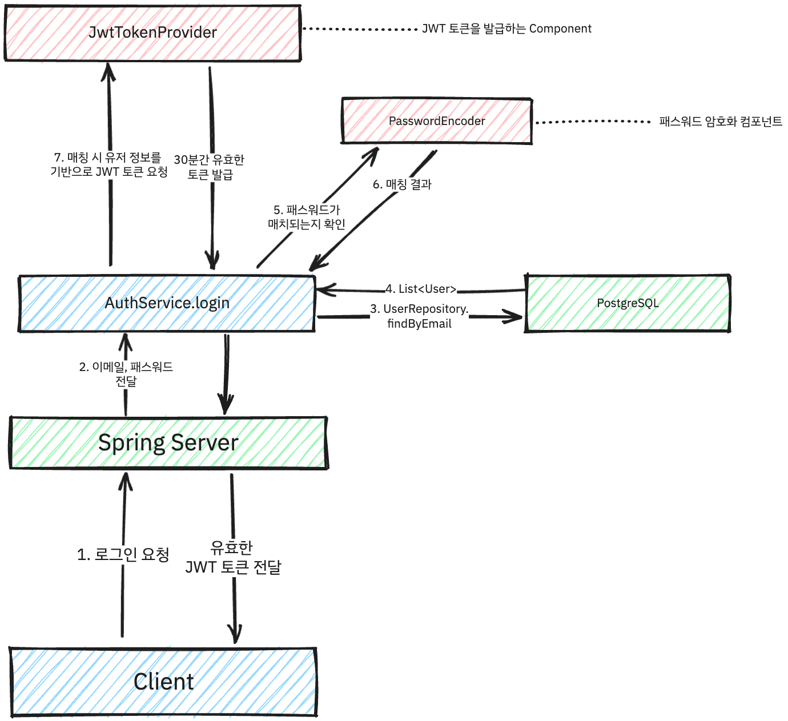
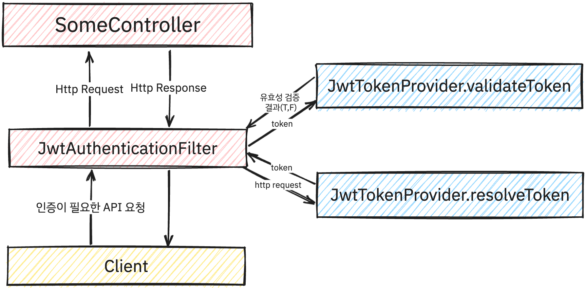

당연하게도 우리의 서비스는 블로그를 만드는 서비스였기에, 사용자가 회원가입을 하고, 로그인을 하여 자신의 블로그를 만들 수 있어야 했습니다.

이를 위해 인증을 어떤 방식으로 구현할 지, 어떤 기술을 사용할 지 고민하였습니다.

## JWT vs Session
실무에서 프로젝트를 진행하면서도 얘기를 많이 했었던 부분이기도 했습니다. JWT라는 기술이 있기에, _"서버에서 인증 정보를 핸들링 할 필요가 있을까?"_ 로 많은 고민을 했었습니다.

클라이언트에서 인증정보를 관리하고, 요청시마다 토큰을 보내서 Filter나, Interceptor에서 인증하는 방식이니 만큼, 서버에서 별도의 토큰의 유효성을 검증하는 로직이 필요없다고 판단하였습니다.

물론 해당 방식에는 각 기술마다의 장단점이 있습니다.
### 장점
- 서버에서 인증 정보를 핸들링 할 필요가 없어서 서버의 부하를 줄일 수 있습니다.
- 인증정보를 저장할 필요가 없기 때문에 별도의 인증정보를 위한 인프라(DB, Redis 등)가 필요하지 않습니다.
- 구현이 세션에 비해 간단하고, 별도의 인프라가 필요하지 않기 때문에 서버를 확장할 때, 세션을 사용하는 것보다 간편합니다.

### 단점
- 비밀번호 변경, 로그아웃과 같은 기능을 구현한다 해도, 실제 토큰이 expire시키는 것이 아니기 때문에, 클라이언트에서 토큰을 삭제하는 방식으로 구현해야 합니다.
  - 사용자가 비밀번호 변경 시 기존에 사용하던 토큰을 expire 시키는 보안적인 요구사항을 필요로 할 경우, 서버에서 토큰을 관리하지 않고서는 구현하기 어렵습니다.
- 토큰을 클라이언트에서 관리하기 때문에, 토큰을 탈취당할 경우, 해당 토큰을 사용하여 인증을 할 수 있습니다.
  - 이를 방지하기 위해 토큰을 탈취당했을 경우, 서버에서 해당 토큰을 블랙리스트에 추가하여, 해당 토큰을 사용할 수 없도록 하는 방식을 사용할 수 있습니다.
  - 하지만 이 경우 서버에서 결론적으로 토큰을 관리하는 방식이 되기 때문에, 서버의 부하가 증가하게 됩니다.

### 결론 
Plog에서 내부적으로 내린 결정사항은 먼저 서버의 부하를 최소화하기 위해 JWT를 사용하기로 결정하였습니다.

대신 access token의 expire기간을 짧게 두고, 별도의 refresh token없이 access token을 자주 refresh하는 방식으로 구현하기로 결정하였습니다.

서버와 통신이 단절되는 경우 해당 방식이 취약할 수는 있지만, 인터넷 단절과 같은 상황은 크게 발생하지 않는 상황이라 가정하였습니다. 


## Spring Security


Spring Security는 Spring에서 인증과 권한을 담당하는 프레임워크입니다.

Spring Security를 사용하면, 인증과 권한을 위한 로직을 직접 구현하지 않아도 되기 때문에, 개발자는 서비스에 맞는 로직 부분만 최소한으로 구현하여 인증 로직을 구현할 수 있습니다.

이미 Spring에서는 해당 방식의 인증이 표준이기도 하고, Plog 에서 역시 Spring을 사용하기 때문에, Spring Security를 사용하여 인증 로직을 구현하기로 결정하였습니다. 


## 로그인 로직 구현
로그인 시 JWT에 대한 인증은 다음과 같은 방식으로 이루어지게 됩니다.



```java
    // 로그인
    public UserLoginResponse login(@RequestBody UserLoginRequest request) {
        // 유저 정보 가져오기
        User user = userRepository.findByEmail(request.getEmail()).orElseThrow(LoginFailException::new);
        
        // 패스워드 매칭 확인
        if (!passwordEncoder.matches(request.getPassword(), user.getPassword())) {
            throw new LoginFailException();
        }

        // 생성한 토큰을 통해 로그인 응답 생성
        return UserLoginResponse.builder()
                .token(new Token(jwtTokenProvider.createToken(user.getUsername(), user)))
                .build();
    }
```

추가로 로그인 API와 같은 경우 아직 토큰을 가지지 않은 상태이기 때문에, SecurityConfig에서 해당 API는 인증을 거치지 않도록 설정하여야 합니다.

```java
@RequiredArgsConstructor
@EnableWebSecurity
public class WebSecurityConfig extends WebSecurityConfigurerAdapter {

    private final JwtTokenProvider jwtTokenProvider;

    // 암호화에 필요한 PasswordEncoder 를 Bean 등록합니다.
    @Bean
    public PasswordEncoder passwordEncoder() {
        return PasswordEncoderFactories.createDelegatingPasswordEncoder();
    }

    // authenticationManager를 Bean 등록합니다.
    @Bean
    @Override
    public AuthenticationManager authenticationManagerBean() throws Exception {
        return super.authenticationManagerBean();
    }

    @Override
    protected void configure(HttpSecurity http) throws Exception {
        http.httpBasic().disable() // rest api 만을 고려하여 기본 설정은 해제하겠습니다.
                .csrf().disable() // csrf 보안 토큰 disable처리.
                .sessionManagement().sessionCreationPolicy(SessionCreationPolicy.STATELESS) // 토큰 기반 인증이므로 세션 역시 사용하지 않습니다.
                .and()
                .authorizeRequests() // 요청에 대한 사용권한 체크
                .antMatchers(HttpMethod.POST, "/auth/login").permitAll() // 로그인 API는 인증을 거치지 않도록 설정
                // .. 중략 ()
                .and()
                .addFilterBefore(new JwtAuthenticationFilter(jwtTokenProvider),
                        UsernamePasswordAuthenticationFilter.class);
        // JwtAuthenticationFilter를 UsernamePasswordAuthenticationFilter 전에 넣는다
    }
}
```

## 인증 로직 구현
인증 로직은 다음과 같은 방식으로 이루어지게 됩니다.



전반적인 인증 과정은 필터에서 이루어지며, Plog에서는 `JwtAuthenticationFilter`에서 토큰을 받아서 인증을 진행합니다.
```java
@RequiredArgsConstructor
public class JwtAuthenticationFilter extends GenericFilterBean {

    private final JwtTokenProvider jwtTokenProvider;

    @Override
    public void doFilter(ServletRequest request, ServletResponse response, FilterChain chain) throws IOException, ServletException {
        // 헤더에서 JWT 를 받아옵니다.
        String token = jwtTokenProvider.resolveToken((HttpServletRequest) request);

        // 토큰이 없는 경우 다음 체인으로 넘김
        if (token == null) {
            chain.doFilter(request, response);
            return;
        }

        // 유효한 토큰인지 확인합니다.
        if (jwtTokenProvider.validateToken(token)) {
            // 토큰이 유효하면 토큰으로부터 유저 정보를 받아옵니다.
            Authentication authentication = jwtTokenProvider.getAuthentication(token);
            // SecurityContext 에 Authentication 객체를 저장합니다.
            SecurityContextHolder.getContext().setAuthentication(authentication);
        } else {
            // 유효하지 않은 토큰이거나 토큰이 없는 경우 401 Unauthorized 오류를 반환합니다.
            HttpServletResponse httpResponse = (HttpServletResponse) response;
            httpResponse.sendError(HttpStatus.UNAUTHORIZED.value(), "Unauthorized");
            return;
        }

        chain.doFilter(request, response);
    }
}
```

`JwtTokenProvider`은 다음과 같이 구현되어 있습니다.
```java
@RequiredArgsConstructor
@Component
public class JwtTokenProvider {

    private final UserDetailsService userDetailsService;
    
    private String secretKey = "안전한 장소에 두길 권장합니다.";

    // 객체 초기화, secretKey를 Base64로 인코딩한다.
    @PostConstruct
    protected void init() {
        secretKey = Base64.getEncoder().encodeToString(secretKey.getBytes());
    }

    // JWT 토큰 생성
    public String createToken(String userPk, User user, Long blogID) {
        Claims claims = Jwts.claims().setSubject(userPk); // JWT payload 에 저장되는 정보단위
        claims.put("roles", user.getRoles()); // 유저가 가진 권한
        claims.put("userID", user.getId()); // 유저의 ID
        claims.put("nickname", user.getNickname()); // 유저의 닉네임
        claims.put("blogID", blogID); // 유저가 가진 블로그 ID
        Date now = new Date();
        // 토큰 유효시간 30분
        long tokenValidTime = 30 * 60 * 1000L;
        return Jwts.builder()
                .setClaims(claims) // 정보 저장
                .setIssuedAt(now) // 토큰 발행 시간 정보
                .setExpiration(new Date(now.getTime() + tokenValidTime)) // set Expire Time
                .signWith(SignatureAlgorithm.HS256, secretKey)  // 사용할 암호화 알고리즘과
                // signature 에 들어갈 secret값 세팅
                .compact();
    }

    // JWT 토큰에서 인증 정보 조회
    public Authentication getAuthentication(String token) {
        UserDetails userDetails = userDetailsService.loadUserByUsername(this.getUserPk(token));
        return new UsernamePasswordAuthenticationToken(userDetails, "", userDetails.getAuthorities());
    }


    // 토큰에서 회원 정보 추출
    public String getUserPk(String token) {
        return Jwts.parser().setSigningKey(secretKey).parseClaimsJws(token).getBody().getSubject();
    }

    public String resolveToken(String bearerToken) {
        if (bearerToken != null && bearerToken.startsWith("Bearer "))
            return bearerToken.substring(7);
        return null;
    }

    // Request의 Header에서 token 값을 가져옵니다. "Authorization Bearer {token}"
    public String resolveToken(HttpServletRequest request) {
        String bearerToken = request.getHeader("Authorization");
        return resolveToken(bearerToken);
    }


    // 토큰의 유효성 + 만료일자 확인
    public boolean validateToken(String jwtToken) {
        try {
            Jws<Claims> claims = Jwts.parser().setSigningKey(secretKey).parseClaimsJws(jwtToken);
            return !claims.getBody().getExpiration().before(new Date());
        } catch (Exception e) {
            return false;
        }
    }
}
```

필터에서 JwtTokenProvider를 의존성으로 갖고 있기 때문에 request Header에서 토큰을 가져와 해당 Token의 유효성을 Token Provider가 검증하게 됩니다.