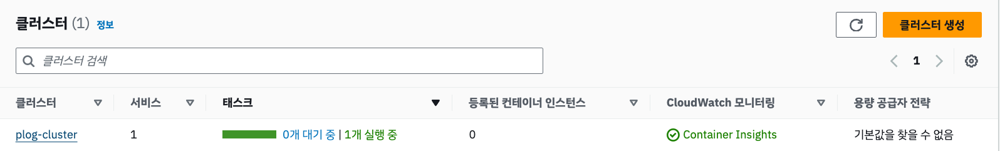
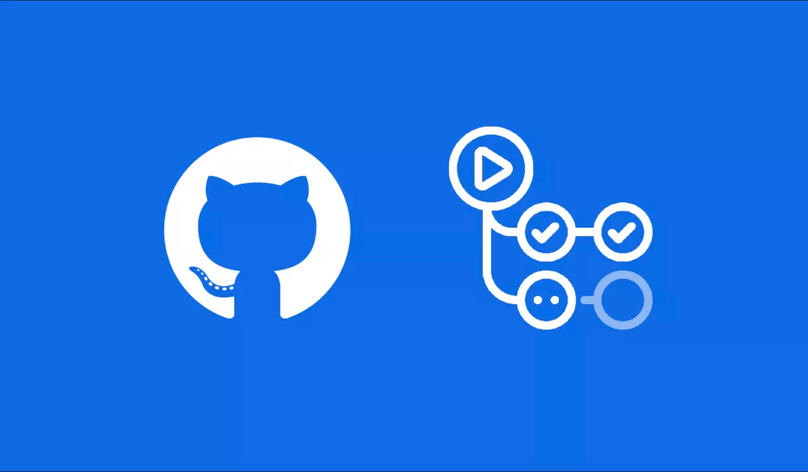

# 배포를 자동화하게 된 이유


초기에 회사에서는 EC2에 서버가 있어서 배포를 각 서버에 직접 SSH로 접속하여 배포를 진행하다 회사에서 처음으로 CI/CD를 적용한 배포를 적용하기 시작했습니다.

배포라는 작업이 단순해보일 수는 있지만 단순하게 구동해도 아래와 같은 작업을 병행하여야 합니다.
- SSH를 설정하고, 접속
- EC2 서버 내에 폴더에 접근하여 Git Pull
- Docker 이미지 빌드 || Java JAR/WAR Build
- Docker 이미지 Run || Java JAR/WAR Run
- Nginx, Apache 등의 웹 서버 (재)시작

이런 부분은 휴먼 에러를 발생시키기 쉽고, 사람에 따라서는 빼먹거나 잘못 배포되는 일을 발생시키게 됩니다. _(dev 반영 내용이 프로덕션에 반영되는 등)_

또한 각각의 기술스택에 대한 이해를 필요하기 때문에 신입 직원이오거나 배포가 익숙치 않은 직원이 오면 로직 뿐 아니라 전반적인 배포 시퀀스 역시 학습해야 하기에 Learning Curve가 높아지게 만드는 요소가 됩니다.

회사에서 이런 부분을 해결한 경험이 있고, Github Action을 도입하면 클릭이나, 푸시 이벤트 등으로 간편하게 배포를 진행할 수 있기에 개발 단계를 좀 더 용이하게 하고, 프론트에도 변경사항이 빠르게 반영되도록  Github Action을 이용한 CI/CD를 도입하게 되었습니다.

# 무엇을 배포할 것인가?


Plog는 앞전 [아키텍처를 설명하는 파트](/docs/plog-back/#backend-architecture-overview)에서 [AWS ECS](https://aws.amazon.com/ko/ecs/)를 사용하여 서버가 구성되어있다고 설명하였습니다.
AWS ECS는 AWS에서 제공하는 컨테이너 오케스트레이션 서비스로, Docker를 사용하여 배포를 진행할 수 있습니다.

## AWS ECS를 사용한 이유
AWS ECS를 사용한 이유는 여러가지가 있겠지만, 첫번째 목적은 공부에 대한 목적이었습니다. 

최근 백엔드 사이에서 Docker Container를 잘 다루는 엔지니어가 각광받고 있고, 실무에서도 Docker를 사용한 경험을 많이 요구합니다.

해당 프로젝트는 공부에 먼저 중점을 두고 시작한 프로젝트이기에, [Plog Study](/docs/plog-study) 파트에서 공부했던 Docker를 의미있게 사용하고 싶었습니다.

#### EC2에 Docker를 깔고 실행하면 되지 않나?
EC2에 Docker를 깔고 실행하는 것도 가능합니다. 하지만, AWS ECS를 사용하면 다음과 같은 장점이 있습니다.

- Docker Container를 통해 플랫폼 및 환경에 구애받지 않고 배포를 진행하고 싶었습니다.
- ECS에서 테스크 조절을 통해 원할 때 서버의 스케일을 조절할 수 있기에, 트래픽이 많아지면 서버를 늘리고, 트래픽이 적어지면 서버를 줄이는 등의 작업을 진행할 수 있기에 AWS ECS가 유리할 것이라 판단하였습니다.
- EC2에서 OS에 따라 진행해야 하는 방화벽, 보안 그룹 등의 설정을 ECS에서는 테스크를 통해 설정할 수 있기에, 편리하다고 판단하였습니다.

# 어떻게 배포할 것인가?

## ECS 구성
ECS를 배포하기 위해서는 ECS의 테스크가 어떤 설정값을 갖고 실행될 것인지 정의해야 합니다.

이는 ECS Task Definition을 통해 정의할 수 있습니다.


테스크 정의에 들어가면 테스크 정의 패밀리, 인프라(OS 등), CPU, Memory, 컨테이너 이미지 경로 등을 설정할 수 있습니다.

한 컨테이너 뿐만 아니라 컨테이너의 종류나 수를 다양하게 설정할 수 있어, 마치 AWS에서 구성한 Docker Compose와 같은 느낌을 받게 하였습니다.


### Task Definition
잘 모르는 부분은 옆에 있는 `정보`라는 부분을 통해 천천히 알아갈 수 있어 초심자라도 천천히 공부하면 배포를 진행할 수 있습니다.
저희는 `plog-back-task-family`라는 task family를 생성하였습니다. 


### Cluster
클러스터도 `plog-cluster`라는 이름으로 정의하였고


### Service
서비스는 위에서 정의했던 테스트 정의를 통해 `plog-api`라는 서비스를 생성하여 주었습니다.


### Task
테스크는 서비스를 생성하면 서비스에서 설정한 원하는 테스크 수에 따라 컨테이너가 유동적으로 실행되어 각 컨테이너가 ECS Task가 됩니다. 저는 원하는 테스크 수를 1로 설정하여 아래처럼 1개의 테스크만이 수행됨을 알 수 있습니다.


### Overall
다 만들고 나면 이런 구조가 되는데요, 클러스터 내에 서비스 하나, 서비스 내에 테스크 1개만 존재하여 볼품이 없긴 하지만, 이런 구조가 ECS의 기본적인 구성이라고 보시면 될 것 같네요


ECS에 대해 더 자세히 알고 싶다면 저희가 [ECS를 공부하면서 조사했던 내용](https://github.com/project-555/plog-study/blob/main/aws/ecs.md)을 참고해주세요

## Dockerfile 구성
Dockerfile은 Docker 이미지를 빌드하기 위한 설정 파일입니다.

저희는 Spring을 사용하여 구성하였기에 지금 현재 저희가 사용하고 있던 Java 및 Gradle 버전에 맞추어 Dockerfile을 구성하였습니다.

```dockerfile {filename="/Dockerfile"}
# Gradle을 기반으로 하는 Java 프로젝트를 빌드하는 단계
FROM gradle:7.5-jdk18 AS build
WORKDIR /workspace/app

# Gradle wrapper와 설정 파일을 복사합니다.
COPY gradlew .
COPY gradle gradle
COPY build.gradle settings.gradle ./

# 의존성 다운로드를 위해 tasks를 실행하여 캐시를 최적화합니다.
RUN ./gradlew clean build --no-daemon

# 소스코드를 복사하고 애플리케이션을 빌드합니다. (테스트는 제외)
COPY src src
RUN ./gradlew build --no-daemon -x test

# 최종 실행 단계
FROM openjdk:18-slim
VOLUME /tmp
COPY --from=build /workspace/app/build/libs/*.jar app.jar
ENTRYPOINT ["java","-Djava.security.egd=file:/dev/./urandom","-jar","/app.jar"]
```

주석에도 쓰여있듯 Gradle을 기반으로 Java 프로젝트를 빌드하는 단계를 먼저 진행합니다.

그리고 최종 실행 단계에서는 앞서 빌드한 jar 파일을 실행하도록 설정하였습니다.

## Github Action Workflow 구성
Github Action Workflow는 Github에서 제공하는 CI/CD 서비스입니다.



해당 서비스를 이용하면 실제로 Github에 저장되어있는 Source 코드를 빌드하고, 배포하는 등의 작업을 진행할 수 있습니다.

Plog 백엔드 서버를 배포하기 위한 워크플로우는 다음과 같이 구성했습니다.
### Sequence
- Build Job
  1. Checkout
        ```yaml {filename="/.github/workflows/deploy-dev.yaml"}
        - name: Checkout
          uses: actions/checkout@v2
        ```
  2. AWS CLI 로그인
        ```yaml {filename="/.github/workflows/deploy-dev.yaml"}
        - name: Set up AWS credentials
          uses: aws-actions/configure-aws-credentials@v1
          with:
            aws-access-key-id: ${{ secrets.AWS_ACCESS_KEY_ID }}
            aws-secret-access-key: ${{ secrets.AWS_SECRET_ACCESS_KEY }}
            aws-region: ap-northeast-2
        ```
  3. AWS Secrets Manager에서 Config 파일(`application.yaml`, `application-dev.yaml`) 가져오기
        ```yaml {filename="/.github/workflows/deploy-dev.yaml"}
        - name: Make Directory
          run: |
            mkdir -p src/main/resources
        - name: Fetch application.yaml from AWS SecretsManager
          run: |
            SECRET=$(aws secretsmanager get-secret-value --secret-id ${{ secrets.APPLICATION_SECRET_NAME }} | jq -r '.SecretString')
            echo "$SECRET" > src/main/resources/application.yaml
        - name: Fetch application-dev.yaml from AWS SecretsManager
          run: |
            SECRET=$(aws secretsmanager get-secret-value --secret-id ${{ secrets.APPLICATION_DEV_SECRET_NAME }} | jq -r '.SecretString')
            echo "$SECRET" > src/main/resources/application-dev.yaml
        ```
  4. Docker Build and Push to ECR
        ```yaml {filename="/.github/workflows/deploy-dev.yaml"}
        - name: Build, tag, and push image to Amazon ECR
          env:
            ECR_REGISTRY: ${{ steps.login-ecr.outputs.registry }}
            ECR_REPOSITORY: plog-back
            IMAGE_TAG: ${{ env.IMAGE_TAG }}
          run: |
            docker build -t $ECR_REGISTRY/$ECR_REPOSITORY:$IMAGE_TAG .
            docker push $ECR_REGISTRY/$ECR_REPOSITORY:$IMAGE_TAG 
        ```
- Deploy Job
  1. AWS CLI 로그인
      ```yaml {filename="/.github/workflows/deploy-dev.yaml"}
      - name: Set up AWS credentials
        uses: aws-actions/configure-aws-credentials@v1
        with:
           aws-access-key-id: ${{ secrets.AWS_ACCESS_KEY_ID }}
           aws-secret-access-key: ${{ secrets.AWS_SECRET_ACCESS_KEY }}
           aws-region: ap-northeast-2
      ```
  2. AWS ECS에서 이전 Task Definition 가져오기
      ```yaml {filename="/.github/workflows/deploy-dev.yaml"}
      - name: Download Task Definition
        run: |
          aws ecs describe-task-definition --task-definition ${{ env.ECS_TASK }} --query "taskDefinition" > current-task-def.json
     ```
  3. 새로운 Task Definition에 새로운 이미지 경로 등록
     ```yaml {filename="/.github/workflows/deploy-dev.yaml"}
     - name: Fill in the new image ID in the Amazon ECS task definition
       id: task-def
       uses: aws-actions/amazon-ecs-render-task-definition@v1
       with:
          task-definition: current-task-def.json
          container-name: ${{ env.ECS_CONTAINER }}
          image: ${{ env.ECR_REGISTRY }}/${{ env.ECR_REPOSITORY }}:${{ env.IMAGE_TAG }}
          environment-variables: |
            SPRING_PROFILES_ACTIVE=${{ env.ENVIRONMENT }}
     ```
  4. 새로운 Task Definition을 사용하여 서비스 업데이트
     ```yaml {filename="/.github/workflows/deploy-dev.yaml"}
     - name: Deploy Amazon ECS task definition
       uses: aws-actions/amazon-ecs-deploy-task-definition@v1
       with:
         task-definition: ${{ steps.task-def.outputs.task-definition }}
         cluster: ${{ env.ECS_CLUSTER }}
         service: ${{ env.ECS_SERVICE }}
         wait-for-service-stability: true
     ```
     
#### Overall
부분적인 부분만 아니라 모든 파일을 보고 싶다면 [`deploy_dev.yaml`](https://github.com/project-555/plog-back/blob/main/.github/workflows/deploy-dev.yml)을 참고해주세요

# 배운 점
- 현재 회사에서 도입하면서 먼저 경험해보긴 했지만, 이미 갖추어진 환경에서 수행했기 때문에 다른 환경설정 (VPC, 보안그룹, ELB Health Check 등)이 배포 시퀀스를 구성하는데 많은 영향을 끼쳐서 배울 수 있는 점들이 많았는데요
- 주어진 요구사항이 있고 이를 하나하나 해결하면서 짜릿한 쾌감들을 느끼기도 했습니다.
- 만약 컨테이너가 여러개이고, 서비스가 여러개인 상태라면 Code Deploy를 통해 배포를 진행하는 것도 고려해볼만한 사항인 것 같다는 생각이 들었습니다.