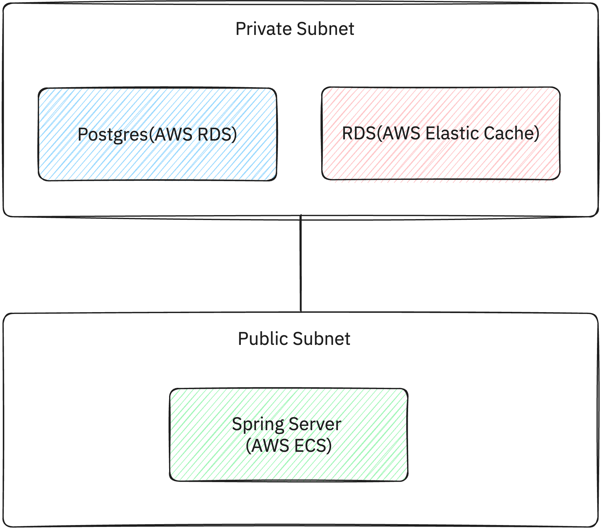
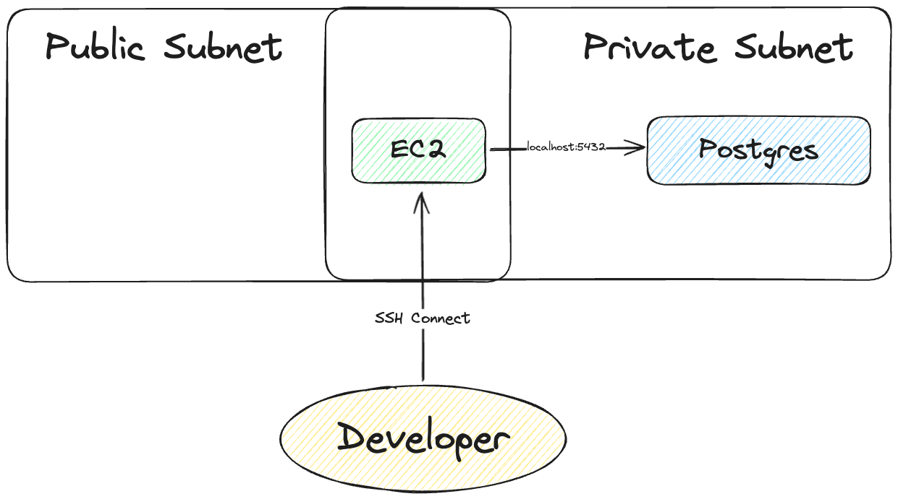

Plog에서는 데이터 베이스로 Postgres를 사용하게 되었던 부분에 대해 [해당 포스팅](/docs/plog-back/postgres)에서 문서화를 진행했었습니다.

사실 메인 DB로 결정할 때 결정도 많이 했지만, 실제 Server와 원활히 연결하기 위해서도 많은 노력을 했었어야 했습니다.

이번 포스팅에선 Plog Backend Server 에서 어떻게 DB와 연결했는지, 구성에 대해 살펴보고자 합니다.

# Private Subnet에 DB를 두기로 결정한 이유
먼저 네트워크에 대해 고민했었습니다. AWS와 같은 Cloud 환경에서는 VPC를 통해 네트워크를 구성할 수 있습니다.

서버, DB 모두 public 영역에 두어도 되지만, 보안적인 측면에서는 Public, Private 영역을 나누어 구성하는 것이 좋을 것 같다고 판단하였습니다.

특히 DB와 같은 민감한 정보를 담고 있는 경우는 Public으로 오픈하기보단 Private 영역에 격리하는 것이 좋다고 생각했습니다. 이유는 아래와 같습니다. 
1. Public 영역에 두게 되면, 외부에서 접근할 수 있는 포트를 열어야 합니다. 포트를 열게되면, 인증 수단은 키나 비밀번호로 마지막 인증수단만 남기에, 보안적으로 취약합니다.
2. 특정 서버에서만 연결해야하는 경우, Public 영역에 두게되면, 해당 서버에서만 접근할 수 있도록 보안 그룹을 설정해야합니다. 이는 서버가 많아질수록 관리가 어려워집니다.
3. 일반적으로 Private 영역의 경우 식별 가능한 클라이언트만 존재하기 때문에, Public 영역에 두는 것보다 보안적으로 안전합니다.

그래서 Plog의 경우, 다음과 같이 Public, Private 영역을 나누어 구성하였습니다.



## 왜 서버는? 
처음에는 서버 역시 Private에 두고 Load Balancer를 Public 영역에 두어서 서버에 접근하도록 구성하였습니다.

그러나 그러면 Private에 접근하기 위한 Endpoint가 필요합니다.

기초에는 VPC Endpoint라는 것을 사용했는데, 하루에 비용이 2~3달러 정도 발생하였습니다. 사실 그리 큰 비용은 아니지만, 공부를 위한 프로젝트이고 비용을 줄이기 위해 다른 방법을 찾아보았습니다.

그래서 서버를 Public 영역에 두고, 서버에서 DB에 접근할 수 있도록 Private 영역에 DB를 두는 방식으로 구성하였습니다.

이를 통해 비용을 1달러 정도 선으로 정리할 수 있었습니다.

#### Private에서 Endpoint를 설정했을 때 


#### Public에서 Endpoint를 설정하지 않았을 때


## 로컬 DB 접속
DB는 private 영역에 두었다고 명시했습니다. 그러나 개발 단계에서는 개발자가 직접 DB를 통해 초기 데이터를 생성하거나, 로컬에서 개발을 진행하기 위해 DB에 접속해야 했습니다.

이를 위해 Public 영역에 Bastion 서버를 두고, Bastion 서버를 통해 Private 영역에 있는 DB에 접속할 수 있도록 구성하였습니다.



RDS로 접속을 위한 명령어는 다음과 같이 구성할 수 있습니다.
```shell 
$ ssh -v -N -L 5433:{AWS RDS Endpoint}:5432 plog-bastion
```

plog-bastion은 미리 설정해 놓은 ssh config 파일에 다음과 같이 등록하여 사용하고 있습니다.

```shell {filename="~/.ssh/config"}
Host plog-bastion
    HostName {EC2 Host Address}
    User ubuntu
    IdentityFile ~/.ssh_key/plog-bastion.pem
```

### Local 개발을 위한 Spring Boot Application 설정
Local 환경에서 JPA를 이용해서 개발한다면 Spring Boot Application을 다음과 같이 설정해야 합니다.

```yaml {filename="/src/main/resources/application-local.yaml"}
spring:
  datasource:
    url: jdbc:postgresql://localhost:5433/{DB Name}
    driver-class-name: org.postgresql.Driver
    username: {DB Username}
    password: {DB Password}
```

localhost로 접속하도록 되어 있어 혼동스러울 수는 있으나 SSH Tunneling이 수행되고 있기 때문에 5433포트로 가는 요청은 Bastion 서버를 통해 Private 영역의 DB로 전달됩니다.

### 주의할 점
Spring 서버를 구동하기 전 SSH Tunneling을 수행해야 합니다. 하지 않을 경우 아래와 같은 메시지를 만나게 되니다.
```
org.postgresql.util.PSQLException: Connection to localhost:5433 refused. Check that the hostname and port are correct and that the postmaster is accepting TCP/IP connections.
```

SSH Tunneling을 수행할 경우 정상적으로 로컬 서버가 구동됨을 확인할 수 있습니다. 

```shell
> Task :BackendApplication.main()

  .   ____          _            __ _ _
 /\\ / ___'_ __ _ _(_)_ __  __ _ \ \ \ \
( ( )\___ | '_ | '_| | '_ \/ _` | \ \ \ \
 \\/  ___)| |_)| | | | | || (_| |  ) ) ) )
  '  |____| .__|_| |_|_| |_\__, | / / / /
 =========|_|==============|___/=/_/_/_/
 :: Spring Boot ::       (v2.7.4-SNAPSHOT)

{"@timestamp":"2023-11-26T01:18:01.178+0900","level":"INFO","message":"Starting BackendApplication using Java 18 on Mac-Studio.local with PID 54343 (/Users/giraffewithcode/dev/personal/plog-back/build/classes/java/main started by giraffewithcode in /Users/giraffewithcode/dev/personal/plog-back)"}
{"@timestamp":"2023-11-26T01:18:01.179+0900","level":"INFO","message":"The following 1 profile is active: "local""}
{"@timestamp":"2023-11-26T01:18:01.544+0900","level":"INFO","message":"Multiple Spring Data modules found, entering strict repository configuration mode"}
{"@timestamp":"2023-11-26T01:18:01.544+0900","level":"INFO","message":"Bootstrapping Spring Data JPA repositories in DEFAULT mode."}
{"@timestamp":"2023-11-26T01:18:01.623+0900","level":"INFO","message":"Finished Spring Data repository scanning in 75 ms. Found 11 JPA repository interfaces."}
{"@timestamp":"2023-11-26T01:18:01.623+0900","level":"INFO","message":"Multiple Spring Data modules found, entering strict repository configuration mode"}
{"@timestamp":"2023-11-26T01:18:01.624+0900","level":"INFO","message":"Bootstrapping Spring Data Redis repositories in DEFAULT mode."}
{"@timestamp":"2023-11-26T01:18:01.633+0900","level":"INFO","message":"Finished Spring Data repository scanning in 4 ms. Found 2 Redis repository interfaces."}
{"@timestamp":"2023-11-26T01:18:01.639+0900","level":"INFO","message":"Multiple Spring Data modules found, entering strict repository configuration mode"}
{"@timestamp":"2023-11-26T01:18:01.639+0900","level":"INFO","message":"Bootstrapping Spring Data Redis repositories in DEFAULT mode."}
{"@timestamp":"2023-11-26T01:18:01.640+0900","level":"INFO","message":"Finished Spring Data repository scanning in 0 ms. Found 0 Redis repository interfaces."}
# ...
```

### ECS에서 사용하는 Spring Boot Application 설정
ECS에서 사용하는 Spring Boot Application은 다음과 같이 설정해야 합니다.

```yaml {filename="/src/main/resources/application.yaml"}
spring:
  datasource:
    url: jdbc:postgresql://{AWS RDS Endpoint}:5432/{DB Name}
    driver-class-name: org.postgresql.Driver
    username: {DB Username}
    password: {DB Password}
```

이미 ECS는 Public, Private 영역에 속해있으므로 Bastion 서버를 통해 접속할 필요가 없습니다.

따라서 RDS의 Endpoint로 접속하도록 설정하면 됩니다.


# 마치며
이번 포스팅에서는 Plog의 DB와 서버의 연결 구성에 대해 살펴보았습니다.

Private에 ECS도 구성하지 못한 것이 아쉬움이 많이 남습니다.

굳이 VCS Endpoint 말고도 NAT Instance를 EC2에 생성하여, Private 영역에 있는 서버가 외부와 통신할 수 있도록 구성할 수도 있었을 텐데, 추후 개선을 통해 해당 부분을 개선해보고 싶습니다.