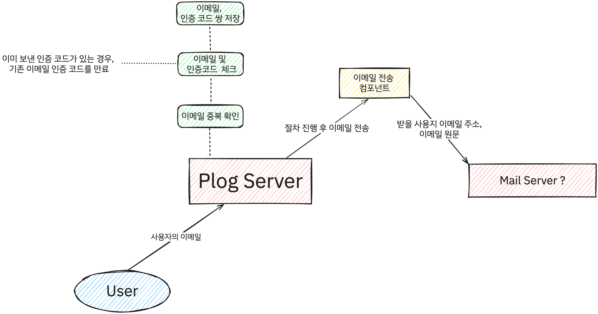
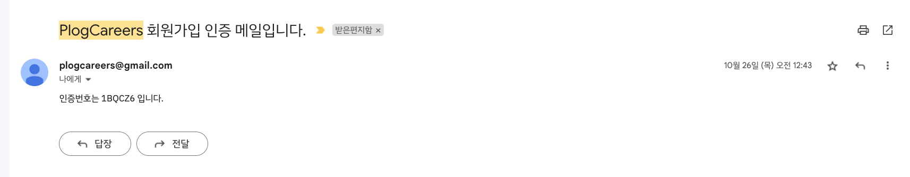
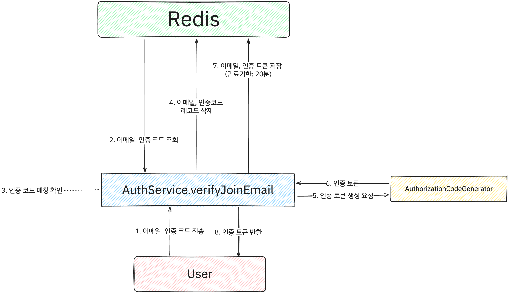
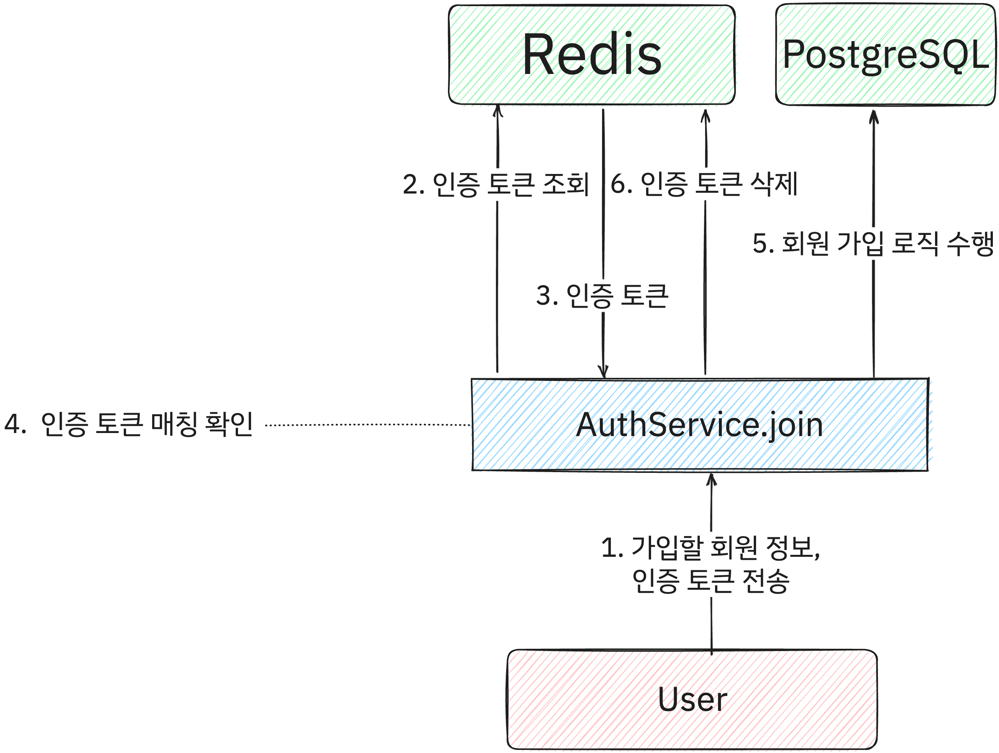

Plog는 프로젝트 초기 단계에 회원가입 API와 함께 이메일 인증을 구현하였습니다.

이메일 인증을 어떻게 해야 할지 고민했던 기억, 간단한 구현 방식을 공유합니다.

## 이메일 인증이 왜 필요한가? 
프로젝트 특성 상 공부를 목적으로 한 프로젝트였기에 사실 이메일 인증이 필요한지에 대한 고민을 많이 했습니다.

그럼에도 서비스를 만들기 위해선 회원가입이 필요하고, 회원가입을 하기 위해서는 신뢰성을 보장하는 최소한의 회원을 인식하기 위한 인증 방식이 필요하다고 생각하게 되었습니다. _(비밀번호 찾기도 필요하죠!)_

휴대폰 인증도 있지만, 휴대폰 인증은 비용이 발생하고, 휴대폰 인증을 위한 인프라가 필요하기 때문에 빠르고 저렴한 비용으로 구축 가능한 이메일 인증을 Plog의 인증 방식으로 선택하게 되었습니다.


## 이메일 인증을 어떻게 구현할 것인가?
처음 이메일 인증을 구현하려고 생각하니 다음과 같은 시퀀스에 따라 이메일을 인증해야 겠구나 하고 생각하였습니다.

대략적으로 다음과 같이 의사 시퀀스를 구성하였습니다.



그 후 이메일 전송을 위해 조사를 진행해보았습니다.

이메일 전송 시 많이 사용하는 기술 중 하나가 Redis, Java Mail Sender를 통한 방식이었고, 해당 방식을 통해 이메일 인증을 구현하기로 결정하였습니다.

## 왜 Redis를 사용할까?
Redis는 메모리 기반의 Key-Value 구조의 비관계형 데이터베이스입니다.

간편하게 Map 형태로 데이터를 저장할 수 있고, 데이터를 저장하고 조회하는데 빠른 속도를 보장합니다.
API 캐시,  세션 캐시, 메시지 브로커 등 다양한 용도로 사용할 수 있지만, Plog에서는 이메일 인증 위한 토큰 및 이메일 인증 코드를 저장하기 위해 사용하였습니다.

기존에 PostgreSQL을 사용하고 있었기에, PostgreSQL에도 이메일 인증 코드를 저장할 수 있었지만, Redis를 사용하는 이유는 다음과 같습니다.
이메일 인증 코드는 영원히 유효한 상태이면 안됩니다. 해당 방식을 구현하기 위해서는 RDB에서는 다음 형태로 데이터를 쌓을 수 있습니다. 

```sql
CREATE TABLE email_verification (
    id SERIAL PRIMARY KEY,
    email VARCHAR(255) NOT NULL,
    code VARCHAR(255) NOT NULL,
    created_at TIMESTAMP NOT NULL DEFAULT CURRENT_TIMESTAMP,
    expired_at TIMESTAMP NOT NULL
);
```

다만  이런 형태의 경우 조회 시마다 `expired_at`을 비교하여 유효한지 확인해야 합니다. 

이는 조회 시마다 `expired_at`을 비교하고, 만료를 위해 기존 데이터를 삭제하는 로직이 필요하며, 이는 성능적으로나 코드의 복잡도 측면에서 좋지 않습니다.

반면 Redis의 경우 자체적으로 만료 기능을 제공하고 있습니다. 이를 통해 만료 기능을 사용하면, 만료 기능을 위한 로직을 구현할 필요가 없습니다.

개발자는 해당 이메일에 대한 인증 코드가 있는지에 따른 조회만으로도 이메일 인증에 대한 부분을 손쉽게 구현할 수 있습니다.


## 메일을 어떻게 보낼까?
Spring 서버에서 메일을 보내는 방법 중 하나로 [Java Mail Sender](https://docs.spring.io/spring-framework/docs/current/javadoc-api/org/springframework/mail/javamail/JavaMailSender.html)라는 스프링에서 공식적으로 지원하는 라이브러리를 사용할 수 있습니다.

다양한 서드파티 라이브러리를 사용할 수 있지만, Plog에서는 타 서비스에 대해 의존도가 낮은 부분, 스프링에서 공식적으로 지원하는 라이브러리라는 점, 이미 많은 사용 예제가 있어 사용하기 편리하다는 점 등을 고려하여 Java Mail Sender를 사용하기로 결정하였습니다.

## 이메일 인증메일 전송 로직 구현
이메일 인증 메일 전송 로직은 아래와 같은 시퀀스로 이루어집니다. (컨트롤러는 주요 비즈니스 로직이 아니므로 생략하였습니다.)


핵심 비즈니스 로직인 `sendVerifyJoinEmail()`메서드는 다음과 같습니다.
```java
    public void sendVerifyJoinEmail(SendVerifyJoinEmailRequest request) {
        // 이미 가입된 이메일인지 확인
        if (userRepository.existsByEmail(request.getEmail())) {
            throw new EmailDuplicatedException();
        }

        String verifyCode = authorizationCodeGenerator.generate(6, AuthorizationCodeCase.UPPER_CASE); // 6자리 랜덤 문자열 생성

        // Redis에 이메일 및 인증 코드 저장
        emailVerifyCodeRepository.save(
                EmailVerifyCode.builder()
                        .email(request.getEmail())
                        .expiredTime(300L) // 이메일 인증 코드는 5분간 유효
                        .verifyCode(verifyCode)
                        .build()
        );

        // 유저에게 인증 이메일 전송
        SimpleMailMessage simpleMailMessage = new SimpleMailMessage();

        simpleMailMessage.setTo(request.getEmail());
        simpleMailMessage.setSubject("PlogCareers 회원가입 인증 메일입니다.");
        simpleMailMessage.setText("인증번호는 " + verifyCode + " 입니다."); // TODO: 이메일 내용 html화 하고, 꾸미기

        javaMailSender.send(simpleMailMessage);
    }
```

`authorizationCodeGenerator`는 랜덤 문자열을 테스트 하기 위해 `RandomStringUtils`를 컴포넌트화한 라이브러리로 구현은 간단하며 다음과 같습니다.

```java
@Component
@AllArgsConstructor
public class AuthorizationCodeGenerator {
    public String generate(int length, AuthorizationCodeCase stringCase) {
        String code = RandomStringUtils.randomAlphanumeric(length);
        if (stringCase == AuthorizationCodeCase.UPPER_CASE) {
            return code.toUpperCase();
        } else if (stringCase == AuthorizationCodeCase.LOWER_CASE) {
            return code.toLowerCase();
        } else {
            return code;
        }
    }
}
```

`userRepository`는 JPA를 사용하여 구현하였으며, 단순히 이메일이 존재하는지에 대한 여부를 확인하기 위해 사용하였습니다.

`emailVerifyCodeRepository`는 Redis에 이메일 및 인증 코드를 저장하기 위해 사용하였습니다. (구현이라고 할게 없는 정도네요)

```java
@RedisHash
public interface EmailVerifyCodeRepository extends KeyValueRepository<EmailVerifyCode, String> {
}
```

`EmailVerifyCode` 엔티티는 다음과 같이 구성하였습니다.
```java
@AllArgsConstructor
@Getter
@Setter
@Builder
@EqualsAndHashCode
@ToString
@RedisHash("emailVerifyCode")
public class EmailVerifyCode {
    @Id
    private String email;

    private String verifyCode;

    @TimeToLive
    private Long expiredTime;
}
```

### 이메일 전송 결과
이메일 전송 결과는 다음과 같습니다.


## 이메일 중간 인증 로직 구현
이메일 인증 버튼을 눌렀을 때는 아직 회원가입이 완료된 시점이 아니기 때문에 중간에 인증번호 확인 버튼을 눌렀을 때

이메일 인증 로직은 전반적으로 다음과 같은 시퀀스로 이루어집니다. (컨트롤러는 주요 비즈니스 로직이 아니므로 생략하였습니다.)



핵심 비즈니스 로직인  `verifyJoinMail()` 메서드는 다음과 같습니다.

```java
    public VerifyJoinEmailResponse verifyJoinEmail(VerifyJoinEmailRequest request) {
        EmailVerifyCode emailVerifyCode = emailVerifyCodeRepository.findById(request.getEmail()).orElseThrow(EmailVerifyCodeNotFoundException::new);

        if (!emailVerifyCode.getVerifyCode().equals(request.getVerifyCode())) {
            throw new EmailVerifyCodeUnmatchedException();
        }

        // 이메일 인증 코드 정보 삭제
        emailVerifyCodeRepository.delete(emailVerifyCode);

        String verifyToken = authorizationCodeGenerator.generate(20, AuthorizationCodeCase.NONE);
        // 인증된 이메일 정보 저장
        verifiedEmailRepository.save(
                VerifiedEmail.builder()
                        .email(request.getEmail())
                        .verifyToken(verifyToken)
                        .expiredTime(1200L) // 이메일 인증 정보는 20분간 유효
                        .build()
        );

        return VerifyJoinEmailResponse.builder()
                .email(request.getEmail())
                .verifyToken(verifyToken)
                .build();
    }
```

`emailVerifyCodeRepository`는 Redis에 저장된 이메일 인증 코드를 조회하기 위해 사용하였습니다. [이전 시퀀스](#이메일-인증메일-전송-로직-구현)에서 사용한 `EmailVerifyCode` 엔티티를 조회합니다.

중간 인증 API에서는 중간인증이 끝난 `EmailVerifyCode` 정보를 삭제하고, 이메일 인증이 완료된 이메일 및 회원가입 토큰을 저장하기 위해 `verifiedEmailRepository`를 사용하였습니다.

회원가입 시에는 인증 번호와는 다르게 입력 시간이 오래 걸릴 수 있는 것을 고려하여 20분간 유효한 회원가입 토큰을 생성하였습니다.

회원가입 인증 토큰을 담는 엔티티는 다음과 같이 구성하였습니다.
```java
@AllArgsConstructor
@NoArgsConstructor
@Builder
@Getter
@Setter
@EqualsAndHashCode
@ToString
@RedisHash("verifiedEmail")
public class VerifiedEmail {
    @Id
    String email;
    String verifyToken;
    @TimeToLive
    Long expiredTime;
}
```

## 회원가입 로직 구현
회원가입 로직은 다음과 같은 시퀀스로 이루어집니다. (컨트롤러는 주요 비즈니스 로직이 아니므로 생략하였습니다.)



핵심 비즈니스 로직인 join() 메서드는 다음과 같습니다. 
```java
    @Transactional
    public void join(UserJoinRequest request) {
        // 인증된 이메일 조회
        VerifiedEmail verifiedEmail = verifiedEmailRepository.findById(request.getEmail()).orElseThrow(VerifyEmailNotFoundException::new);
        if (!verifiedEmail.getVerifyToken().equals(request.getVerifyToken())) {
            throw new VerifyTokenUnmatchedException();
        }

        // # 회원 가입 로직
        // - 블로그명 중복 체크
        // ...
        
        // - 비밀번호 암호화
        // ... 
        
        // - 사용자 생성
        // ...
        
        // - 사용자 블로그 생성
        // ...

        // 회원 가입 후 레코드 삭제
        verifiedEmailRepository.delete(verifiedEmail);
    }
```

최종적으로 회원가입 여부만을 확인하면 되기 때문에 `verifyEmailRepository`에서는 인증 토큰 조회, 회원가입이 모두 수행된 후 해당 토큰을 삭제하는 로직만을 구현하였습니다.


## 배운 점
- 머릿속으로만 그리던 이메일 인증을 직접 RESTful API를 통해 구현해보면서 이메일 인증에 대한 이해도가 높아졌습니다.
- Redis를 연동하면서 삽질도 많이 하고, 특징도 많이 익혀가면서 행복한 시간이 되었네요 :)