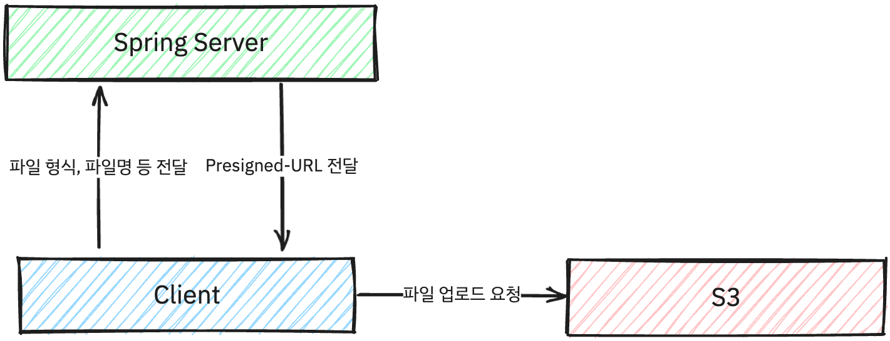

## 파일 업로드가 Plog에 왜 필요했을까?
파일 업로드는 Plog에서 관리하는 프로필 사진, 포스팅 썸네일 뿐만 아니라 마크다운 내 삽입되는 이미지, 드래그 앤 드랍으로 삽입되는 이미지  등을 업로드 시키기 위해 필요했었습니다.

S3가 파일을 관리하기에는  최적이었고, 실무에서도 S3를 활용한 경험이 있어 S3에 파일을 업로드하고 업로드 한 URL을 통해 관리하는 방법을 사용하기로 했습니다.

## 방법
S3에 파일을 업로드 하는 방식으로는 2가지가 생각났습니다.
1. 서버에서 Form 파일 형식으로 파일을 받아서 S3에 업로드
2. 서버에서는 S3와 관련한 인증 및 Pre-signed URL을 생성하고, 클라이언트에서 해당 URL을 통해 업로드

1번 방법도 흔히 사용하는 방법이지만, 이미지 파일을 서버에서 핸들링 하는 것은 실무에서 사용했을 때 CPU 사용율 및 메모리 측면에서 좋지 않았던 경험이 있어 서버 부하를 줄이기 위해 2번 방법을 사용하기로 했습니다.

### Pre-signed URL
- Pre-signed URL은 S3에 업로드할 파일에 대한 권한을 가진 URL을 생성하는 방식입니다. 
- 보안적으로 안전하게 파일을 업로드할 수 있으며, 서버에서는 해당 URL을 생성하고 클라이언트에서는 해당 URL을 통해 업로드를 진행합니다.

### Sequence
전반적인 시퀀스는 다음과 같습니다.




## Backend Side
### S3 Client
- 먼저 업로드 하기 위해서 S3에서 제공하는 SDK를 사용하여 S3 Client를 생성합니다.
- 간단하게 아래와 같이 버킷을 받아 `fileName`, `contentType`을 파라미터로 받아 Pre-signed URL을 생성하는 메서드를 구현하였습니다.
- 이후 Service, Controller에서 해당 메서드를 적절히 호출하여 사용합니다.
```java
@Component
@RequiredArgsConstructor
public class AWSS3Client {

    private final AmazonS3 amazonS3;

    @Value("${cloud.aws.s3.bucket}")
    private String bucket;

    public String generatePUTPresignedURL(String fileName, String contentType) {
        String objectKey = UUID.randomUUID() + "/" + fileName;

        GeneratePresignedUrlRequest generatePresignedUrlRequest = new GeneratePresignedUrlRequest(bucket, objectKey)
                .withMethod(HttpMethod.PUT)
                .withContentType(contentType)
                .withExpiration(new Date(System.currentTimeMillis() + 1000 * 60 * 10)); // 10분간 유효한 URL 생성

        return amazonS3.generatePresignedUrl(generatePresignedUrlRequest).toString();
    }
}
```

### Config
- S3 Client를 사용하기 위해선 AWS의 인증 정보가 필요합니다.
- AWS의 인증 정보는 `application.yml`에 저장하고, `@ConfigurationProperties`를 통해 주입받아 사용하도록 하였습니다.
- EC2 인스턴스의 태그를 통해 스택 정보를 가져올 수도 있지만, 저희는 EC2 인스턴스를 사용하지 않기 때문에 `stack.auto`를 `false`로 설정하였습니다.
```yaml {filename="/src/main/resources/application.yml"}
  aws:
    credentials:
      accessKey: ${AWS_ACCESS_KEY_ID} # AWS Access Key
      secretKey: ${AWS_SECRET_ACCESS_KEY} # AWS Secret Key
    region:
      static: ap-northeast-2 # 서울 리전
      auto: false
    s3:
      bucket: ${AWS_S3_BUCKET} # S3 버킷 이름
    stack:
      auto: false # EC2 인스턴스의 태그를 통해 스택 정보를 가져올지 여부
```

## Frontend Side 
- Frontend에서는 Server에서 반환한 Pre-signed URL을 통해 파일을 업로드합니다.
- 저는 파일 업로드 하는 함수는 표준화하고, Callback함수를 통해 업로드 성공, 실패 시에 대한 처리를 하도록 구현하였습니다.
```ts
export function uploadFile(file: File,
                           afterUploadCallback: (uploadedURL: string) => void,
                           uploadFailedCallback: (error: any) => void = (error) => {
                               console.error(error);
                           }) {
    plogAuthAxios.post('/files/generate-presigned-url', { // Pre-signed URL 생성
        contentType: file.type,
        fileName: file.name
    }).then((res) => {
        const preSignedURL = res.data.preSignedURL; // Server로부터 전달받은 Pre-signed URL

        // URL을 받은 후에 PUT 요청으로 파일을 업로드 (AWS)
        axios.put(preSignedURL, file, { 
            headers: {
                'Content-Type': file.type
            }
        }).then((res) => {
            afterUploadCallback(preSignedURL.split('?')[0]);
        }).catch((err) => {
            uploadFailedCallback(err)
        });
    }).catch((err) => {
        uploadFailedCallback(err)
    });
}
```