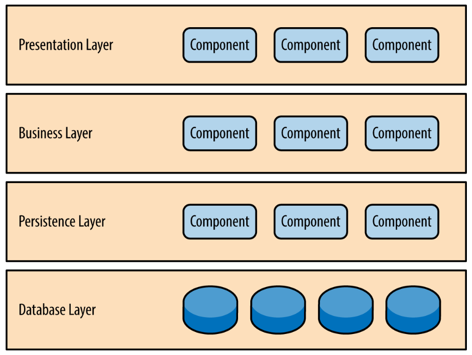
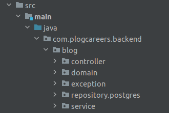
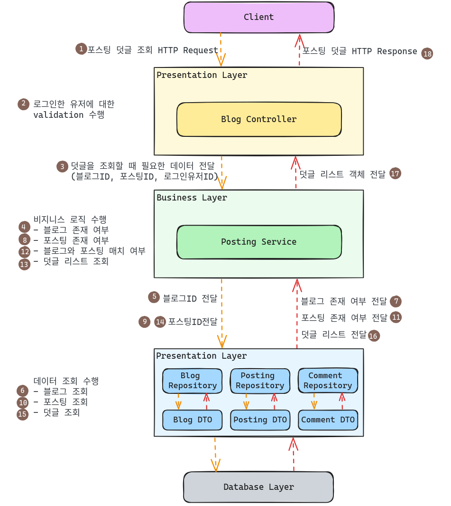

아키텍처 패턴에는 `Microservices Architecture`, `Serverlsess Architecture`, `Layered Architecture` 등 여러가지가 있습니다.  

여기서 `Layered Architecture`는 소프트웨어 시스템을 여러 계층으로 나누고, 각 계층은 명확한 책임을 가지며 하위의 계층에만 의존하도록 하는 아키텍처 패턴입니다.  

`Layered Architecture`의 경우 모듈성이 높아 각 계층을 독립적으로 개발 및 유지보수하기에 용이합니다. 또한 표준화된 구조로 많은 사람들에게 익숙하여 러닝커브가 크지 않고 설계가 간결하여 쉽게 적용할 수 있습니다.  

이런 장점들을 토대로 저희는 `Layered Architecture`를 저희의 아키텍처 패턴으로 채택하였습니다.  

## 계층의 종류

`Layered Architecture`는 3-Tier 혹은 4-Tier 계층 구조가 가장 일반적이며, 이 중에 우리는 4-Tier 계층 구조를 채택하였습니다.  

4-Tier 계층의 구조는 아래와 같습니다.  

각 계층에 대해 알아보자면 다음과 같습니다.  

1. `Presentation Layer`: 클라이언트의 요청을 받고, 결과를 클라이언트에 응답하는 계층이며 하위 계층인 `Business Layer`와 의존성을 가지고 있습니다. 

2. `Business Layer`: 비지니스 로직을 담당하는 계층으로 하위 계층인 `Persistence Layer`와 의존성을 가지고 있습니다.  
3. `Persistence Layer`: 데이터베이스에 접근하는 계층으로 데이터베이스에 데이터를 저장, 조회, 삭제하는 로직을 수행하며 하위 계층인 `Database Layer`와 의존성을 가지고 있습니다.  
4. `Database Layer`: 데이터베이스 그 자체를 의미합니다.  

## 실제 프로젝트 구조

이를 바탕으로 저희가 `Plog`의 블로그 기능을 구현한 디렉토리 구조를 보자면 다음과 같습니다.  

여기서 `exception` 디렉토리의 경우 핵심 비지니스 로직에 대한 예외를 처리하고 있으므로 도메인과 관련된 계층에 속한다고 할 수 있습니다.  

이를 바탕으로 디렉토리를 각 계층으로 분류해보자면 다음과 같습니다.  

- Presentation Layer: `controller`
- Business Layer: `service`
- Persistence Layer: `domain`, `repository.postgres`, `exception`

## 계층의 상호작용과 데이터 흐름

예시를 통해 각 계층별 상호작용과 데이터 흐름에 대해 확인해보겠습니다.  

예시 상황은 포스팅에 대한 덧글을 조회하는 상황입니다.  

이미지의 번호와 각 Layer간의 상호작용이 발생하며, 데이터가 흐르게 됩니다.  
