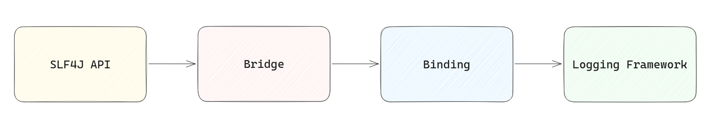
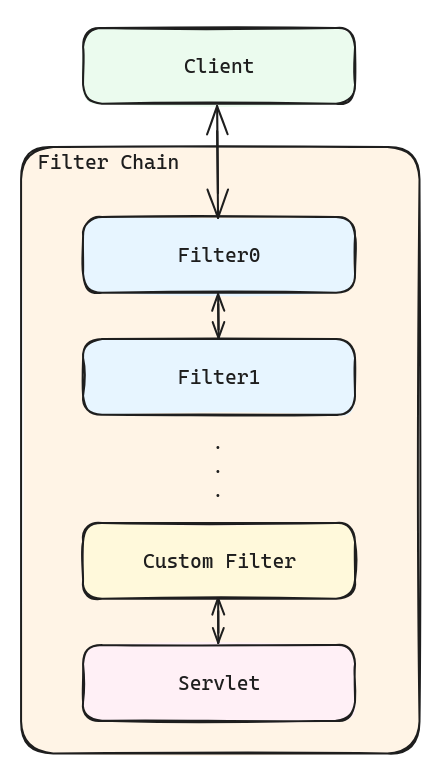

# Observability

## 로깅을 하게 된 이유

로그는 서버에서 발생하는 모든 이벤트에 대한 기록입니다. 로그를 통해 서버의 모니터링과 오류 추적을 용이하게 할 수 있습니다.

Plog 프로젝트를 진행하면서 다른 여느 프로젝트와 마찬가지로 많은 API들을 만들게 되었고, 이를 서버에 올려 동작시켰습니다.

프론트에서 작업을 하면서 API에 장애가 발생할 경우 이에 대한 원인 파악이 쉽지 않았습니다.

각자의 로컬에서 어플리케이션을 실행시켜 프론트에서 한 것과 동일한 요청을 보내고 디버그하는 방식이었다보니 장애 파악에 시간이 많이 소요되었고, 간혹 재현불가능한 장애에 대해서는 트래킹 자체가 불가했습니다.

로깅을 도입한다면 배포된 서비스에서 장애가 발생할 경우 빠르게 원인을 파악하고 대처하여 정상적인 서비스 제공에 힘을 쓸 수 있다고 생각하여 로깅을 도입하기로 했습니다.


## 어떤 라이브러리를 선택할 것인가?

java에는 로깅을 위한 여러 라이브러리가 있습니다.  이 중에 저희가 원하는 구현체를 언제든 사용할 수 있도록 저희는 먼저 `SLF4J` 라이브러리를 사용하였습니다.

`SLF4J`는 로깅 추상화를 위해 인터페이스를 제공하는 라이브러리로 아래 그림과 같은 동작 과정을 가지고 있기 때문에 바인딩하는 구현체를 자유롭게 선택할 수 있습니다.



가장 기본적인 `java.util.logging` 부터 `log4j`, `logback` 등 여러가지가 있는데, 저희는 이 중에서 `logback`을 구현체로 채택했습니다. 

`logback`의 가장 큰 장점으로는 성능이 좋다는 점인데, `logback`은 비동기 로깅이며 백그라운드에서 처리되어 어플리케이션 성능에 영향을 미치지 않습니다.   

또한 `java.util.logging`보다 유연하게 로그를 남길 수 있고 `log4j`의 아키텍처를 기반으로 만들었기에 안정성이 좋다는 것도 장점이라고 생각했습니다.  

xml파일을 사용하기 때문에 가독성이 떨어진다는 점과 패턴 레이아웃을 통해 로그를 남기기 때문에 일부 비효율적으로 느껴지는 부분도 있었습니다.  

하지만 많은 곳에서 이를 사용하고있어 문서나 커뮤니티가 많아 개발일정이 촉박한 상태에서 선택하기에 좋은 선택지였습니다.  

또한 spring boot에서 `SLF4J - logback`을 기본으로 채택하고 있기 때문에 우리 프로젝트와도 적합하다고 생각했습니다.


## 어떤 것을 로깅할 것인가?

java는 긴 스택트레이스를 가지고 있기 때문에 무작정 로그를 남기면 중요한 로그가 무엇인지 파악하기 어렵기 때문에 필요한 곳에서만 로그를 남겨야한다고 생각했습니다.

또한 서버에서 발생하는 장애에 대해 기록하는 것이 가장 큰 목적이므로 로그를 읽고 어떤 이슈가 있었는지, 어디에서 발생한 이슈인지 등의 정보를 추론할 수 있어야한다고 생각했습니다.

이에 따라 저희는 아래와 같은 항목을 로깅에 포함하기로 했습니다.

### timestamp

작업하다가 특정 시간에 발생했던 에러에 대해 알게되었을 때, 빠른 트래킹을 할 수 있도록 이벤트가 발생한 시간을 로깅에 포함하였습니다.

### level

무수히 쌓이는 로그들 중 저희가 확인하고 싶은 로그에 대해 더욱 쉽게 찾을 수 있도록 저희가 직접 정해놓은 로그 레벨을 로깅에 포함하였습니다.

### requestID

각 이벤트에 대한 고유 ID(UUID 사용)를 부여하여 로그 상에서 이벤트 구분을 명확히 하기 위해 requestID를 로깅에 포함하였습니다.

### requestURL

에러 트레이스 중 호출된 API정보를 빠르게 파악하기 위해 호출된 API의 요청 URL을 로깅에 포함하였습니다.

### caller

직접적으로 에러가 발생한 지점을 파악하기 위해 호출하고 있는 메서드 명을 로깅에 포함하였습니다.

### requestBody 혹은 request

이벤트 및 에러가 발생했을 때, 각 메서드에 전달된 요청데이터가 무엇이었는지 파악하기 위해 requestBody(Controller) 혹은 request(Service, Repository)를 로깅에 포함하였습니다.

### responseBody 혹은 response

이벤트 및 에러가 발생했을 때, 각 메서드에서 반환한 데이터가 무엇이었는지 파악하기 위해 responseBody(Controller) 혹은 response(Service, Repository)를 로깅에 포함하였습니다.

### exception

발생한 에러에 대해 정확히 파악하기 위해 정의해둔 에러에 대해서는(500을 제외한 에러 코드가 있는 경우) 에러 코드와 메세지 등을, 서버에러(500, Internal Error)의 경우 근접한 5개의 스택트레이스를 포함하여 exception 부분에 담아 로깅에 포함하였습니다.

### status

responseBody의 경우 최종적으로 발생한 오류를 확인하기 위해 메서드에서 반환한 status code를 로깅에 포함하였습니다.

### message

웹 어플리케이션을 실행하면서 생기는 기본적인 시스템 로그와 저희가 특정 상황에서 직접 지정한 메세지들을 message부분에 담아 로깅에 포함하였습니다.


## 어떻게 로깅할 것인가?

현재 저희 회사에서는 로그를 각 서버에서 파일로 남기는 방식을 채택하고 있는데, 이 프로젝트에서는 저희가 AWS서버를 통해 배포하는 만큼 AWS의 Cloud Watch Logs를 사용해 저희의 ECS 인스턴스에서 로그를 모니터링하기로 했습니다.

서비스 로그는 ECS의 Service에서 확인할 수 있습니다.  


또한 이런 로그들을 바탕으로 Grafana와 연동시켜 대시보드를 구성하기로 했습니다.


## Filter와 AOP


저희는 크게 `Filter`, `Interceptor`, `AOP` 중에서 `Filter`와 `AOP`를 이용해 로깅을 구현했습니다.  

`Filter`에서는 최초 client의 request와 최후 server의 response를 확인하기 위해, `AOP`는 내부 메서드들 사이에서 발생하는 이벤트들을 확인하기 위해 사용하였습니다.  


### Filter

기본적으로 `Filter`는 여러 기능을 하는  `Filter` 들을 엮어둔 Filter Chain을 모두 통과하는데, custom한 `Filter`를  Filter Chain에 등록할 수 있으며, 이는 맨 마지막에 시행됩니다.  



저희는 로깅을 남기기 위한 일련의 과정을 Filter Chain에 추가하였고, 이에 대한 기본 format은 logback에 다음과 같이 추가하였습니다.  

```xml
# Filter 기본 format
<pattern>
    {"@timestamp":"%d{yyyy-MM-dd'T'HH:mm:ss.SSSZ}","level":"%level","requestID":"%X{requestID}","requestURL":"%X{requestURL}","caller":"%X{caller}","status":%X{status},"requestBody":%X{requestBody},"responseBody":%X{responseBody},"message":"%msg"}%n
</pattern>
```

실제 저희 EC2에서 확인 가능한 로그 예시는 다음과 같습니다.


### AOP

AOP는 관점(비지니스 로직 기준에 따라 나뉘는 부분)을 모듈화하는 것을 의미하며, 이 관점마다 `@Before`, `@AfterReturning`, `@AfterThrowing`과 같은 pointcut에서 반복적인 작업을 수행하게 할 수 있습니다.  

저희가 AOP에 대해 공부했던 부분에 대해 확인하고 싶으시다면 [여기](https://github.com/project-555/plog-study/blob/main/spring/06.aop.md)를 눌러 확인해볼 수 있습니다.  


저희는 aop로 Service와 Repository의 pointcut에서 로깅을 하였고, 이에 대한 기본 format은 logback에 다음과 같이 추가하였습니다.

```xml
# AOP 기본 Format
<pattern>
    {"@timestamp":"%d{yyyy-MM-dd'T'HH:mm:ss.SSSZ}","level":"%level","requestID":"%X{requestID}","caller":"%X{caller}","request":%X{request},"response":%X{response},"exception":%X{exception},"message":"%msg"}%n
</pattern>
```

실제 저희 EC2에서 확인 가능한 로그 예시는 다음과 같습니다.


## Grafana 대시보드 구성 및 한계

_(이 내용은 태영님이 작성해주실 예정)_


## 배운 점

저의 경우에는 Spring을 사용한 첫 웹 어플리케이션을 만드는 프로젝트였는데, 웹 어플리케이션에 대한 이해도가 낮았어서 Filter에 대해 처음에 공부하는데 시간이 꽤나 걸렸습니다.  

이번 프로젝트를 통해 웹 어플리케이션에 대한 이해도를 높이게 되어 기쁘게 생각하고 있습니다.


## 아쉬웠던 점

저희가 사용한 방식대로 logback을 사용하면서 정해진 기본 틀에 의해 빈 값이 반드시 생기게 됩니다.

같이 개발을 진행한 태영님이 이를 조금 더 발전된 형태로 작성하는 방향에 대해 고민했고, 로그 내용을 동적바인딩이 가능하도록 구현해주었습니다.

그런데 개발 마무리단계에 로깅을 구현하다보니 마무리 일정이 다가와 이를 실제로 적용해 보지 못해 아쉽게 생각됩니다.

또한 마지막 세팅을 하면서 logback자체에도 유연하게 로깅을 구현할 수 있는 방법이 더 많다는 것을 알게 되었습니다.

추후에 이런 것들을 반영하면 조금 더 효율적인 로그를 작성할 수 있을 것 같습니다.  