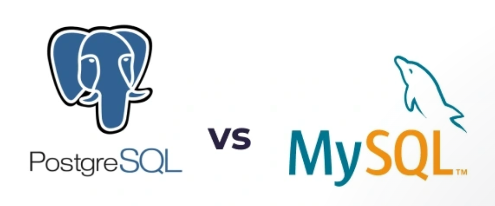

서비스를 만들고 운영하는데 있어서 저장할 데이터가 생기는 것은 필수불가결한 일입니다.

이를 위해 저희는 데이터를 어떤 DB에 저장하고 관리할지에 대해 고민하게 되었습니다.

## DB 선정에서 고려했던 점

수익을 목표로 하는 프로젝트가 아니었고, 초기비용이 많이 드는 것은 부담스러웠기 때문에 저희는 자연스레 라이센스 비용이 발생하지 않는 오픈소스 중에서 DB를 선정해야겠다고 생각했습니다.

또한 프로젝트에 참여한 멤버들은 Window, Linux, Mac 이렇게 세 가지의 OS를 사용하고 있었기 때문에 반드시 이 세 가지 OS에서 모두 잘 작동해야 했습니다.

그리고 블로그 서비스에 맞게 읽기와 쓰기 작업이 빈번하게 이루어지게 되고, 회원가입 과정에서 다양한 민감정보를 다루기 때문에 데이터 무결성을 보존하는 것이 중요하게 여겨졌습니다.

이러한 저희의 상황에 맞추어 여러 선택지 중에서 후보군을 추릴 때 다음과 같은 점들을 고려했습니다.

- 별도의 라이센스 비용이 발생하지 않는가?
- 다양한 OS버전에서 실행할 수 있는가?
- 읽기/쓰기 등의 작업을 빠르게 수행할 수 있는가?
- ACID를 잘 준수하여 데이터의 무결성을 보존할 수 있는가?
- 커뮤니티가 활성화 되어있어 정보를 쉽게 얻을 수 있는가?
- 다양한 기능을 제공하며 확장성이 좋은가?

그리고 이를 토대로 `MySQL`과 `PostgreSQL` 로 후보군을 대폭 줄였습니다.

## MySQL vs PostgreSQL

두 가지 모두 저희에게 꽤나 좋은 선택지였습니다.

각각의 장점에 대해 알아보면서 저희는 `PostgreSQL`가 가장 최상의 MVCC를 제공한다는 점과 가장 엄격하게 ACID 규정을 준수하고 있다는 점에서 `PostgreSQL`이 더 좋다고 생각하였습니다.

또한 팀원들이 `PostgreSQL`을 사용해보고 싶어했던 점도 `PostgreSQL`를 선택하는데 한 몫을 하였습니다.

이런 것들을 고려하여 저희는 최종적으로 `PostgreSQL`을 DB로 선정하였습니다.