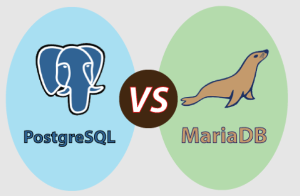
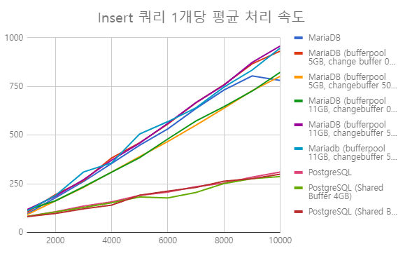
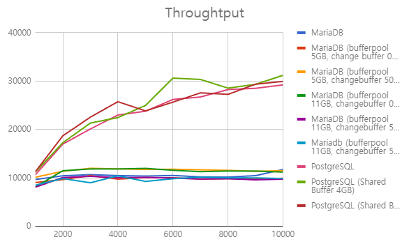
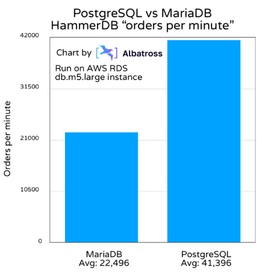
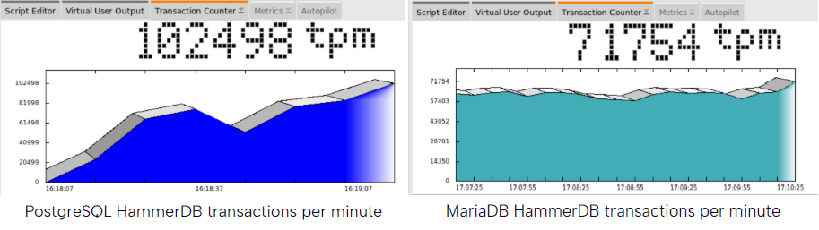
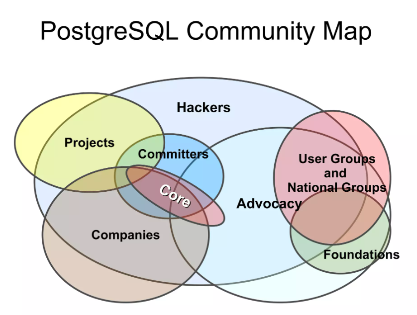

서비스를 만들고 운영하는데 있어서 저장할 데이터가 생기는 것은 필수불가결한 일입니다.

이를 위해 저희는 데이터를 어떤 DB에 저장하고 관리할지에 대해 고민하게 되었습니다.

## DB 선정에서 고려했던 점

가장 먼저 저희 서비스의 특성에 맞는 DB를 선정해야한다고 생각했습니다.

블로그 서비스에 맞게 읽기와 쓰기 작업이 빈번하게 이루어지게 되므로 이에 최적화되어있어야 한다는 것과, 회원가입 과정에서 다양한 민감정보를 다루기 때문에 데이터 무결성을 보존하는 것이 중요하게 여겨졌습니다.

또한 프로젝트에 참여한 멤버들은 Window, Linux, Mac 이렇게 세 가지의 OS를 사용하고 있었기 때문에 반드시 이 세 가지 OS에서 모두 잘 작동해야 했습니다.

추가적으로 해당 프로젝트는 수익을 목표로 하는 프로젝트가 아니었고, 초기비용이 많이 드는 것은 부담스러웠기 때문에 라이센스 비용이 발생하지 않는 오픈소스 중에서 DB를 선정해야겠다고 생각했습니다.

이러한 저희의 상황에 맞추어 다음과 같은 점들을 고려했습니다.

- 서비스의 특성에 맞는 데이터를 저장하기에 적합한 DB인가?
  - ACID를 잘 준수하여 데이터의 무결성을 보존할 수 있는가?
- 다양한 OS에서 실행할 수 있는가?
- 별도의 라이센스 비용이 발생하지 않는가?
- 읽기/쓰기 등의 작업을 빠르게 수행할 수 있는가?
- 커뮤니티가 활성화 되어있어 정보를 쉽게 얻을 수 있는가?

### 서비스의 특성에 맞는 데이터를 저장하기에 적합한 DB인가?

DB는 다음과 같이 다양한 종류가 있습니다.  

- 관계형 데이터베이스 (Relational Database): 테이블간의 관계를 기반으로 데이터를 구조화함
- NoSQL 데이터베이스: 정해진 Schema가 없어 다양한 형태의 데이터를 저장함
- 계층형 데이터베이스 (Hierarchical Database): 트리구조로 데이터를 저장하며 계층적인 형태로 데이터를 구조화함
- 네트워크형 데이터베이스 (Network Database): 그래프 형태로 데이터를 구조화함

블로그 서비스는 정형화된 형식의 데이터가 저장되는 경우가 대부분이며, 트리나 그래프와 같은 데이터 구조를 필요로하지 않다고 생각했습니다.  

따라서 관계형 데이터베이스가 가장 적합하다고 생각하였습니다.

또한 고려대상이었던 ACID속성에 대해 관계형 데이터베이스는 대체적으로 엄격히 이를 준수하기 때문에 더욱 적합하다는 생각을 하였습니다.  

관계형 데이터베이스에 해당하는 `MySQL`, `MariaDB`, `PostgreSQL`, `Oracle` 를 후보로 좁혔습니다. 

### 다양한 OS에서 실행할 수 있는가?

| OS          | MySQL | MariaDB | PostgreSQL | Oracle |
| ----------- | ----- | ------- | ---------- | ------ |
| **Linux**   | O     | O       | O          | O      |
| **Mac**     | O     | O       | O          | O      |
| **Window**  | O     | O       | O          | O      |
| **Solaris** | O     | O       | O          | O      |
| **FreeBSD** | O     | O       | O          | O      |

앞에서 추렸던 네가지 후보 모두 프로젝트 참여 멤버들이 사용하는 OS를 지원하였고, 별도의 OS들도 지원하는 것을 확인할 수 있었습니다.  

어떤 DB를 선택하더라도 OS문제가 발생하지 않을 것이라고 생각하였으며, 후보군도 그대로 가게 되었습니다.  

### 별도의 라이센스 비용이 발생하지 않는가?

`Oracle`은 라이센스 비용이 청구되는 것으로 잘 알려져 있으며, `MySQL`의 경우에도 상업적 사용에는 비용이 발생한다.  

따라서 이 두 가지 후보를 제외하고 `MariaDB`와 `PostgreSQL` 두 가지로 추려지게 되었다.

### 읽기/쓰기 등의 작업을 빠르게 수행할 수 있는가?

작업 속도에 대한 것은 [여기](https://tristan91.tistory.com/317)와 [여기](https://www.albatrossmigrations.com/blog/mariadb-postgresql-performance)에서 잘 비교된 벤치마크를 참고하였습니다.

insert쿼리 1개를 처리하는 속도를 비교한 벤치마크를 살펴보면 아래와 같습니다.  

속도면에서 `PostgreSQL`이 `MariaDB`보다 약 3배 이상 빠른 것을 확인할 수 있었습니다.  

또한 전체적인 성능 또한  `PostgreSQL`이 `MariaDB`보다 약 3배 좋았습니다.  

이를 주문 서비스를 통해 2분간의 주문과 트랜잭션 등을 비교한 내용을 살펴보자면  분당 `PostgreSQL`에  `MariaDB` 보다 84% 많은 양의 주문을 처리할 수 있었습니다.  

그에 반해 실제 트랜잭션은 39%밖에 차이가 나지 않았습니다.  

따라서 전반적인 성능이 `PostgreSQL`이 더 좋다는 것을 확인할 수 있었습니다.  

### 커뮤니티가 활성화 되어있어 정보를 쉽게 얻을 수 있는가?

그럼에도 불구하고 `PostgreSQL`을 도입함에 있어 고민이 되었던 부분은 바로 커뮤니티 부분이었습니다.  

물론 전체적으로 보면 `PostgreSQL`과 `MariaDB` 모두 활성화된 커뮤니티가 있었지만, 한국에서는 `PostgreSQL`에 대한 커뮤니티를 찾기 어려웠기 때문입니다.  

`PostgreSQL`은 러닝커브가 어느정도 존재하고 이를 활용할 수 있는 사람이 있어야하는데 `PostgreSQL`을 사용해보고 싶은 멤버는 있었지만 사용해본 경험이 있었던 멤버는 없어 커뮤니티 활성화여부 역시 중요하였습니다.  

하지만 `PostgreSQL`은 다양한 회사들이 참여하는 커뮤니티 소유하고 있으므로 이 부분에 대해 보류하였습니다.  

## 마치며

실무에서 현재 RDBMS로 `MariaDB`를 사용하고있는데 프로젝트를 진행하며 직접 DB에 대해 비교하고 선정해보면서 최근 트렌드는 `PostgreSQL`로 많이 기울고 있다는 느낌을 받았습니다.  

최근 트렌드를 접하고 이에 대해 사용해볼 수 있는 기회가 있어서 좋았습니다.  

