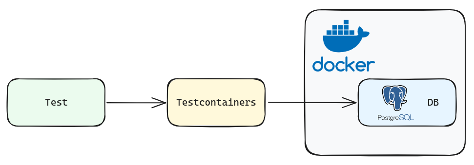
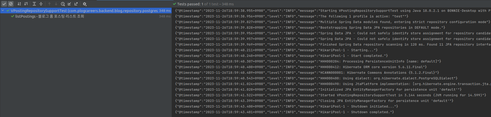

## 테스트를 하게 된 이유

일부 API에서는 복잡한 쿼리나 다이나믹한 쿼리를 사용하기 위해 `JPA`가 아닌 `Querydsl`을 사용하게 되었습니다.

`JPA`의 경우 이미 매우 안정되고 보장된 라이브러리이므로 별도의 테스트가 필요하지 않다고 생각되었지만, `Querydsl`의 경우 저희가 원하는 대로 잘 동작하는지 확인할 필요성을 느꼈습니다.

## 어떻게 테스트를 할 것인가?

`Querydsl`을 테스트하기 위해서는 테스트 실행 시 아래와 같은 과정을 거쳐야 했습니다.

1. TestDB를 별도로 구축
2. 테스트하고자 하는 `Querydsl`에서 필요한 Table에 데이터 삽입
3. `Querydsl`을 사용하여 원하는 데이터 처리가 가능한지 확인

이 과정 중에서 저희는 TestDB를 구축하여 진행하는 `Integration testing`를 수행하기 위해 `Testcontainers`를 사용하였습니다.

### Testcontainers

`Testcontainers`는 외부 리소스와 통합 테스트를 수행하는데 적합한 라이브러리입니다.

Service에서 사용되는 모든 메서드는 `JUnit`을 사용하여 테스트코드를 작성하였지만, `Querydsl`을 사용하는 부분을 테스트하기 위해서는 `JUnit`외에 다른 테스트 방식을 채택해야했습니다.

앞서 언급한대로 `Querydsl`을 사용하는 부분을 테스트 하기 위해서는 테스트용 DB를 별도로 구축하는 부분이 필요했습니다.

최초에는 `Docker`를 사용하여 테스트용 DB를 별도로 구축하려고 했지만, `Testcontainers`는 `Docker Container`를 사용하면서도 docker-compose.yaml과 같은 파일을 작성하지 않더라도 테스트 환경을 구성할 수 있다는 장점이 있어 `Testcontainers`를 사용하기로 결정하였습니다.



## TestDB 구축의 어려웠던 점

resources디렉토리에 `Schema.sql`에다가 DDL을 별도 세팅하여 테스트 수행 시 테스트DB를 구축하게 하였습니다.

저희가 이미 구축해둔 Table들을 그대로 만드는 것이기 때문에 DDL을 작성하는 것은 매우 쉬운 일이었지만, 실제 이 sql을 통해 TestDB를 띄우는 것은 생각보다 많은 난관에 부딪혔습니다.

처음에는 테이블명의 오름차순대로 sql을 작성하였습니다.

하지만 이는 바로 에러가 발생하였고 내용을 파악해보니 sql 문서에서의 순서와 테이블을 생성하는 순서가 동일하므로 이에 따라 테이블들의 관계에 따라 sql을 작성해야 했습니다.

가령 A테이블의 컬럼을 B테이블에서  외래키로 쓴다고 했을 때, B테이블보다 A테이블이 더 먼저 생성될 수 있도록 하기 위해 명령이 더 상단에 위치해야 했습니다.

예시로 아래와 같이 blog테이블의 id를 외래키로 사용하는 category테이블은 blog 테이블을 생성하기 전에 먼저 생성할 수 없습니다.

```sql  {filename="/test/resources/schema-postgres.sql"}
create table if not exists plog_blog.category
(
    id            serial
        constraint category_pk primary key,
    category_name varchar(100) not null,
    category_desc varchar(1000),
    blog_id       integer
        constraint category_blog_id_fk references plog_blog.blog
            on update cascade on delete cascade
);

create table if not exists plog_blog.blog
(
    id          integer   default nextval('plog_blog.blog_info_id_seq') not null
        constraint blog_info_pk primary key,
    blog_name   varchar(50) unique,
    user_id     integer
        constraint blog_user_id_fk references plog_ums.user
            on update cascade on delete cascade,
    short_intro varchar(100),
    intro_html  text,
    update_dt   timestamp default now(),
    create_dt   timestamp default now(),
    intro_md    text
);
```

따라서 테이블들의 관계를 잘 살피고 먼저 생성되어야하는 테이블들을 생성하는 쿼리를 파일 상단에 위치시켜야했습니다.

또한 테이블에서 사용할 sequence에 대해서도 테이블 생성 이전에 미리 생성해주어야 했습니다.

마찬가지로 이를 잇는 부분도 두 가지를 별도로 생성한 이후에 이어져야 했습니다.

예시로 아래와 같이 blog테이블에서 사용하는  sequence는 다음과 같이 생성하고 부여하여 선언할 수 있습니다.

``` sql  {filename="/test/resources/schema-postgres.sql"}
create sequence plog_blog.blog_info_id_seq;

create table if not exists plog_blog.blog
(
    id          integer   default nextval('plog_blog.blog_info_id_seq') not null
        constraint blog_info_pk primary key,
    blog_name   varchar(50) unique,
    user_id     integer
        constraint blog_user_id_fk references plog_ums.user
            on update cascade on delete cascade,
    short_intro varchar(100),
    intro_html  text,
    update_dt   timestamp default now(),
    create_dt   timestamp default now(),
    intro_md    text
);

alter sequence plog_blog.blog_info_id_seq owned by plog_blog.blog.id;
```

처음에 이런 부분을 제대로 신경쓰지 못하여서 TestDB를 만드는데 꽤나 많은 고생을 했습니다.

## Spring에서 Test 환경을 구축하기 어려웠던 점

TestDB 구축에 필요한 DDL을 모두 작성하였다면 이를 실제 테스트에서 사용할 수 있도록 저희가 사용하는 `PostgreSQL`의 컨테이너를 설치하고, 작성한 sql을 실행하도록 해야했습니다.

이 과정은 Repository test간 한 번만 실행이 되도록 하고 싶었으나 실제 검색 등을 통해 얻은 정보에서는 매 테스트 코드 앞에 같은 내용을 반복적으로 작성하고 있었습니다.

따라서 저희는 이를 위해 별도의 기본 클래스를 만들고 이를 상속하도록 하고자 했으며 다음과 같은 `BaseRepositorySupportTest`를 통해 이를 구현하였습니다.

```java {filename="/test/blog/repository/postgres/VPostingRepository.java"}
@Testcontainers
@DataJpaTest
@AutoConfigureTestDatabase(replace = AutoConfigureTestDatabase.Replace.NONE)
@RequiredArgsConstructor
public class BaseRepositorySupportTest {
    @Container
    public static PostgreSQLContainer<?> postgres = new PostgreSQLContainer<>(
            "postgres:15.2"
    ).withInitScript("schema-postgres.sql");

    @BeforeAll
    static void beforeAll() {
        postgres.start();
    }

    @AfterAll
    static void afterAll() {
        postgres.stop();
    }

    @BeforeEach
    void setUp() {
        DBConnectionProvider connectionProvider = new DBConnectionProvider(
                postgres.getJdbcUrl(),
                postgres.getUsername(),
                postgres.getPassword()
        );
    }
}
```

이렇게 DB 컨테이너를 새로 띄우고, 테이블을 생성한 뒤에야 본격적으로 test코드를 작성할 수 있었습니다.

## Test 코드를 실행하기까지 어려웠던 점

test 코드 구현은 조금 쉽다고 생각해서였는지 여기서도 결국 어려움을 겪었습니다.

처음에는 단순히 테스트하고자 하는 `Querydsl`에서 필요한 각 Table에 데이터를 세팅해주고 이를 실행시켜보면 된다고 생각했습니다.

`Querydsl`을 테스트하려면 이 entity들이 영속화되어있어야 했는데,  각 Table에서는 `JPA`를 사용하므로 기존에 선언되어있는 EntityManager를 사용할 것이라고 생각하였습니다.

하지만 이는 잘못된 생각이었고 Test를 위한 EntityManager를 별도로 주입받아 이를 해결해야했습니다.

이를 코드로 살펴보면 다음과 같습니다.

```java {filename="/test/blog/repository/postgres/VPostingRepository.java"}
public class VPostingRepositorySupportTest extends BaseRepositorySupportTest {

    @Autowired
    TestEntityManager testEntityManager;
    VPostingRepositorySupport vPostingRepositorySupport;

    @BeforeEach
    void init() {
        vPostingRepositorySupport = new VPostingRepositorySupport(testEntityManager.getEntityManager());
    }
}
```

특히 이 부분은 원인을 찾고 해결하는데 가장 오랜 시간이 걸렸습니다.

이런 세팅까지 모두 마쳐주고 난 뒤에야 비로소 데이터를 세팅하고 `Querydsl`이 정상동작하는지 확인해볼 수 있었습니다.

## 테스트 실행 결과

이렇게 완성된 Test 코드를 실행해보니 다음과 같이 성공적으로 repository test를 마칠 수 있었습니다.  



## 배운 점과 아쉬웠던 점

회사에서 `Unit testing`에 대해서는 여러 번 작성해본 경험이 있는데, `Integration testing`을 해 본 적은 없었습니다.

특히 별도의 테스트용 DB를 구축하고 해당 DB를 사용한 테스트를 해본 적이 없었는데 이런 경험을 해볼 수 있어서 좋았습니다.

여러 어려움에 부딪히며 생각보다 긴 시간을 소요했던 점은 아쉬웠지만, 도전적인 과제를 풀어나간다는 것에 대해 성취감을 느낄 수 있었습니다.

또한 이를 해결해가며 막연하게 생각하고 넘어갔던 점들이 많았음을 깨닫고, 어떤 프로세스를 도입함에 있어 더욱 꼼꼼하게 모든 부분을 확인해야겠다는 생각을 가지게 되었습니다.  
