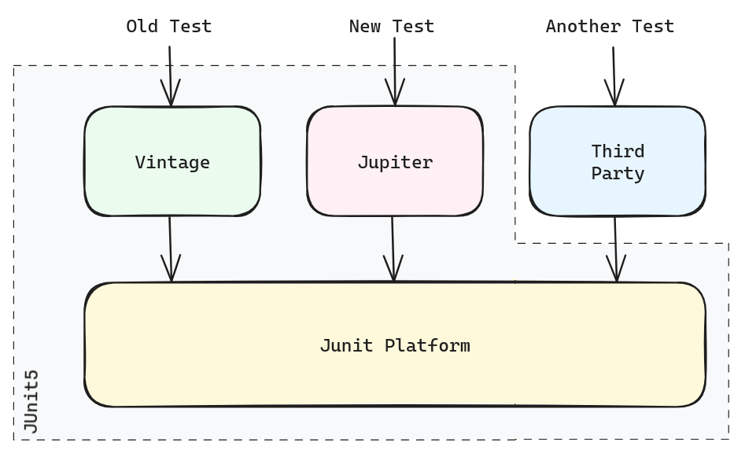
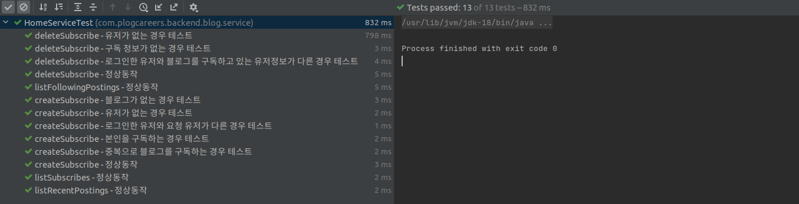

## 테스트를 하게 된 이유

테스트는 소프트웨어의 기능과 동작을 확인해 결함을 찾아내고, 원하는 결과가 나오는지 확인할 수 있는 방법입니다.

프로젝트 초반에 전체적인 틀을 잡는데 시간이 오래걸렸고, 큰 틀이 여러 번 수정되는 일이 있었습니다.

그런데 그럴 때마다 새로운 부분에 대해서는 잘 작성하였지만 기존 코드는 정상작동하는지 확인이 다 되지 않은 채로 배포하는 일이 잦아졌고 나중에서야 결함이 생기게 되었다는 것을 확인했습니다.

완성된 부분에 대해서는 미리 Test Code를 작성한다면, 소프트웨어를 수정하면서 예상하지 못했던 결함을 방지해나갈 수 있다고 생각이 되어 Test를 하게 되었습니다.


## 어떻게 테스트를 할 것인가?

저희는  `Unit testing`은 `JUnit5`를 사용하였습니다.

### JUnit5

`JUnit`은 Spring과 통합할 수 있다는 장점때문에 Spring을 사용하는 프로젝트에서 많이 사용되는 단위 테스트 프레임워크입니다.

특히 `JUnit5`는 Spring Boot 2.2버전 이상부터 기본으로 제공되기 때문에 쉽게 도입하여 사용할 수 있었습니다.

또한 `JUnit5`는 `JUnit Platform + JUnit Vinatge + JUnit Jupiter`를 합친 것으로, 여기서 `JUnit Platform`은 JVM에서 별도의 엔진으로 테스트를 실행할 수 있다는 장점도 있었습니다.



저희는 `JUnit5`를 사용하여 Service의 각 메서드의 테스트를 시행하였으며 `Mockito`를 사용하여 Mock객체를 만들어 테스트를 시행하였습니다.


## Test 구현 

각 메서드에서 발생할 수 있는 모든 에러와 정상동작을 정의하여 테스트를 작성하였습니다.

가령 아래와 같이 블로그를 구독하는 메서드가 있습니다.

```java {filename="/blog/service/HomeService.java"}
public void createSubscribe(Long loginedUserID, @NotNull CreateSubscribeRequest request) throws BlogNotFoundException {
    Blog blog = blogRepository.findById(request.getBlogID()).orElseThrow(BlogNotFoundException::new);
    User user = userRepository.findById(request.getUserID()).orElseThrow(UserNotFoundException::new);
    if (!user.getId().equals(loginedUserID)) {
        throw new NotProperAuthorityException();
    }
    if (blog.isSelfSubscribe(user)) {
        throw new SelfSubscribeException();
    }
    if (subscribeRepository.existsByUserIDAndBlogId(user.getId(), blog.getId())) {
        throw new SubscribeDuplicatedException();
    }
    subscribeRepository.save(request.toEntity(blog));
}
```

서비스 로직 상 발생할 수 있는 에러의 종류는 아래와 같습니다.

- 구독하려는 블로그 ID가 없을 경우
- 구독을 요청하는 유저의 ID가 없을 경우
- 구독을 요청하는 유저의 ID가 로그인한 유저의 ID와 같지 않을 경우
- 자신의 블로그를 구독하려고 하는 경우
- 이미 구독한 블로그를 구독하려고 하는 경우

따라서 이 5가지의 에러에 정상동작을 포함하여 이 메서드는 다음과 같이 6개의 테스트코드를 작성하였습니다.

```java {filename="/test/blog/service/HomeServiceTest.java"}
@Test
@DisplayName("createSubscribe - 블로그가 없는 경우 테스트")
void testCreateSubscribe_1() {}

@Test
@DisplayName("createSubscribe - 유저가 없는 경우 테스트")
void testCreateSubscribe_2() {}

@Test
@DisplayName("createSubscribe - 로그인한 유저와 요청 유저가 다른 경우 테스트")
void testCreateSubscribe_3() {}

@Test
@DisplayName("createSubscribe - 본인을 구독하는 경우 테스트")
void testCreateSubscribe_4() {}

@Test
@DisplayName("createSubscribe - 중복으로 블로그를 구독하는 경우 테스트")
void testCreateSubscribe_5() {}

@Test
@DisplayName("createSubscribe - 정상동작")
void testCreateSubscribe_6() {}
```

하나의 메서드에 대한 테스트 코드는 뒤에 넘버링을 추가하였으며, `DisplayName`에는 테스트하고자 하는 내용을 명시적으로 작성하였습니다.  

또한 세부 구현은 `BDD(Behavior Driven Development)`을 따랐으며,  `Given-When-Then Pattern`에 따라 아래와 같이 각 파트를 나누어 작성하였습니다.

```java {filename="/test/blog/service/HomeServiceTest.java"}
@Test
@DisplayName("createSubscribe - 정상동작")
void testCreateSubscribe_6() {
    // given
    when(
        blogRepository.findById(1L)
    ).thenReturn(
        Optional.of(Blog.builder().id(1L).user(User.builder().id(2L).build()).build())
    );
    when(
        userRepository.findById(1L)
    ).thenReturn(
        Optional.of(User.builder().id(1L).build())
    );

    // when
    homeService.createSubscribe(1L, CreateSubscribeRequest.builder().userID(1L).blogID(1L).build());

    // then
    verify(subscribeRepository, times(1)).save(any());
}
```

이를 실행해보면 다음과 같은 결과를 확인할 수 있습니다.  

