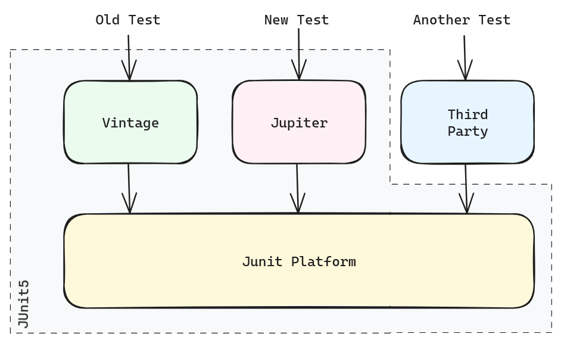
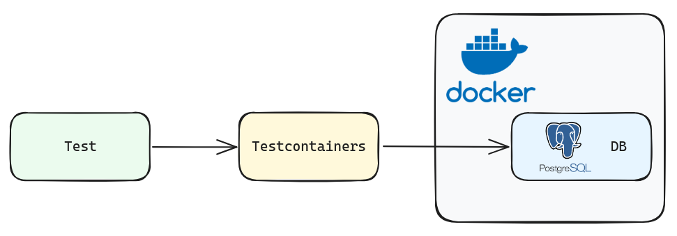

# Testing

## 테스트를 하게 된 이유

테스트는 소프트웨어의 기능과 동작을 확인해 결함을 찾아내고, 원하는 결과가 나오는지 확인할 수 있는 방법입니다.  

프로젝트 초반에 전체적인 틀을 잡는데 시간이 오래걸렸고, 큰 틀이 여러 번 수정되는 일이 있었습니다.  

그런데 그럴 때마다 새로운 부분에 대해서는 잘 작성하였지만 기존 코드는 정상작동하는지 확인이 다 되지 않은 채로 배포하는 일이 잦아졌고 나중에서야 결함이 생기게 되었다는 것을 확인했습니다.  

완성된 부분에 대해서는 미리 Test Code를 작성한다면, 소프트웨어를 수정하면서 예상하지 못했던 결함을 방지해나갈 수 있다고 생각이 되어 Test를 추가하게 되었습니다.  

## 어떻게 테스트를 할 것인가?

저희는 `Unit testing`와 `Integration testing`  두 가지에 초점을 맞추어 Test를 하였습니다.  

이 중에 `Unit testing`은 `JUnit5`를 사용하였고, `Integration testing`은 `Testcontainers`를 사용하였습니다.  

### JUnit5

`JUnit`은 Spring과 통합할 수 있다는 장점때문에 Spring을 사용하는 프로젝트에서 많이 사용되는 단위 테스트 프레임워크입니다.  

특히 `JUnit5`는 Spring Boot 2.2버전 이상부터 기본으로 제공되기 때문에 쉽게 도입하여 사용할 수 있었습니다. 

또한 `JUnit5`는 `JUnit Platform + JUnit Vinatge + JUnit Jupiter`를 합친 것으로, 여기서 `JUnit Platform`은 JVM에서 별도의 엔진으로 테스트를 실행할 수 있다는 장점도 있었습니다.  

저희는 `JUnit5`를 사용하여 Service의 각 메서드의 테스트를 시행하였으며 `Mockito`를 사용하여 Mock객체를 만들어 테스트를 시행하였습니다.  

각 메서드에서 발생할 수 있는 모든 에러와 정상동작을 정의하여 테스트를 작성하였습니다.  

### Testcontainers

`Testcontainers`는 외부 리소스와 통합 테스트를 수행하는데 적합한 라이브러리입니다.  

Service에서 사용되는 모든 메서드는 `JUnit`을 사용하여 테스트코드를 작성하였지만, `Querydsl`을 사용하는 부분을 테스트하기 위해서는 `JUnit`외에 다른 테스트 방식을 채택해야했습니다.  

`Querydsl`을 사용하는 부분을 테스트 하기 위해서는 외부 리소스인 테스트용 DB를 인메모리 DB가 아닌 별도의 DB로 구축하는 부분이 필요했습니다.  

최초에는 `Docker`를 사용하여 테스트용 DB를 별도로 구축하려고 했지만, `Testcontainers`는 `Docker Container`를 사용하면서도 docker-compose.yaml과 같은 파일을 작성하지 않더라도 테스트 환경을 구성할 수 있다는 장점이 있어 `Testcontainers`를 사용하기로 결정하였습니다.  

resources디렉토리에 Schema.sql에다가 DDL을 별도 세팅하여 테스트 수행 시 테스트DB를 구축하게 하였습니다.  

## Test 과정

### Service Layer

### Repository Layer

## 배운 점

회사에서 `Unit testing`에 대해서는 여러 번 작성해본 경험이 있는데, `Integration testing`을 해 본 적은 없었습니다.  

특히 별도의 테스트용 DB를 구축하고 해당 DB를 사용한 테스트를 해본 적이 없었는데 이런 경험을 해볼 수 있어서 좋았습니다.  

## 아쉬웠던 점

`Integration testing`을 처음 해보게 되었는데, `Testcontainers`에 대해 세팅하는 것에 어려움이 많아 `Integration testing`을 적용하는데 오랜 시간이 걸렸던 점이 아쉬웠습니다.  

