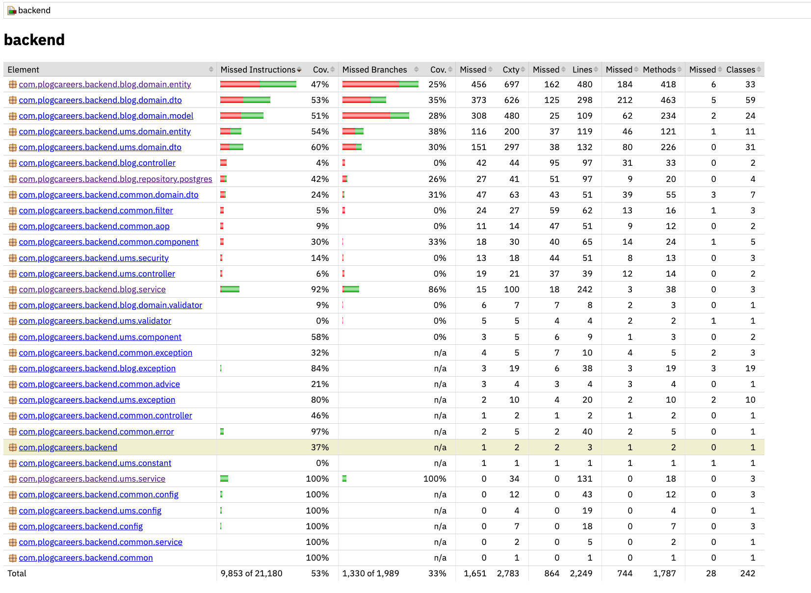
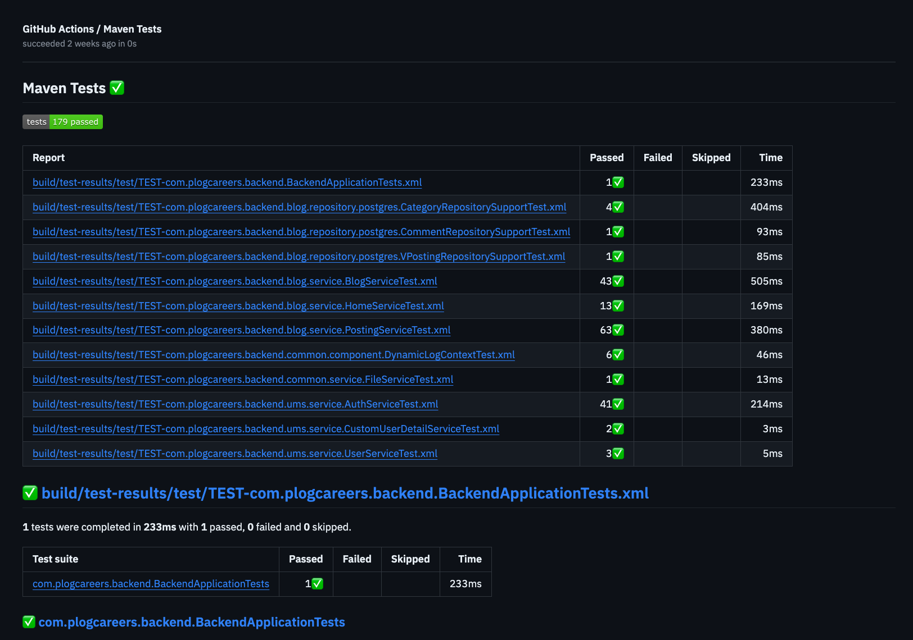
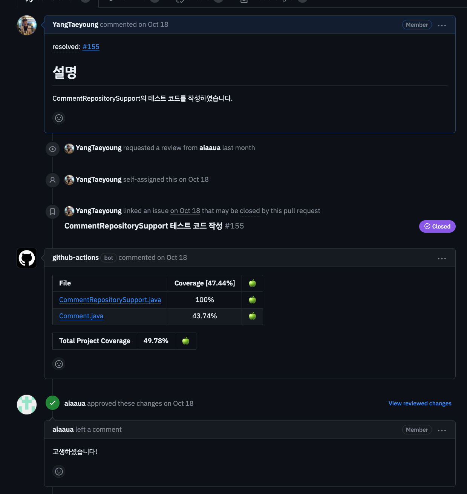

## 테스트 커버리지를 왜 보아야 할까?


백엔드 테스트를 하다보면 테스트를 얼마나 잘 진행하고 있는지 궁금해질 때가 있습니다.
내가 쓴 테스트가 비즈니스 로직을 충분히 테스트 하고 있는지, 각 함수나, 클래스 별로 테스트가 얼마나 잘 진행하고 있는지를 알려주는 척도 중 하나가 바로 **테스트 커버리지**입니다.

사실 테스트 커버리지는 테스트가 실제 코드를 얼마나 수행했는지를 보여주는 척도일 뿐이지, **테스트 커버리지가 100% 라고 해서 테스트를 잘 진행하고 있는 것은 아닙니다.**
이유로는 테스트 커버리지가 포함한다하여, 모든 파라미터에 대해 테스트를 수행하지 못하는 경우가 많으며, 잘못된 테스트 케이스인 경우도 있고, 실제 비즈니스 상황에서 발생하는 경우라고 판단하기도 어렵기 때문입니다. 

다만 테스트 커버리지를 통해 우리 코드의 대체적인 코드 완성도를 파악할 수 있으며, 테스트 코드를 잘 작성하기 위해 코드를 개선하는 것도 흔한 일이라, 실무 중에는 테스트 코드를 작성해두면, 코드 변경사항이 있었을 때 좀 더 실수를 빨리 알아챌 수 있었습니다. (테스트가 통과되지 않으니까요.)

### 테스트의 목적
다만 테스트 커버리지를 보는 궁극적인 목적으로 Plog에서는 다음을 위해 테스트 커버리지를 보고 있습니다.
1. **개발자의 편안한 마음**
   - 실무에서는 오히려 내가 코드를 변경함으로써 다른 코드에서 버그가 나지 않을까? 생각하는 경우가 많았습니다. 다만 테스트 코드에서 _"이런 로직은 해당 파라미터를 필요로 해"_ 와  같은 테스트 코드가 있다면 테스트 코드도 변경사항에 따라 테스트가 깨지면서,  내가 알지 못했던 곳에서 발생하는 오류나 버그를 빠르게 알 수 있었습니다.
   - 부작용으로는 테스트가 깨지지 않으면, ~~왜 안깨지지 하면서 불안한 마음도 함께 얻을 수 있죠~~ 
2. **Happy Case 는 테스트 되었음을 보장**
   - 적어도 모든 파라미터까지는 아니지만 사용자가 흔히 보내는 오류를 낼 수 있는 코드 (ex. `null`, `empty` 등)에 대해서는 파라미터를 지정하므로 해당 코드가 `if`분기에서 잘 들어가고 있는지와 같은 테스트가 되었음을 보장할 수 있습니다.  
3. **API 테스트 등으로 확인하기 어려운 비즈니스 로직을 테스트**
   - 실무를  하다보면 다른 개발자가 선행 작업을 해줘야 실제 테스트가 가능한 경우거나, 스케줄링 작업과 같은 경우에는 실제 테스트가 어려운 경우가 있습니다. 이런 경우에는 테스트 코드를 작성하여, 실제 테스트가 어려운 부분을 간접적으로나마 테스트 할 수 있습니다.  

## Spring 에서는 테스트 커버리지를 어떻게 볼 수 있을까?
스프링에서 테스트 코드를 보는 것은 간편합니다. JUnit5 기준 jacoco 플러그인을 사용하면, 테스트 커버리지를 쉽게 볼 수 있습니다.

```gradle {filename="/build.gradle"}
plugins {
 // ... 중략
    id 'jacoco'
}
```

먼저 jacoco를 셋업하기 위해 build.gradle에 위와 같이 플러그인을 추가합니다.

### Plog의 Jacoco 설정 
```gradle {filename="/build.gradle"}
// ... 중략

jacoco {
    toolVersion = "0.8.8"
}

jacocoTestReport {
    reports {
        html.enabled true
        csv.enabled true
        xml.enabled true
    }
}

jacocoTestCoverageVerification {
    violationRules {
        rule {
            enabled true
            element 'CLASS'
            includes = [
                    "*.*Service", "*.*Support"
            ]
            limit {
                counter = 'LINE'
                value = 'COVEREDRATIO'
                minimum = 0
            }
            excludes = []
        }
    }
}
```

> 전반적인 설정이 궁금하다면 [`build.gradle`](https://github.com/project-555/plog-back/blob/main/build.gradle)을 참고해주세요.
 
`jacoco` 설정은 크게 3가지로 나눌 수 있습니다.
- `jacoco`
    - `toolVersion`
        - jacoco의 버전을 설정합니다.
- `jacocoTestReport`
  - 테스트 리포트를 생성하는 설정입니다.
  - `html`, `csv`, `xml` 등의 리포트를 생성할 수 있습니다.
- `jacocoTestCoverageVerification`
  - 테스트 커버리지를 검증하는 설정입니다.
  - 저희 프로젝트의 경우 `minimum`을 0으로 설정하여, 커버리지를 보는 용도로만 사용하고 있습니다. (일반적으로는 목표를 설정하는 편이 좋습니다.)
  - `element`에는 `CLASS`, `METHOD`, `LINE` 등을 설정할 수 있습니다.
    - `CLASS`는 클래스 단위로 커버리지를 검증합니다.
  - `includes`에는 커버리지를 검증할 클래스를 설정할 수 있습니다.
    - 저희 프로젝트의 경우 JPA로 생성된 `Repository`는 이미 검증되었다고 가정하고, 실제 비즈니스 로직에 좀 더 집중하기 위해, 비즈니스 레이어 코드가 담기는 `Service`에 대해 테스트를 검증하도록 설정하였습니다.
    - JPA와는 별개로 데이터 레이어이지만, Dynamic Query 등을 사용하기 때문에 `QueryDSL`로 구성한 `Support` 클래스에 대해서는 별도 검증이 필요하다 생각해서 커버리지를 검증하도록 설정하였습니다.

### 테스트를 실행하고 리포트를 보기
테스트를 실행하고 팀원들이 리포트를 편하게 보기 위해서 Makefile을 활용하여 명령어를 만들어 두었습니다.

```makefile {filename="/Makefile"}
.PHONY: test
test:
	@./gradlew test --stacktrace
	@./gradlew jacocoTestReport
	@open ./build/reports/tests/test/index.html
	@open ./build/reports/jacoco/test/html/index.html
```

- 해당 명령어를 실행하면, 테스트를 실행하고, 테스트 리포트를 생성하고, 생성한 테스트 리포트를 열어 다음과 같이 확인할 수 있습니다.
  
  ```bash
  $ make test
  
  > Task :test
  
  See https://docs.gradle.org/7.5/userguide/command_line_interface.html#sec:command_line_warnings
  
  BUILD SUCCESSFUL in 17s
  7 actionable tasks: 2 executed, 5 up-to-date
  
  See https://docs.gradle.org/7.5/userguide/command_line_interface.html#sec:command_line_warnings
  
  BUILD SUCCESSFUL in 1s
  5 actionable tasks: 2 executed, 3 up-to-date
  
  ```
  
  
  
## Github Pull Request에 테스트, 테스트 리포트를 추가하기
로컬에서만 이렇게 실행한다면 테스트를 진행하는데에는 큰 문제가 없지만, 테스트 누락이나, 테스트가 Pull Request를 올릴 때마다 Checkout해서 실행시켜보아야 한다면 코드리뷰에 큰 장애가 될 것 입니다. 

이를 방지하기 위해 Pull Request가 올라올 때마다 테스트를 실행, 테스트 결과를 PR의 코맨트로 남기는 Github Action을 구성할 수 있습니다.

```yaml {filename="/.github/workflows/test-coverage.yml"}
name: Measure coverage

on:
  pull_request:
    branches: [ main, feat/*, fix/*, test/* ]
```
먼저 PR이 올라올 때마다 해당 Action을 실행하도록 설정합니다. 저희는 branch 컨벤션에 따라 `feat`, `fix` 등의 브런치를 생성하도록 사전에 조율했기 때문에 해당 브런치에 대해서만 테스트를 실행하도록 설정하였습니다.


```yaml {filename="/.github/workflows/test-coverage.yml"}
jobs:
  build:
    runs-on: ubuntu-latest
    steps:
      - name: Checkout
        uses: actions/checkout@v2

      - name: Set up AWS credentials
        uses: aws-actions/configure-aws-credentials@v1
        with:
          aws-access-key-id: ${{ secrets.AWS_ACCESS_KEY_ID }}
          aws-secret-access-key: ${{ secrets.AWS_SECRET_ACCESS_KEY }}
          aws-region: ap-northeast-2

      - name: Make Directory
        run: |
          mkdir -p src/main/resources

      - name: Fetch application.yaml from AWS SecretsManager
        run: |
          SECRET=$(aws secretsmanager get-secret-value --secret-id ${{ secrets.APPLICATION_SECRET_NAME }} | jq -r '.SecretString')
          echo "$SECRET" > src/main/resources/application.yaml

      - name: Fetch application-test.yaml from AWS SecretsManager
        run: |
          SECRET=$(aws secretsmanager get-secret-value --secret-id ${{ secrets.APPLICATION_TEST_SECRET_NAME }} | jq -r '.SecretString')
          echo "$SECRET" > src/main/resources/application-test.yaml
      - name: Set up JDK 18
        uses: actions/setup-java@v1
        with:
          java-version: 18
```
테스트를 실행하기 위해 Test Config의 내용을 AWS Secrets Manager에서 가져오고 Java를 셋업하는 부분입니다. 

```yaml {filename="/.github/workflows/test-coverage.yml"}
      - name: Run Test
        run: |
          chmod +x gradlew    
          ./gradlew test
          ./gradlew jacocoTestReport
```
먼저 테스트를 실행하는 부분입니다. 테스트를 수행하고  jacocoTestReport를 통해 테스트 리포트를 생성합니다.

```yaml {filename="/.github/workflows/test-coverage.yml"}
      - name: Publish Unit Test Results
        uses: dorny/test-reporter@v1
        if: always()  # 테스트가 실패하여도 Report를 보기 위해 `always`로 설정
        with:
          name: Maven Tests
          path: build/test-results/**/*.xml
          reporter: java-junit
          fail-on-error: true
```

생성된 테스트 리포트를 생성하는 액션으로 성공 실패에 따라 상세 테스트 결과를 액션에서 다음과 같이 확인할 수 있게 합니다.



```yaml {filename="/.github/workflows/test-coverage.yml"}
      - name: Add coverage to PR
        id: jacoco
        uses: madrapps/jacoco-report@v1.3
        with:
          paths: ${{ github.workspace }}/build/reports/jacoco/test/jacocoTestReport.xml
          token: ${{ secrets.GITHUB_TOKEN }}
          min-coverage-overall: 0
          min-coverage-changed-files: 0
```
해당 액션은 위처럼 테스트 리포트를 만드는 것이 아니라, 실제 테스트한 결과 및 커버리지를 PR의 코멘트를 남겨주는 액션으로 변경된 코드에 대해 다음과 같이 결과를 볼 수 있습니다.


