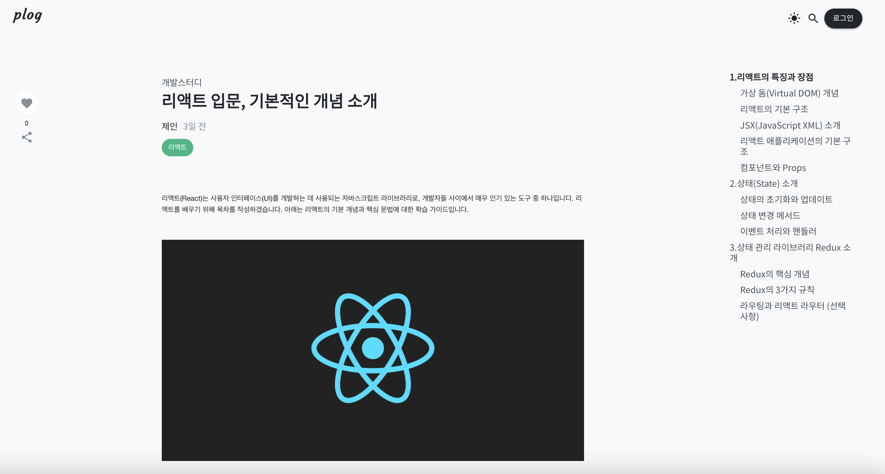

# Hello Frontend For Plog 👋
해당 부분은 Plog의 프론트엔드를 구성하는 각 요소 및 개발에 대한 내용을 담고 있습니다.

## Stacks
프론트엔드 개발에 사용한 기술 및 라이브러리는 아래와 같습니다. 만약 기술의 도입 근거에 대해 좀 더 자세히 알고 싶다면 ["_Plog의 프론트엔드 기술 도입 이유 읽어보기_"](/docs/plog-front/frontend_tech_stack/) 문서를 참고 부탁드립니다.

#### Environments

#### Config

#### Development

#### Deploy

 
 

## 페이지 모아보기
plog의 `개발자 블로그` 서비스 페이지를 한눈에 볼 수 있도록 정리했습니다. 

|                                                       블로그 홈                                                        |               포스팅 검색                |
|:------------------------------------------------------------------------------------------------------------------:|:-----------------------------------:|
|                                                                                                          |    |
|                                                     <b>로그인</b>                                                     |             <b>회원가입</b>             |
|                                                                                         |      |
|                                                     <b>포스팅</b>                                                     |            <b>새글 작성</b>             |
|                                                                                  |  |
|                                                    <b>내 프로그</b>                                                    |            <b>마이 페이지</b>            |
|                                                                                        |         |

 
 

# 핵심 기능 소개

plog의 블로그 페이지를 구현하며 가장 신경썼던 기능을 소개합니다. 

### `다크모드`

- 많은 사이트/어플리케이션에서 다크모드를 지원하고 있고, 사용자 경험 향상을 근거로 plog에도 다크모드 기능을 제공하기로 결정하였습니다.
- 토글 버튼을 이용하여 클릭 한번으로 간단하게 `라이트모드` / `다크모드`를 설정할 수 있습니다.
- local storage에 theme 정보를 기억하여 사용자가 지정한 테마를 반영구적으로 기억합니다.
- css 사용자 지정 속성을 이용하여 테마 별 색상 코드를 효율적으로 관리할 수 있습니다. 
- 보다 더 자세한 설명이 필요하시다면 ["_plog에서 다크모드를 구현한 방법_"](/docs/plog-front/frontend_darkmode/)문서를 참고 부탁드립니다. 

### `toc`

- 블로그의 기본이라고 할 수 있는 TOC 기능을 직접 구현하였습니다.
- HTML 문서 내의 제목을 수집하여 목차를 자동으로 생성하며, 이를 통해 문서의 구조를 시각적으로 파악할 수 있도록 하였습니다. 
- 블로그 글이 수정되면 TOC 구조도 자동으로 갱신되도록 구현하였습니다. 
- 스크롤 이동할 때 목차 강조 표시함으로써 사용자는 문서 내에서 현재 위치를 알 수 있습니다. 
- 사용자는 전체 문서를 스크롤하지 않고 클릭을 통해 특정 섹션으로 이동할 수 있습니다.
- ["_plog에서 TOC를 구현한 방법_"](/docs/plog-front/frontend_tech_stack/)문서에서 자세한 설명을 확인할 수 있습니다. 

### 이미지 첨부 `Drag&Drop`

- 사용자는 영역에 끌어다 놓는(드래그 앤 드랍) 동작으로 이미지를 편리하게 업로드할 수 있습니다.
- 파일을 직접 찾아 업로드 하는 것보다 직관적이며, 따라서 사용자에게 좋은 경험을 제공할 수 있다고 판단하였습니다. 
- `Toast UI` 에디터를 사용하여 구현하였습니다. 

### `무한 스크롤`

- 블로그 홈에 작성된 모든 게시글을 로딩하지 않고 사용자가 페이지를 스크롤 할 때마다 추가적으로 불러옵니다.
- 스크롤 위치를 감시하여 블로그 게시글을 15개씩 추가 로딩합니다.
- 따라서 초기 로딩속도를 빠르게 유지 할 수 있으며, 사용자는 데이터를 기다릴 필요 없이 게시글을 조회할 수 있습니다. 
