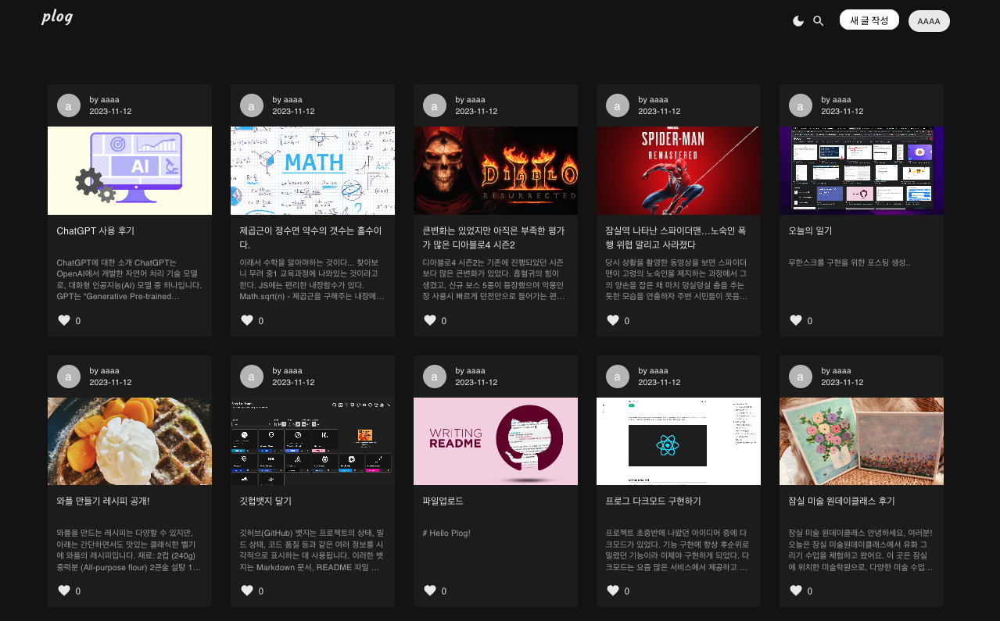
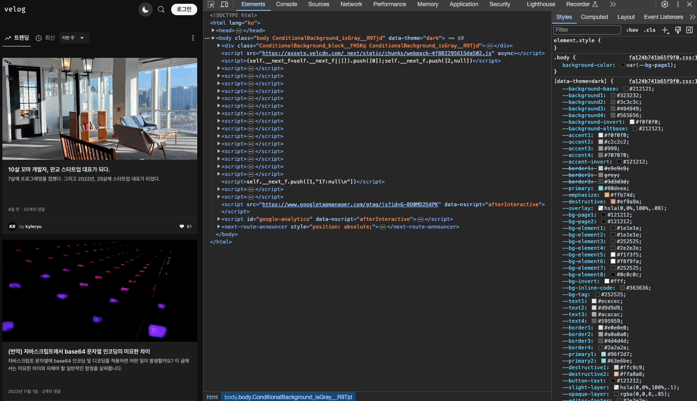
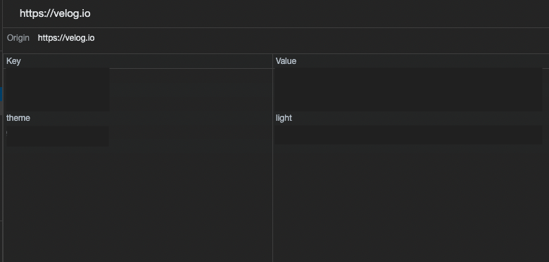

## 다크모드
  
다크 모드는 사용자 인터페이스(UI)나 애플리케이션의 테마를 어두운 색상으로 변경하는 디자인 옵션을 말합니다.  
주로 흑백의 어두운 배경과 밝은 텍스트를 사용하여 화면의 명암을 강조합니다.  
다크 모드는 웹사이트, 모바일 앱, 운영 체제 등에서 적용될 수 있으며, 사용자 설정에 따라 자동으로 변경되기도 합니다.  
대부분 웹사이트나 어플리캐이션에서는 토글 버튼 혹은 설정 메뉴를 통해 사용자가 선택할 수 있도록 제공하고 있습니다. 

다크모드의 장점으로는

`시각적 편의성` : 밝은 화면은 사용자의 눈을 피로하게 만들 수 있으며 야간이나 어두운 환경에서는 눈이 밝은 빛에 민감하게 반응할 수 있습니다.  
`에너지 절약`: 일부 디스플레이는 밝은 색을 표현할 때 더 많은 에너지를 소비하기도 하기 떄문에 다크 모드를 통해 배터리 수명을 보호할 수 있습니다.  
`미각적 트렌드`: 현대적인 느낌을 주며, 많은 사용자들이 선호하는 트렌드입니다. 또한 다수의 서비스에서 제공하고 있습니다. 

## React에서 다크모드를 적용하는 방법

리액트에서 다크모드를 적용하기 위해 구글링을 해 본 결과 크게 두가지 방법으로 요약되었습니다. 

#### styled-component 사용

#### context API 사용

## Plog에서 채택한 방법

### 다른 웹 사이트 조사 

다크모드를 구현하기 위해 참고한 사이트 중 `velog`에서는 다크모드를 어떻게 하고 있는지 살펴보았습니다.

velog에서는 헤더의 토글버튼을 클릭하면 가장 상단인 `<body>`태그의 `date-theme`라는 속성이 변경되고 있었습니다.
그리고 CSS의 사용자 변수 지정 기능을 이용하여 data-theme에 따른 서로 다른 디자인을 적용하고 있었습니다. 

또한, 이렇게 웹 브라우저의 local storage에 theme값을 저장하여 다크모드 / 라이트모드 상태를 기억하고 있는 것을 확인했습니다. 

저희가 다크모드를 도입하고자 한 시기는 기능 상 구현이 대부분 마무리되어가는 시기였기 때문에 도전적으로 기술을 도입하기 힘들었습니다.
따라서 `컴포넌트 파일의 수정을 최소화하는 것`이 1순위 조건이었습니다. 

따라서 velog에서 사용한 방법을 채택하는 것이 가장 최선이라고 판단하였습니다. 

## 다크모드 구현하기 

#### 1. 다크모드 디자인 가이드 만들기 (feat. CSS 사용자 속성)
#### 2. toggle button 생성하기 
#### 3. MUI 컴포넌트에도 적용하기
#### 4. Toast UI 에디터에서 다크모드 적용하기

