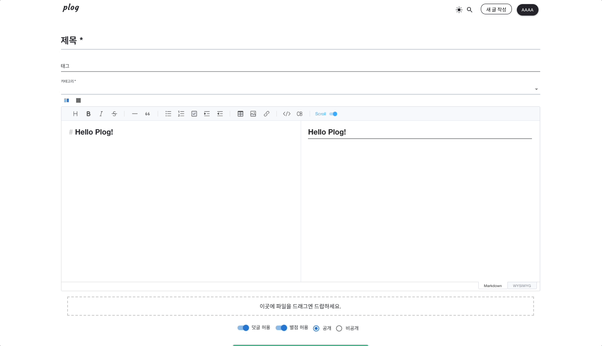

## 다크모드
  
다크 모드는 사용자 인터페이스(UI)나 애플리케이션의 테마를 어두운 색상으로 변경하는 디자인 옵션을 말합니다.  
주로 흑백의 어두운 배경과 밝은 텍스트를 사용하여 화면의 명암을 강조합니다.  
다크 모드는 웹사이트, 모바일 앱, 운영 체제 등에서 적용될 수 있으며, 사용자 설정에 따라 자동으로 변경되기도 합니다.  
대부분 웹사이트나 어플리캐이션에서는 토글 버튼 혹은 설정 메뉴를 통해 사용자가 선택할 수 있도록 제공하고 있습니다. 


다크모드의 장점으로는

`시각적 편의성` : 밝은 화면은 사용자의 눈을 피로하게 만들 수 있으며 야간이나 어두운 환경에서는 눈이 밝은 빛에 민감하게 반응할 수 있습니다.  
`에너지 절약`: 일부 디스플레이는 밝은 색을 표현할 때 더 많은 에너지를 소비하기도 하기 떄문에 다크 모드를 통해 배터리 수명을 보호할 수 있습니다.  
`미각적 트렌드`: 현대적인 느낌을 주며, 많은 사용자들이 선호하는 트렌드입니다. 또한 다수의 서비스에서 제공하고 있습니다. 


## React에서 다크모드를 적용하는 방법

리액트에서 다크모드를 적용하기 위해 구글링을 해 본 결과 크게 두가지 방법으로 요약되었습니다. 

#### styled-component 사용

#### context API 사용
- [아래 목차](#3-테마-상태값을-관리할-context-생성)에서 설명합니다.


## Plog에서 채택한 방법


### 다른 웹 사이트 조사 

다크모드를 구현하기 위해 참고한 사이트 중 `velog`에서는 다크모드를 어떻게 하고 있는지 살펴보았습니다.


velog에서는 헤더의 토글버튼을 클릭하면 가장 상단인 `<body>`태그의 `date-theme`라는 속성이 변경되고 있었습니다.
그리고 CSS의 사용자 변수 지정 기능을 이용하여 data-theme에 따른 서로 다른 디자인을 적용하고 있었습니다. 


또한, 이렇게 웹 브라우저의 local storage에 theme값을 저장하여 다크모드 / 라이트모드 상태를 기억하고 있는 것을 확인했습니다. 


저희가 다크모드를 도입하고자 한 시기는 기능 상 구현이 대부분 마무리되어가는 시기였기 때문에 도전적으로 기술을 도입하기 힘들었습니다.
따라서 `컴포넌트 파일의 수정을 최소화하는 것`이 1순위 조건이었습니다. 

따라서 velog에서 사용한 방법을 채택하는 것이 가장 최선이라고 판단하였습니다. 


## 다크모드 구현하기 


#### 1. 다크모드 디자인 가이드 만들기 (feat. CSS 사용자 속성)
```css
html[class~='dark'] {
    --bg-page1: #121212;
    --bg-card1: #1E1E1E;
    --bg-element1: #121212;
    --bg-element2: #121212;
    --bg-element3: #1E1E1E;
    --bg-element4: #c5c5c5;
    /*코드 생략*/

}

html[class~='light'] {
    --bg-page1: #F8F9FA;
    --bg-card1: #FFFFFF;
    --bg-element1: #FFFFFF;
    --bg-element2: #F8F9FA;
    --bg-element3: #F1F3F5;
    --bg-element4: #868E96;
    /*코드 생략*/
}

```
Css로 다크모드를 적용하기 위해서는 두가지 개념을 알고 있어야합니다. `속성 선택자`와 `사용자 정의 변수`입니다.  

`속성 선택자`는 태그가 특정 속성값을 가질 때 선택하기 위한 접근 선택자 중 하나입니다.  
`사용자 정의 변수`는 단어 그대로 css파일 내에서 변수를 이용하여 값을 재사용할 수 있게 하는 기능입니다.  
코드에서 확인할 수 있듯이 변수는 `--번수명` 형태로 선언 가능합니다. 이렇게 선언된 변수는 프로젝트 전역에서 접근할 수 있습니다. 

- 디자인 가이드는 velog를 참고하였습니다. 


#### 2. toggle button 생성하기 
```jsx
import React from "react";
import DarkModeIcon from '@mui/icons-material/DarkMode';
import LightModeIcon from '@mui/icons-material/LightMode';

export default function Header() {
    return (
        <div className='header inner-container'>
            <div><a href='/'><span className='logo darkmode'>plog</span></a></div>
            <div>
                <span className='mode-toggle-btn' onClick={changeMode}>
                    {theme === 'dark' ? <DarkModeIcon sx={{color: '#ECECEC'}}/> : <LightModeIcon/>}
                </span>
                {/*코드 생략*/}
            </div>
        </div>
    )
}
```
테마를 변경할 수 있는 토글버튼을 생성합니다. (`mui`에서 제공하는 icon을 사용하였습니다.)


#### 3. 테마 상태값을 관리할 context 생성
```jsx
import {createContext, useState} from "react";

export const ModeContext = createContext({
    theme: '',
    setTheme: (theme: string) => {
    }
})

const Root = () => {
    const mode = localStorage.getItem('mode') === 'dark' ? 'dark' : ''
    const [theme, setTheme] = useState<string>(mode);
    
    return (
        <div className='container'>
            <ModeContext.Provider value={{theme, setTheme}}>
                <Header/>
                <Outlet/>
            </ModeContext.Provider>
        </div>
    )
};

export default Root;
```
최상위 폴더 안에 컨텍스트를 생성하였습니다.
- `createContext`: createContext 함수를 사용하여 새로운 컨텍스트를 생성합니다.
- `ModeContext`: 생성된 컨텍스트를 나타내는 변수로, 이 컨텍스트를 다른 컴포넌트에서 사용할 수 있도록 export 합니다.
- `theme 및 setTheme`: 초기 값으로 빈 문자열('')을 가진 theme와 빈 함수를 가진 setTheme을 포함하는 객체를 컨텍스트의 기본 값으로 설정합니다.


Root 컴포넌트 파일 내에서 렌더링 될 때 상태값을 세팅합니다.
- `localStorage.getItem('mode')`: 로컬 스토리지에서 'mode'라는 키로 저장된 값을 가져와 Dark 모드 여부를 확인합니다. 
- `ModeContext.Provider`: Provider를 사용하여 자식 컴포넌트에 theme 및 setTheme을 전달합니다. 이를 통해 ModeContext에 있는 값을 하위 컴포넌트에서 사용할 수 있습니다.


#### 4. 토글 버튼에 이벤트 연결하기

헤더 컴포넌트가 처음 랜더링 될 때, 그리고 theme의 상태값이 변경될 때마다 html태그의 클래스를 추가합니다.
```js
  useEffect(() => {
    if (theme === '') {
        localStorage.setItem('mode', 'light')
        document.getElementsByTagName("html")[0].classList.add("light");
    } else if (theme === "dark") {
        document.getElementsByTagName("html")[0].classList.add("dark");
    }
  }, [theme]);
```

토글 버튼에 연결할 이벤트 함수를 생성합니다.
html의 클래스 이름에 'dark'와 'light' 중 무엇이 포함되었는지에 따라 알맞게 클래스 이름을 가감해줍니다. 
해당 모드를 계속 기억하기 위해 local storage에도 저장해주었습니다. 
```js
   const darkOnOff = () => {
        if (document.getElementsByTagName("html")[0].classList.contains("dark")) {
            document.getElementsByTagName("html")[0].classList.remove("dark");
            document.getElementsByTagName("html")[0].classList.add("light");
            localStorage.setItem("mode", "light");
            setTheme('')
        } else {
            document.getElementsByTagName("html")[0].classList.remove("light");
            document.getElementsByTagName("html")[0].classList.add("dark");
            localStorage.setItem("mode", "dark");
            setTheme('dark')
        }
    };
```

<br/>
<br/>
<strong>최종 코드</strong>

```jsx
import React, {useContext} from "react";
import {ModeContext} from "../../Root";

export default function Header() {
    
    const {theme, setTheme} = useContext(ModeContext) //Root 파일에서 생성한 컨텍스트 사용
    const changeMode = () => darkOnOff()
    
    useEffect(() => {
        if (theme === '') {
            localStorage.setItem('mode', 'light')
            document.getElementsByTagName("html")[0].classList.add("light");
        } else if (theme === "dark") {
            document.getElementsByTagName("html")[0].classList.add("dark");
        }
    }, [theme]);

    const darkOnOff = () => {
        if (document.getElementsByTagName("html")[0].classList.contains("dark")) {
            document.getElementsByTagName("html")[0].classList.remove("dark");
            document.getElementsByTagName("html")[0].classList.add("light");
            localStorage.setItem("mode", "light");
            setTheme('')
        } else {
            document.getElementsByTagName("html")[0].classList.remove("light");
            document.getElementsByTagName("html")[0].classList.add("dark");
            localStorage.setItem("mode", "dark");
            setTheme('dark')
        }
    };

    return (
        <div className='header inner-container'>
            <div><a href='/'><span className='logo darkmode'>plog</span></a></div>
            <div>
                <span className='mode-toggle-btn' onClick={changeMode}>
                    {theme === 'dark' ? <DarkModeIcon sx={{color: '#ECECEC'}}/> : <LightModeIcon/>}
                </span>
            </div>
            {/*코드 생략*/}
        </div>
    )
}
```
#### 5. MUI 컴포넌트에도 적용하기
기본적인 html 태그의 경우 위의 방법으로 간단하게 색상을 변경할 수 있었습니다.  
하지만, MUI element의 경우 내부 구조와 스타일이 이미 정의되어 있기 때문에 누구나 편리하게 일정 수준 이상의 디자인을 구현해날 수 있지만, 
커스텀 디자인을 적용하기에는 다소 까다롭다는 단점이 존재했습니다.  

물론 MUI에서는 Theme를 통해 스타일을 일괄적으로 변경할 수도 있지만, 현실적으로 적용하기에는 무리가 있었습니다.  
따라서 저희는 적용이 안된 MUI 컴포넌트에 대해서는 `CSS-in-js` 방법으로 직접 변경을 하는 방법을 선택하였습니다. 

```jsx
  <TextField
    sx={{
        '& textarea':{color: 'var(--text1)'},
        '& fieldset':{borderColor: 'var(--form-border)'},
        '& .MuiInputBase-root-MuiInput-root':{color:'var(--text1)'},
    }}
    InputProps={{style: {padding: '4px'}}}
    InputLabelProps={{style: {fontSize: '16px'}}}
    defaultValue={myPageInfo.shortIntro && myPageInfo.shortIntro.length > 0 ? myPageInfo.shortIntro : "짧은 소개를 작성해보세요!"}
    onChange={handleIntroChange}
    fullWidth
/>
```
#### 6. Toast UI 에디터에서 다크모드 적용하기
Toast UI Editor에서는 다크모드를 제공하고 있습니다.  
Theme라는 속성을 통해 "dark"인 경우에는 다크모드, "default" 인 경우에는 라이트모드로 설정할 수 있습니다. 

그러나 상태값이 정상적으로 변경되는 것도 확인했으나 막상 동작하지 않는 이슈가 있었습니다.  
[관련 이슈](https://github.com/nhn/tui.editor/issues/1618)를 참고하여 알아보니, 해당 DOM element의 classList에 다크모드 class명을 추가,삭제하며 핸들링하고 있었습니다.

에디터가 다크모드일 때의 class 이름을 확인하여 아래와 같은 코드를 추가하였습니다. 

```jsx
export const PlogEditor = React.forwardRef((props: PlogEditorProps, ref: LegacyRef<Editor>) => {
    const theme = useContext(ModeContext);
    
   const modeCheck = () => {
        const editorEl = document.getElementsByClassName("toastui-editor-defaultUI")[0];

        if (editorEl) {
            if (theme.theme === 'dark') {
                editorEl.classList.add("toastui-editor-dark");
            } else {
                editorEl.classList.remove("toastui-editor-dark");
            }
        }
    }

    useLayoutEffect(() => {
        modeCheck()
    }, [theme.theme])

    return (
        <Box>
            <Editor/>
        </Box>
    )
})
```

##### 동작 화면
  