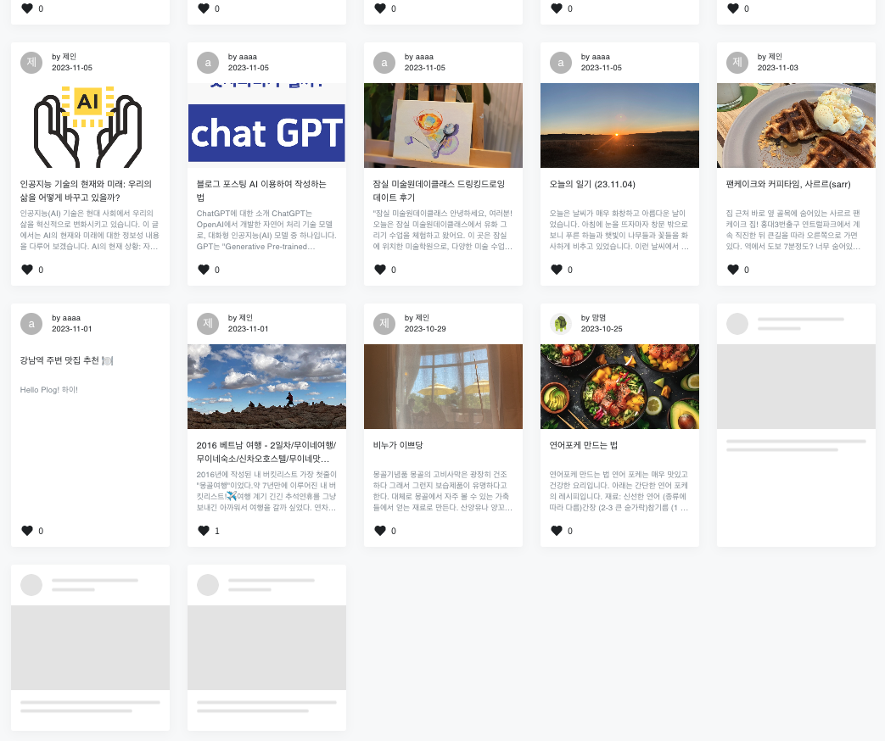

## Infinity Scroll(무한스크롤)

`Infinity Scroll`는 웹 페이지에서 콘텐츠를 자동으로 로드하여 사용자가 스크롤을 끝까지 내릴 때마다 새로운 콘텐츠를 계속해서 표시하는 디자인 패턴입니다. 
사용자가 페이지의 끝에 도달할 때마다 "더 보기" 버튼을 클릭하거나 다음 페이지로 이동하는 대신에 스크롤을 통해 자연스럽게 콘텐츠를 로드할 수 있게 하여 사용자 경험을 향상시키는 데 도움이 됩니다.


Plog의 메인 페이지에서 최종 구현된 화면은 아래와 같습니다. 


## Infinity Scroll의 기본 플로우 
무한스크롤의 기본적인 동작은 아래와 같은 흐름을 갖습니다. 

1. `초기 로딩` : 페이지가 로드될 때 몇개의 콘텐츠가 표시됩니다.
2. `스크롤 이벤트 감지` : 사용자가 스크롤을 내리면 스크롤 이벤트가 감지됩니다.
3. `자동 로딩` : 스크롤이 일정 위치에 도달하는 순간, 추가적인 콘텐츠를 동적으로 로드합니다.
4. `콘텐츠 추가` : 가져온 데이터는 페이지에 동적으로 추가되어 사용자가 스크롤을 이어 나갈 때 새로운 콘텐츠가 표시됩니다.
5. `반복` : 사용자가 스크롤을 계속 내리면 위의 과정이 계속 반복됩니다.


## Plog에서는 어떻게 구현했나?
Plog에서 구현한 방법도 위의 플로우와 비슷합니다.  
초기 컨텐츠가 로딩된 후, 마지막 콘텐츠가 특정 스크롤 위치로 오면 그 다음 컨텐츠를 서버에 요청합니다. 


#### 1. 초기 컨텐츠 로딩

`useEffect` hooks를 이용하여 첫 랜더링 시 포스팅을 불러오도록 작성했습니다.
```tsx
   useEffect(() => getPosting(), [])
```

`getPosting` 은 서버에 컨텐츠 정보를 요청하는 함수입니다. 아래와 같이 작성했습니다.  

최초 로딩의 경우 `lastCursorID`초기값은 `null`이기 때문에 0~15번째 포스팅을 불러오며,  
이후 `lastCursorID`값이 있으면 `lastCursorID`번째 부터 15개씩 불러옵니다.  
서버에서 요청한 포스팅 데이터를 `setPosting`를 통해 상태값을 변경합니다. 

```tsx
    const getPosting = async () => {
        try {
            let res;
            if (lastCursorID === null) {
                res = await plogAxios.get(`/home/recent-postings?pageSize=${pageSize}`)
            } else {
                res = await plogAxios.get(`/home/recent-postings?lastCursorID=${lastCursorID}&pageSize=${pageSize}`)
            }

            const postingArr = res.data.homePostings 
            const cursor = postingArr[postingArr.length - 1].postingID // setLastCursorID값 재설정

            if (lastCursorID === null) {
                setPosting(postingArr); // 최초 로드한 포스팅
            } else {
                setPosting([...posting, ...postingArr]); // 최초 로드한 포스팅 + 스크롤 시 추가 로드한 포스팅
            }
            setLastCursorID(cursor);
        } catch (err) {
            console.log(err);
        }
    }
```

#### 2. 스크롤 이벤트 등록 및 감지

`useEffect`를 통해 페이지가 로딩될 때 스크롤 이벤트를 등록해줍니다.  
페이지를 벗어나면 해당 이벤트를 제거하기 위해 `return`문을 작성해주었습니다. 
```tsx
   useEffect(() => {
        window.addEventListener("scroll", handleScroll);
        return () => {
            window.removeEventListener("scroll", handleScroll);
        };
    });

```

등록한 `handleScroll` 이벤트 핸들러는 아래와 같이 구현하였습니다.  
특정 위치에 스크롤바가 오게되면 포스팅을 로드하는 API요청을 보냅니다. 
```ts
    const handleScroll = () => {
        const scrollHeight = document.documentElement.scrollHeight;
        const scrollTop = window.scrollY;
        const clientHeight = document.documentElement.clientHeight;

        if (scrollTop + clientHeight + 1 >= scrollHeight) {
            getPosting()
        }
    };
```


#### 3. 로딩 시 스켈레톤 UI 추가하기
서버에 추가 데이터를 요청을 할 때 로딩중이라는 시각적 표시가 없다면, 사용자는 데이터를 받아오는 중이라 다음 컨텐츠를 볼 수 없는 것인지, 컨텐츠가 끝났기 떄문에 다음 컨텐츠가 없는 것인지 명확하게 인지할 수 없습니다.   

따라서 추가 콘텐츠를 로드하고 있느 중에 사용자가 정보를 알 수 있는 UI를 추가할 필요가 있었습니다.
저희는 `스켈레톤UI` 컴포넌트를 만들어 적용하였습니다. 
> 스켈레톤 UI는 실제 데이터가 렌더링 되기 전에 보이게 될 화면의 윤곽을 먼저 그려주는 로딩 애니메이션입니다. 그렇기 떄문에 사용자가 예상하고 있는 콘텐츠에 대한 이해도를 향상시키는 효과와 더불어 페이지 내 요소의 배치 및 구조를 시각적으로 일관되게 유지할 수 있어 전반적인 사용자 경험을 높여줍니다.



Skeleton 컴포넌트를 하나하나 만들 수도 있었지만, Plog의 홈포스팅 카드를 만들 떄 MUI를 이용하기도 했고 기본적으로 [MUI](https://mui.com/material-ui/react-skeleton/)에서 Skeleton UI를 제공하고 있어서 이를 활용하기로 했습니다.

홈포스팅 카드 컴포넌트의 구조를 그대로 가져와 내용을 제목과 사진 대신 Skeleton 컴포넌트로 대체해주었습니다. 

```tsx
 const SkeletonCard = () => {
        const numbers = Array.from({length: 3}, (_, index) => index);

        return (
            <>
                {numbers.map(number => (
                    <Card key={number}
                          sx={{
                              width: 280,
                              display: 'inline-block',
                              margin: '1rem',
                              boxShadow: 'rgba(0, 0, 0, 0.04) 0px 4px 16px 0px',
                          }}>
                        <CardHeader
                            avatar={<Skeleton animation="wave" variant="circular" width={40} height={40}/>}
                            title={<Skeleton animation="wave" height={10} width="80%" style={{marginBottom: 6}}/>}
                            subheader={<Skeleton animation="wave" height={10} width="40%"/>}/>
                        <Skeleton sx={{height: 150}} animation="wave" variant="rectangular"/>
                        <CardContent sx={{paddingBottom: 0,}}>
                            <Skeleton animation="wave" height={10} style={{marginBottom: 6}}/>
                            <Skeleton animation="wave" height={10} width="80%" style={{marginBottom: 6}}/>
                        </CardContent>
                    </Card>
                ))}
            </>
        )
    }
```

이렇게 만들어진 Skeleton 컴포넌트를 &연산자를 이용해 로딩중일 때만 렌더링하도록 하였습니다. 
```tsx
    <div className='posting-container'>
    <div className='postcard-wrapper inner-container'>
        {posting.length && posting.map((post: postType) => <PostCard key={post.postingID} post={post}/>)}
        {isLoading && <SkeletonCard/>}
    </div>
</div>
```


구현 단계에 따라 설명해서 코드가 파편적인 느낌이 있지만, 작성한 내용은 아래 4개로 요약할 수 있습니다. 
- 포스팅을 불러오는 함수
- 스크롤 이벤트를 감지하는 함수
- `useEffect`를 이용하여 함수 호출 
- 사용자 편의를 위한 skeleton 컴포넌트 

전체 코드는 아래에서 확인 가능합니다. 

<br/>
<details>
<summary>전체 코드 확인하기</summary>
<div>

```tsx
//BlogMain.tsx
import React, {useEffect, useState} from 'react';
import {plogAxios} from "../../modules/axios";
import PostCard from '../../components/blog/PostCard';
import jwt_decode from "jwt-decode";
import Skeleton from '@mui/material/Skeleton';
import {Card, CardContent, CardHeader} from "@mui/material";
import {postType} from "../../types/PostingType";

const BlogMain = () => {
    let token = localStorage.getItem('token')

    const [posting, setPosting] = useState<postType[]>([]);
    const [lastCursorID, setLastCursorID] = useState<number | null>(null)
    const [pageSize] = useState<number>(15);
    const [isLoading, setIsLoading] = useState<boolean>(false);

    useEffect(() => {
        if (token !== null) {
            const decoded = jwt_decode(token);
            // @ts-ignore
            localStorage.setItem('userID', decoded.userID)
        }
        getPosting()
    }, [])

    useEffect(() => {
        window.addEventListener("scroll", handleScroll);
        return () => {
            window.removeEventListener("scroll", handleScroll);
        };
    });

    const getPosting = async () => {
        if (isLoading) return;
        setIsLoading(true);

        try {
            let res;
            if (lastCursorID === null) {
                res = await plogAxios.get(`/home/recent-postings?pageSize=${pageSize}`)
            } else {
                res = await plogAxios.get(`/home/recent-postings?lastCursorID=${lastCursorID}&pageSize=${pageSize}`)
            }

            const postingArr = res.data.homePostings
            const cursor = postingArr[postingArr.length - 1].postingID

            if (lastCursorID === null) {
                setPosting(postingArr);
            } else {
                setPosting([...posting, ...postingArr]);
            }
            setLastCursorID(cursor);
        } catch (err) {
            console.log(err);
        }

        setIsLoading(false);
    }


    // 스크롤 이벤트 핸들러
    const handleScroll = () => {
        const scrollHeight = document.documentElement.scrollHeight;
        const scrollTop = window.scrollY;
        const clientHeight = document.documentElement.clientHeight;

        if (scrollTop + clientHeight + 1 >= scrollHeight) {
            getPosting()
        }

    };


    const SkeletonCard = () => {
        const numbers = Array.from({length: 3}, (_, index) => index);

        return (
            <>
                {numbers.map(number => (
                    <Card key={number}
                          sx={{
                              width: 280,
                              display: 'inline-block',
                              margin: '1rem',
                              boxShadow: 'rgba(0, 0, 0, 0.04) 0px 4px 16px 0px',
                          }}>
                        <CardHeader
                            avatar={<Skeleton animation="wave" variant="circular" width={40} height={40}/>}
                            title={<Skeleton animation="wave" height={10} width="80%" style={{marginBottom: 6}}/>}
                            subheader={<Skeleton animation="wave" height={10} width="40%"/>}/>
                        <Skeleton sx={{height: 150}} animation="wave" variant="rectangular"/>
                        <CardContent sx={{paddingBottom: 0,}}>
                            <Skeleton animation="wave" height={10} style={{marginBottom: 6}}/>
                            <Skeleton animation="wave" height={10} width="80%" style={{marginBottom: 6}}/>
                        </CardContent>
                    </Card>
                ))}
            </>
        )
    }

    return (
        <div className='posting-container'>
            <div className='postcard-wrapper inner-container'>
                {posting.length && posting.map((post: postType) => <PostCard key={post.postingID} post={post}/>)}
                {isLoading && <SkeletonCard/>}
            </div>
        </div>
    )
};

export default BlogMain;
```
</div>
</details>