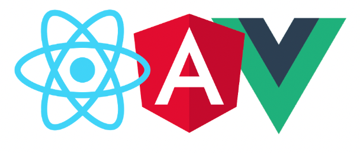

## React 

#### 프론트엔드 프레임워크(라이브러리) 비교

대표적인 프론트엔드 라이브러리 프레임워크는 리액트, 뷰, 앵귤러가 있습니다.  
(리액트는 프레임워크가 아닌 라이브러리지만 표현 상 프레임워크로 칭하겠습니다.)

세개의 프레임워크 모두 web-app을 만들 때 사용되며, 바닐라 자바스크립트로 만들 때보다 쉽게 개발이 가능하다는 장점이 있습니다,
`앵귤러`의 경우 러닝커브가 높고. 사용해본 경험이 있는 팀원이 없었기 때문에 초기 학습 시간이 오래 소요될 것 같다는 판단으로 후보에서 제외하였습니다.


[코드너리](https://www.codenary.co.kr/statistics/list?category=%ED%94%84%EB%A1%A0%ED%8A%B8%EC%97%94%EB%93%9C)라는 서비스에서 국내 서비스의 기술 스택을 조사해본 결과,  
리액트JS를 사용하는 기업이 총 184개, Vue를 사용하는 기업이 총 76개로 나타났습니다.  
물론, 혼용해서 사용하는 경우가 가장 많았습니다.

- react를 이용하는 국내 서비스 : 카카오뱅크, 원티드랩, 토스, 당근
- vue를 이용하는 국내 서비스 : 네이버웹툰, 라인, 카카오스타일, 에이블리, 여기어때, 강남언니

처음엔 Vue로 진행할 예정이었으나, 기존 프론트엔드 개발자가 떠나고 제가 새로 합류하게 되면서 제게 좀 더 익숙한 프레임워크인 리액트를 채택하였습니다. 

#### ReactJS를 채택한 이유
- 제가 합류한 시점에 이미 백엔드 개발은 마무리 된 상태였기 때문에 제가 Vue를 공부하며 프론트엔드 개발을 진행할 `시간적 여유가 없다고 판단`한 것이 가장 큰 이유였습니다.
- 또한 프론트엔드 개발 중에 필연적으로 이슈가 발생하게 됩니다. 그 상황에서 한 명이라도 프레임워크에 대한 이해도가 있어야 시행착오 기간을 줄일 수 있습니다.
- 위 통계에서도 보다시피 다양한 서비스들이 리액트를 사용하여 개발되었고, 어떻게 구현할지, 구현할 수 있는 기능인지 등 레퍼런스가 비교적 다양합니다. 
- 덧붙어, 개발 언어를 숙력도가 낮은 타입스크립트로 결정했기 때문에 커뮤니티가 가장 큰 리액트를 채택하여 빠르게 해결방법을 찾고 피드백을 얻는게 중요했습니다. 


## TypeScript

#### JavaScript  vs  TypeScript

TypeScript는 JavaScript의 슈펴셋으로 JavaScript에서 제공하는 기능을 그대로 사용할 수 있습니다.
JavaScript TypeScript 차이는 간단하게 말해 `type`을 명시하는지, 아닌지입니다. 
JavaScript 변수를 선언할때 자료형을 따로 명시할 필요가 없지만 TypeScript의 경우 아래처럼 자료형을 같이 명시합니다. 

```ts
const a:number = 1;
const b:number = 2;
```


간단하게 차이를 그려보자면 아래 표로 정리할 수 있습니다. 


|      JavaScript      |     TypeScript     |
|:--------------------:|:------------------:|
| 동적 타입 언어  / 인터프리터 언어 | 정적 타입 언어  / 컴파일 언어 |
|       독립적 사용가능       |    자바스크립트에 의존적     |
|    타임에 제한이 없어 유연함    |     타입에 제한을 받음     |
|     간단한 프로젝트에 적합     |  비교적 복잡한 프로젝트에 적합  |


개인적으로 타입을 지정하지 않아 유연하다는 것이 JavaScript의 장점이라고 생각하고 있기 때문에, TypeScript의 필요성에 의문을 가지고 있었습니다.
제가 느꼈을 때는 타입을 지정하여 줄일 수 있는 에러보다는 초기 설정이 까다롭고, 개발을 시작하기 전에 데이터의 타입과 형태를 미리 지정해서 설계해야하고, 
코드가 길어져 가독성이 떨어진다는 단점이 더 크게 다가왔습니다. 


그럼에도 불구하고 이번 프로젝트에서 TypeScript를 채택한 이유는 아래와 같습니다. 

#### 채택 이유
- 리액트와의 호환성도 좋은 편이며, 자바스크립트의 슈퍼셋이기 때문에 자바스크립트의 기능을 그대로 사용가능합니다. 따라서 새로 들어가는 프로젝트에서 굳이 채택하지 않을 이유가 없었습니다. 
- 타입스크립트 장점인 타입 에러를 줄일 수 있다는 것을 직접 경험해봄으로써 과연 JavaScript보다 효율적인가를 직접 판단하고 싶었습니다.
- 학습을 목적으로 한 사이드 프로젝트이기 때문에 이미 익숙한 자바스크립트 사용하는 것보다 숙련도가 낮은 타입스크립트를 채택하는 것이 개인적으로 더 도움이 된다고 생각했습니다. 
- 많은 스타트업, 서비스에서 TypeScript로 개발한 경험을 요구하고 있습니다. 

