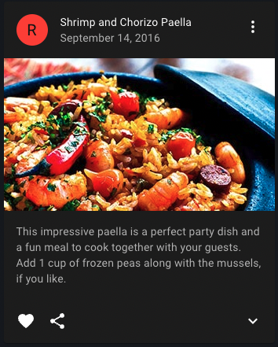
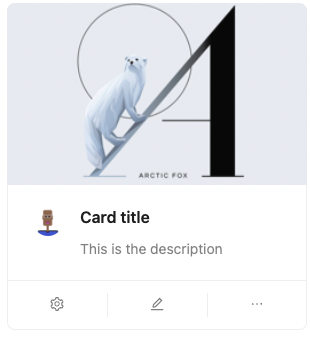
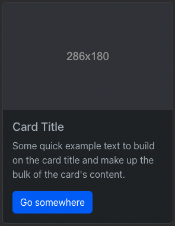

## React 

#### 프론트엔드 프레임워크(라이브러리) 비교

대표적인 프론트엔드 라이브러리 프레임워크는 리액트, 뷰, 앵귤러가 있습니다.  
(리액트는 프레임워크가 아닌 라이브러리지만 표현 상 프레임워크로 칭하겠습니다.)

세개의 프레임워크 모두 web-app을 만들 때 사용되며, 바닐라 자바스크립트로 만들 때보다 쉽게 개발이 가능하다는 장점이 있습니다,
`앵귤러`의 경우 러닝커브가 높고. 사용해본 경험이 있는 팀원이 없었기 때문에 초기 학습 시간이 오래 소요될 것 같다는 판단으로 후보에서 제외하였습니다.


[코드너리](https://www.codenary.co.kr/statistics/list?category=%ED%94%84%EB%A1%A0%ED%8A%B8%EC%97%94%EB%93%9C)라는 서비스에서 국내 서비스의 기술 스택을 조사해본 결과,  
리액트JS를 사용하는 기업이 총 184개, Vue를 사용하는 기업이 총 76개로 나타났습니다.  
물론, 혼용해서 사용하는 경우가 가장 많았습니다.

- react를 이용하는 국내 서비스 : 카카오뱅크, 원티드랩, 토스, 당근
- vue를 이용하는 국내 서비스 : 네이버웹툰, 라인, 카카오스타일, 에이블리, 여기어때, 강남언니

처음엔 Vue로 진행할 예정이었으나, 기존 프론트엔드 개발자가 떠나고 제가 새로 합류하게 되면서 제게 좀 더 익숙한 프레임워크인 리액트를 채택하였습니다. 

#### ReactJS를 채택한 이유
- 제가 합류한 시점에 이미 백엔드 개발은 마무리 된 상태였기 때문에 제가 Vue를 공부하며 프론트엔드 개발을 진행할 `시간적 여유가 없다고 판단`한 것이 가장 큰 이유였습니다.
- 또한 프론트엔드 개발 중에 필연적으로 이슈가 발생하게 됩니다. 그 상황에서 한 명이라도 프레임워크에 대한 이해도가 있어야 시행착오 기간을 줄일 수 있습니다.
- 위 통계에서도 보다시피 다양한 서비스들이 리액트를 사용하여 개발되었고, 어떻게 구현할지, 구현할 수 있는 기능인지 등 레퍼런스가 비교적 다양합니다. 
- 덧붙어, 개발 언어를 숙력도가 낮은 타입스크립트로 결정했기 때문에 커뮤니티가 가장 큰 리액트를 채택하여 빠르게 해결방법을 찾고 피드백을 얻는게 중요했습니다. 


## TypeScript

#### JavaScript  vs  TypeScript

TypeScript는 JavaScript의 슈펴셋으로 JavaScript에서 제공하는 기능을 그대로 사용할 수 있습니다.
JavaScript TypeScript 차이는 간단하게 말해 `type`을 명시하는지, 아닌지입니다. 
JavaScript 변수를 선언할때 자료형을 따로 명시할 필요가 없지만 TypeScript의 경우 아래처럼 자료형을 같이 명시합니다. 

```ts
const a:number = 1;
const b:number = 2;
```


간단하게 차이를 그려보자면 아래 표로 정리할 수 있습니다. 


|      JavaScript      |     TypeScript     |
|:--------------------:|:------------------:|
| 동적 타입 언어  / 인터프리터 언어 | 정적 타입 언어  / 컴파일 언어 |
|       독립적 사용가능       |    자바스크립트에 의존적     |
|    타임에 제한이 없어 유연함    |     타입에 제한을 받음     |
|     간단한 프로젝트에 적합     |  비교적 복잡한 프로젝트에 적합  |


개인적으로 타입을 지정하지 않아 유연하다는 것이 JavaScript의 장점이라고 생각하고 있기 때문에, TypeScript의 필요성에 의문을 가지고 있었습니다.
제가 느꼈을 때는 타입을 지정하여 줄일 수 있는 에러보다는 초기 설정이 까다롭고, 개발을 시작하기 전에 데이터의 타입과 형태를 미리 지정해서 설계해야하고, 
코드가 길어져 가독성이 떨어진다는 단점이 더 크게 다가왔습니다. 


그럼에도 불구하고 이번 프로젝트에서 TypeScript를 채택한 이유는 아래와 같습니다. 

#### 채택 이유
- 리액트와의 호환성도 좋은 편이며, 자바스크립트의 슈퍼셋이기 때문에 자바스크립트의 기능을 그대로 사용가능합니다. 따라서 새로 들어가는 프로젝트에서 굳이 채택하지 않을 이유가 없었습니다. 
- 타입스크립트 장점인 타입 에러를 줄일 수 있다는 것을 직접 경험해봄으로써 과연 JavaScript보다 효율적인가를 직접 판단하고 싶었습니다.
- 학습을 목적으로 한 사이드 프로젝트이기 때문에 이미 익숙한 자바스크립트 사용하는 것보다 숙련도가 낮은 타입스크립트를 채택하는 것이 개인적으로 더 도움이 된다고 생각했습니다. 
- 많은 스타트업, 서비스에서 TypeScript로 개발한 경험을 요구하고 있습니다. 


## MUI (Material-UI)


#### React UI 라이브러리 종류
React에서 사용할 수 있는 UI 라이브러리 종류는 매우 다양합니다. 대표적으로는 Plog에서 채택한 [`MUI`](https://mui.com/)를 비롯하여 [`ant design`](https://ant.design/), [`react bootstrap`](https://react-bootstrap.netlify.app/), [`tailwindCSS`](https://tailwindcss.com/) 등이 있습니다.  

우선 이러한 UI 라이브러리를 사용하는 이유는 직접 컴포넌트 디자인을 만드는 것보다 시간과 노력이 적게 소요되고, 대부분 어느정도 반응형을 지원하고 있기 때문에 
디바이스나 브라우저 크기의 차이를 어느정도 커버해주기 때문입니다. 따라서 개발자는 CSS를 꾸미는 것보다 기능 개발에 집중할 수 있습니다. 

Plog는 블로그를 기반으로 한 서비스이기 때문에 그와 관련된 컴포넌트를 가장 많이 제공하는 라이브러리를 찾아야했습니다. 가령, 차트나 대시보드에 특화된 것 보다는 카드 형태의 UI, 프로필 관련 UI, 태그와 같은 컴포넌트들이 더 중요했습니다. 
우리에게 필요한 컴포넌트와 인기도를 기준으로 추려진 후보는 `MUI`, `ant Design`, `react bootstrap` 3개 입니다.  

##### 라이브러리 비교

|              MUI               |           ant Design           |               react bootstrap               |
|:------------------------------:|:------------------------------:|:-------------------------------------------:|
|             구글 개발              |            알리바바 개발             |                   트위터 개발                    |
|        JS, TS 예제 코드 제공         |        JS, TS 예제 코드 제공         |                 JS 예제 코드 제공                 |
|        대부분 필요한 컴포넌트 제공         |        대부분 필요한 컴포넌트 제공          |          대부분 필요한 컴포넌트 제공             |
|  |  |  |


#### 채택 이유
- 필요한 컴포넌트는 세개의 라이브러리 모두 제공하고 있었습니다. MUI에서 제공하는 Card 컴포넌트가 저희가 생각하는 형태와 거의 동일했습니다.
- MUI는 리액트와 높은 호환성을 가지고 있고, 많은 양의 자료와 도구들을 빠르게 개발할 수 있습니다.
- 커스터마이징이 자유롭진 않으나, 이미 정형화 된 디자인이 되어있어 디자이너가 없는 프로젝트 환경에 적합하다고 판단했습니다.
- 디자인과 관련된 라이브러리이기 때문에 미적인 요소도 중요한 판단 기준이었습니다. 팀원들의 취향울 반영하여 가장 깔끔하고, 마음에 드는 디자인이었습니다.  


## Toast UI Editor

리액트에서 텍스트 편집 라이브러리를 검색하면 `draft`, `quill`, `jobit`이 먼저 나옵니다. 하지만 저희 프로젝트에서는 `Toast UI Editor`를 선택하였습니다.
`Toast UI Editor`는 NHN 엔터테인먼트에서 개발한 텍스트 편집 도구로 개발자들에게 친숙한 마크다운 문법과 위지윅 화면을 모두 제공합니다.
<div>


</div>

#### 채택 이유
- 마크다운와 위지윅을 모두 지원하는 무료 오픈소스 라이브러리로 리액트, 바닐라JS 환경에서도 사용 가능했습니다.
- Plog는 국내 유저를 대상으로 하는 서비스이기 떄문에 한글에 맞춤화된 에디터가 필요했습니다. Toast UI Editor는 국내 업체가 만든 국내 오픈소스이므로 **한글에 가장 적합할 것**이라고 판단하였습니다. 
- 문서 편집과 뷰어를 모두 제공하고 있으며 해당 에디터의 문서 설명이 쉽게 잘 되어 있었습니다.
- 에디터의 디자인도 다른 라이브러리와 비교했을 때 가장 깔끔한 느낌이었습니다. 


##  AWS Amplify

#### 프론트엔드 배포 방법
프론트엔드 페이지를 배포하는 방법은 여러 가지가 있겠지만 가장 일반적인 방법은 아래와 같습니다. 

1. **GitHub Pages를 이용한 배포**
   - github pages의 기능을 이용하여 배포하는 방식입니다. github에 있는 프로젝트 설정에서 Pages에서 배포할 branch를 설정한 후,url 주소를 이용하여 접속할 수 있습니다.  
2. **Netlify를 이용한 배포**
   - Netlify는 정적 사이트를 무료로 호스팅해주는 서비스로, GitHub, GitLab, Bitbucket과 같은 저장소와 연동하여 자동 배포를 지원합니다. 프로젝트를 저장소에 업로드한 후, [Netlify](https://www.netlify.com/)에서 연동하면 됩니다. 
   - Netlify는 기본적으로 React 앱을 자동으로 감지하고 빌드 설정을 수행하기 때문에 대부분 별다른 설정이 필요하지 않습니다.
   - 자동 배포를 설정할 수 있어, 저장소에 변경이 있을 때마다 자동으로 빌드합니다.
3. **nginx를 이용한 배포**
   - react 빌드 결과의 정적 리소스 파일을 nginx와 연결하여 배포합니다.
4. **Firebase를 이용한 배포**
   -  Firebase는 Google이 제공하는 개발 플랫폼입니다. 그 중  Firebase Hosting을 통해 정적, 동적 컨텐츠를 쉽게 배포할 수 있습니다.
   

#### AWS Amplify란?


`AWS Amplify`는 AWS 리소스들을 이용하여 손쉽게 호스팅, 배포까지 개발하도록 돕는 서비스의 모음입니다.
여기에는 클라이언트 앱 개발을 위한 종합적인 SDK, 라이브러리, 도구 및 설명서가 같이 포함되어 있습니다.
JavaScript, React, Angular, Vue, Next.js 등의 널리 사용되는 웹 프레임워크와 대부분의 모바일 플랫폼을 지원합니다.  


#### 채택 이유
- Amplify Console App을 생성하는 절차가 간편하며 Amplify는 지속적 배포 서비스이기 때문에 배포 과정이 간단한 편입니다. 직접 사용해본 결과 예상보다 더 쉽고 간편했습니다. Amplify 콘솔에서 시키는대로 저장소의 repository를 연결하면 됩니다. 
- SSL 인증서 적용과 Custom Domain 설정 역시 매우 간단하게 할 수 있었습니다. 
- 지정한 Branch에 Pull Request를 생성하면 해당 Pull Request에 대한 독립적인 호스팅 환경이 만들어집니다.
- 아울러 미리보기를 지원하기 때문에 직접 실행해보지 않고도 배포 화면을 확인할 수 있다는 장점도 크게 다가왔습니다. 
- 백엔드 역시 AWS를 사용하여 배포하고 있기 때문에 프론트도 같은 서비스를 사용하는 것이 효율적이라고 판단하였습니다. 