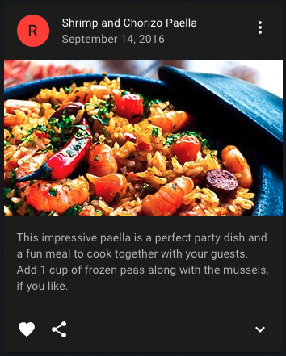
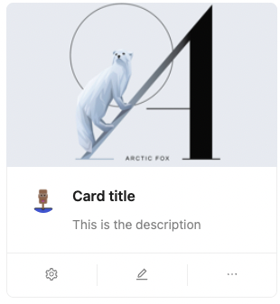

## MUI (Material-UI)

#### React UI 라이브러리 종류
React에서 사용할 수 있는 UI 라이브러리 종류는 매우 다양합니다. 대표적으로는 Plog에서 채택한 [`MUI`](https://mui.com/)를 비롯하여 [`ant design`](https://ant.design/), [`react bootstrap`](https://react-bootstrap.netlify.app/), [`tailwindCSS`](https://tailwindcss.com/) 등이 있습니다.  

우선 이러한 UI 라이브러리를 사용하는 이유는 직접 컴포넌트 디자인을 만드는 것보다 시간과 노력이 적게 소요되고, 대부분 어느정도 반응형을 지원하고 있기 때문에 
디바이스나 브라우저 크기의 차이를 어느정도 커버해주기 때문입니다. 따라서 개발자는 CSS를 꾸미는 것보다 기능 개발에 집중할 수 있습니다. 

Plog는 블로그를 기반으로 한 서비스이기 때문에 그와 관련된 컴포넌트를 가장 많이 제공하는 라이브러리를 찾아야했습니다. 가령, 차트나 대시보드에 특화된 것 보다는 카드 형태의 UI, 프로필 관련 UI, 태그와 같은 컴포넌트들이 더 중요했습니다. 
우리에게 필요한 컴포넌트와 인기도를 기준으로 추려진 후보는 `MUI`, `ant Design`, `react bootstrap` 3개 입니다.  

##### 라이브러리 비교

|              MUI               |           ant Design           |               react bootstrap               |
|:------------------------------:|:------------------------------:|:-------------------------------------------:|
|             구글 개발              |            알리바바 개발             |                   트위터 개발                    |
|        JS, TS 예제 코드 제공         |        JS, TS 예제 코드 제공         |                 JS 예제 코드 제공                 |
|        대부분 필요한 컴포넌트 제공         |        대부분 필요한 컴포넌트 제공          |          대부분 필요한 컴포넌트 제공             |
|  |  |  |

#### 채택 이유
- 필요한 컴포넌트는 세개의 라이브러리 모두 제공하고 있었습니다. MUI에서 제공하는 Card 컴포넌트가 저희가 생각하는 형태와 거의 동일했습니다.
- MUI는 리액트와 높은 호환성을 가지고 있고, 많은 양의 자료와 도구들을 빠르게 개발할 수 있습니다.
- 커스터마이징이 자유롭진 않으나, 이미 정형화 된 디자인이 되어있어 디자이너가 없는 프로젝트 환경에 적합하다고 판단했습니다.
- 디자인과 관련된 라이브러리이기 때문에 미적인 요소도 중요한 판단 기준이었습니다. 팀원들의 취향울 반영하여 가장 깔끔하고, 마음에 드는 디자인이었습니다.  

## Toast UI Editor

리액트에서 텍스트 편집 라이브러리를 검색하면 `draft`, `quill`, `jobit`이 먼저 나옵니다. 하지만 저희 프로젝트에서는 `Toast UI Editor`를 선택하였습니다.
`Toast UI Editor`는 NHN 엔터테인먼트에서 개발한 텍스트 편집 도구로 개발자들에게 친숙한 마크다운 문법과 위지윅 화면을 모두 제공합니다.

#### 채택 이유
- 마크다운와 위지윅을 모두 지원하는 무료 오픈소스 라이브러리로 리액트, 바닐라JS 환경에서도 사용 가능했습니다.
- Plog는 국내 유저를 대상으로 하는 서비스이기 떄문에 한글에 맞춤화된 에디터가 필요했습니다. Toast UI Editor는 국내 업체가 만든 국내 오픈소스이므로 **한글에 가장 적합할 것**이라고 판단하였습니다. 
- 문서 편집과 뷰어를 모두 제공하고 있으며 해당 에디터의 문서 설명이 쉽게 잘 되어 있었습니다.
- 에디터의 디자인도 다른 라이브러리와 비교했을 때 가장 깔끔한 느낌이었습니다. 
