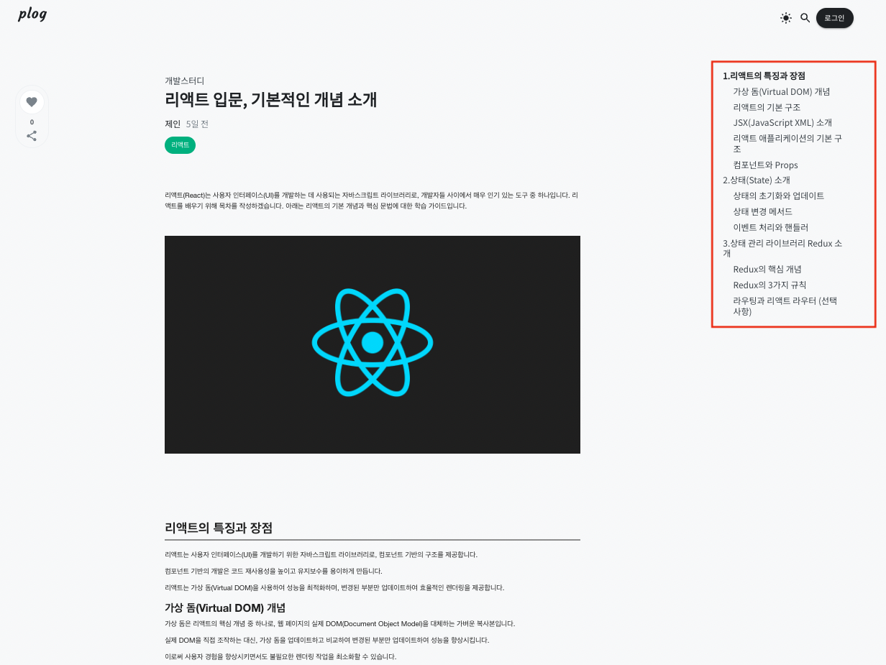
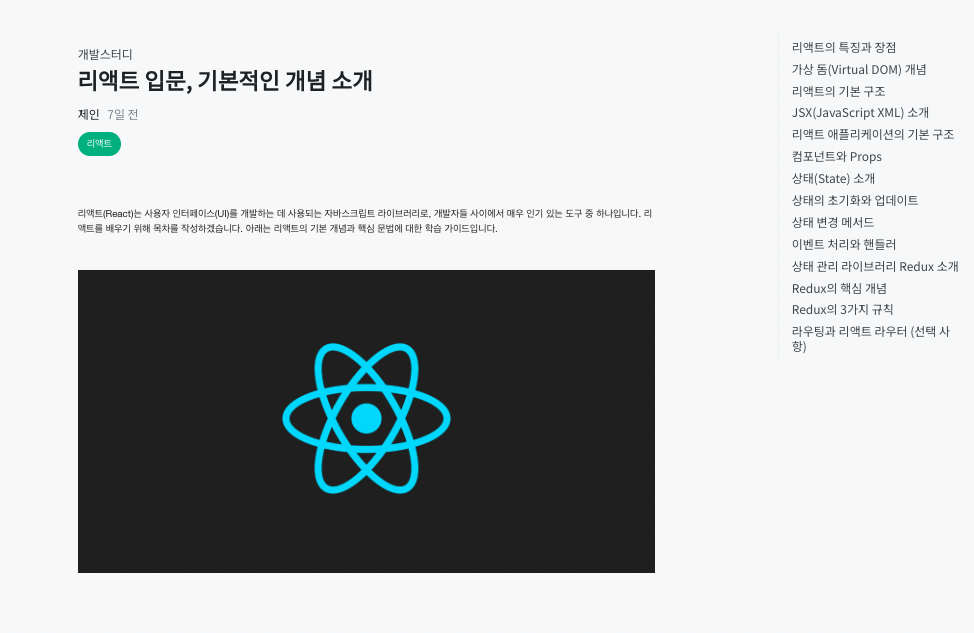
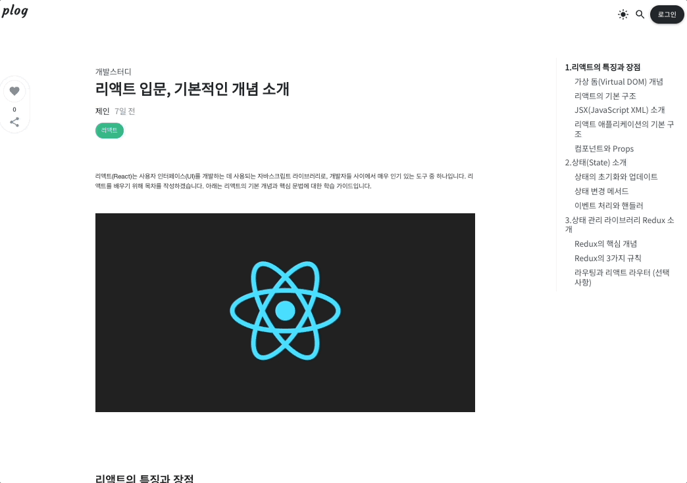

## TOC(테이블 오브 컨텐츠)

`TOC`는 문서나 글에서 섹션 및 장의 목차를 나타내는 기능으로 주로 긴 문서나 논문, 기술 문서, 블로그 글 등에서 사용합니다.
문서 내의 제목을 수집하여 목차를 자동으로 생성하며 문서의 구조를 사용자가 시각적으로 파악할 수 있도록 도와주는 기능힙니다. 

이 외에도 `하이퍼링크`를 제공하여 용자가 목차를 통해 특정 부분으로 이동할 수 있으며 문서 내에서 현재 위치를 알려주므로 사용자는 전체 내용을 스크롤하지 않고도 특정 섹션으로 이동할 수 있습니다.

#### Plog에서 구현한 TOC 화면

Plog 역시 `개발자들을 위한 블로그 서비스`라는 점에서 TOC 기능은 필수라고 생각하였습니다.


## TOC 기본 기능 정의 

TOC에서 구현할 사항은 다음과 같습니다.

- 사용자는 내가 본 섹션과 아직 못본 섹션을 `font-weight` 차이로 구별할 수 있습니다.
- 사용자가 목차의 제목을 클릭하면 그에 해당하는 내용으로 스크롤을 이동합니다.


저희 프로젝트에서는 Toast UI Editor를 이용하여 포스팅을 저장하고, 그 내용을 HTML 스트링 형태로 변환하여 DB에 저장하고 있습니다.
그리고 HTML 태그들 포스팅 업로드/수정 시점에 아래 코드를 통해 유니크한 id값을 랜덤으로 부여하고 있습니다. 
```js
import {v4 as uuidv4} from 'uuid';

export function htmlStringWithRandomID(htmlString: string): string {
    const parser = new DOMParser();
    const doc = parser.parseFromString(htmlString, 'text/html');
    const tags = ['div', 'p', 'h1', 'h2', 'h3', 'h4', 'h5', 'h6'];

    tags.forEach(tag => {
        const elements = doc.querySelectorAll(tag);
        
        elements.forEach(el => {
            // 요소에 ID 속성이 없으면 랜덤한 값을 생성하여 추가합니다.
            if (!el.id) {
                el.id = generateRandomID();
            }
        });
    });
    
    return new XMLSerializer().serializeToString(doc);
}

function generateRandomID(): string {
    return `id-${uuidv4()}`;
}
```

<br/>

## 어떻게 구현하였나?

#### 1. DB에 저장된 HTML 컨텐츠 조회

PostingDetail 컴포넌트에서 포스팅과 관련된 정보를 받아오고 있습니다. `get요청`을 통해 데이터를 조회하고 포스팅 내용에 해당하는
`post['htmlContent']`를 Toc컴포넌트의 props로 넘겨줍니다. 
```jsx
import React, {useEffect,useState} from "react";
import {useParams} from 'react-router-dom'
import {getPlogAxios} from "../../modules/axios";
import Toc from "../../components/blog/Toc";

export function PostingDetail() {
    
    const {blogID, postingID} = useParams();
    const [post, setPost] = useState(null);

    //포스팅 정보 조회
    useEffect(() => {
        getPlogAxios().get(`/blogs/${blogID}/postings/${postingID}`)
            .then(res => setPost(res.data))
            .catch(err => console.log(err.message))
    }, [])

    return (
        <>
            <div className='content-container' style={{flexGrow: '1'}}>
                //포스팅 디테일 관련 컴포넌트 생략
            </div>
            <Toc htmlString={post['htmlContent']}/>
        </>
    )
}
```

#### 2. H1~H3태그들을 추출하여 ToC 구조 생성

부모 컴포넌트에서 받아온 htmlString 값을 실제 접근가능한 Dom으로 만들기 위해 DOMParser를 사용했습니다.  
파싱된 html 태그들 중 `h1`, `h2`, `h3` 태그만 선택하여 tocList 배열에 하나씩 push 합니다.

tocList배열의 구조는 아래와 같습니다. 
- `text` : 태그의 컨텐츠로 목차에서 보여줄 제목입니다.
- `tag` : 태그의 종류 (h1~h3)를 의미하며 해당 태그로 목차의 구조를 시각화 합니다. 
- `id` : 태그 고유의 아이디로 해당 값을 통해 스크롤을 이동합니다.

```jsx
const Toc = ({htmlString}: {htmlString: string}) => {
    const parser = new DOMParser();
    const doc = parser.parseFromString(htmlString, "text/html");
    const headings = doc.querySelectorAll("h1, h2, h3");

    const tocList:Toc[] = []; //Toc 목록이 될 배열 선언

    headings.forEach(heading => {
        const text = heading.textContent; //목차의 제목
        const tag = heading.tagName // h1 h2 h3
        const id = heading.id //태그 고유 id
        tocList.push({ text, tag, id });
    });
    

    return (
        <div className='toc-container'>
            {tocList && tocList.map((toc, idx) => <div key={idx}>{ toc.text }</div>)}
        </div>
    )
};

export default Toc;
```
이렇게 원하는 제목만 추출된 모습을 아래 사진으로 확인할 수 있습니다.

이제 원하는 영역으로 이동하는 기능과, 현재 영역을 표시해주는 강조 기능만 추가하면 완성이 됩니다. 

#### 3. 목차 클릭 시 해당 내용으로 스크롤 이동

클릭 시 스크롤을 이동하는 것은 어렵지 않습니다. 각 제목 요소마다 click 이벤트를 부여하면 됩니다. 
```jsx
const Toc = ({htmlString}: {htmlString: string}) => {
    //코드 생략
    return (
        <div className='toc-container'>
            {tocList && tocList.map((toc, idx) => 
                <div key={idx}
                     onClick={()=> scrollToEl(headings, toc.tag, idx)}>
                    { toc.text }
                </div>)}
        </div>
    )
};

export default Toc;
```


`scrollToEl`이라는 이벤트 함수는 headings 전체와 태그의 종류, 그리고 순서를 파라미터로 받고있습니다.  
해당 함수는 아래처럼 구현하였습니다. 

```js
const scrollToEl = (headings:NodeListOf<Element>, tag:string, idx:number) => {
    const tagList = document.getElementsByTagName(tag);

    for(let i = 0; i < tagList.length; i++){
        if(tagList[i].textContent === headings[idx].textContent){
            tagList[i].scrollIntoView(true);
        }
    }
};
```

headings와 tagList 배열을 비교하여 같은 내용을 가지고 있다면 그 태그, 즉 클릭한 태그로 스크롤을 이동합니다. 
  
> element.scrollIntoView()를 사용하면 element를 기준으로 스크롤이 이동됩니다.  
기본적으로 `true`일 때는  상단을 기준으로 스크롤되며 `false`일 때는 하단을 기준으로 스크롤됩니다.  
> 더 많은 옵션이 궁금하기면 [여기](https://developer.mozilla.org/en-US/docs/Web/API/Element/scrollIntoView) 문서를 참고 부탁드립니다. 
 
#### 4. 스크롤 위치에 따라 목차 강조 표시 

문서의 뷰포트 위치를 기준으로 내가 어떤 챕터를 보고 있는지를 알아내야합니다.  

Plog에서는 
- 이미 저장된 상태값을 이용하기 떄문에 서버와 지속적인 소통이 없다는 점
- 감시해야할 대상이 많지 않은 점
- 라이브러리를 이용하는 것보다 직접 구현하고 싶었던 점

을 근거로 Intersection Observer API가 아닌 `스크롤 이벤트`를 통해 구현하기로 했습니다. 


##### 4.1 스크롤 이벤트 생성 및 등록

```js
 useEffect(() => {
        const handleScroll = () => {
            const position = window.scrollY;
            setScrollPosition(position);
        };

        window.addEventListener('scroll', handleScroll);

        return () => {
            window.removeEventListener('scroll', handleScroll);
        };
    }, []);
```
`handleScroll`이라는 함수는 포스팅 페이지에 진입하자마자 등록되어 나의 위치를 감지할 수 있도록 하고, 페이지를 벗어나면 이벤트를 삭제하여 위치 변화를 감지하지 않도록 하였습니다. 

3번의 `scrollToEl`함수와 `handleScroll`함수는 하나의 hooks로 묶어 다음과 같은 파일로 분리하였습니다.
```ts
import { useState, useEffect } from 'react';

export default function useScrollPosition() {
    const [ scrollPosition, setScrollPosition ] = useState<number>(0);

    useEffect(() => {
        const handleScroll = () => {
            const position = window.scrollY;
            setScrollPosition(position);
        };

        window.addEventListener('scroll', handleScroll);

        return () => {
            window.removeEventListener('scroll', handleScroll);
        };
    }, []);

    const scrollToEl = (headings:NodeListOf<Element>, tag:string, idx:number) => {
        const tagList = document.getElementsByTagName(tag);

        for(let i = 0; i < tagList.length; i++){
            if(tagList[i].textContent === headings[idx].textContent){
                tagList[i].scrollIntoView(true);
            }
        }
    };

    return { scrollPosition, scrollToEl };
}
```


##### 4.2 위치 값에 따라 화면에 위치한 heading id값 구하기
`activeItemId`: TOC 목록 중 강조 표시할 태그를 찾기 위한 함수입니다.  
`targetOffsets`: 추출한 h1~h3 태그들의 offsetTop 값을 구하기 위한 배열입니다.  
`lastIndex`: targetOffsets 에서 현재 위치보다 큰 index 찾습니다.  
`반환값`: 태그의 id값(string)을 반환합니다. 
```tsx
import {useMemo} from "react";
import useScrollPosition from '../../hooks/useScrollPosition'

const Toc = ({htmlString}: {htmlString: string}) => {
    const {scrollPosition, scrollToEl} = useScrollPosition();
    
    const activeItemId = useMemo(() => {
        //각 헤더의 offsetTop 값을 배열로 저장합니다.
        const targetOffsets = tocList.map((item, idx) => {
            const tagList = document.getElementById(item.id);
            return tagList?.offsetTop ?? Infinity;
        });

        const lastIndex = targetOffsets.findIndex((offset) => offset >= scrollPosition);

       if (lastIndex === -1) {
            return tocList[tocList.length - 1]?.id ?? tocList[0]?.id;
        }else {
            return tocList[lastIndex]?.id ?? tocList[0]?.id;
        }
    }, [scrollPosition, tocList]);

    return (
        <div className='toc-container'>
            {tocList && 
                tocList.map((toc, idx) => 
                    <div key={idx} 
                         className={`${activeItemId === toc.id && !!activeItemId ? 'active' :''} title-${toc.tag}`}
                         onClick={()=> scrollToEl(headings, toc.tag, idx)}>
                        { toc.text }
                    </div>
                )}
            </div>
    )
};

export default Toc;
```

activeItemId에서 반환된 id와 toc의 id값을 비교하여 스타일링을 적용합니다. 


#### 5. 완성


만약 스타일링 코드가 궁금하다면 아래 버튼을 클릭하여 확인할 수 있습니다.  
<details>
<summary>Toc.css</summary>
<div>

```css
.sticky {
    position: sticky;
    top: 8rem;
}

.toc-container {
    width: 240px;
    margin-left: 5rem;
    border-left: 2px solid #F1F3F5;
    padding: 0.25rem 0.75rem;
    max-height: calc(100vh - 128px);
    overflow: hidden auto;
}

.toc-container div {
    padding: 5px;
    color: #868E96;
    line-height: 1.2;
    font-size: 1rem;
}

.toc-container div:hover {
    color: #222;
    cursor: pointer;
}

.toc-container div.active {
    color: #000;
    font-weight: bold;
}

.toc-container div.title-H1 {
    counter-increment: toc-counter;
}

.toc-container div.title-H1::before {
    content: counter(toc-counter) ".";
}

.toc-container div.title-H2 {
    padding-left: 12px;
}

.toc-container div.title-H3 {
    padding-left: 24px;
}


@media (max-width: 1215px) {
    .sticky {
        display: none;
    }
}
```

</div>
</details>