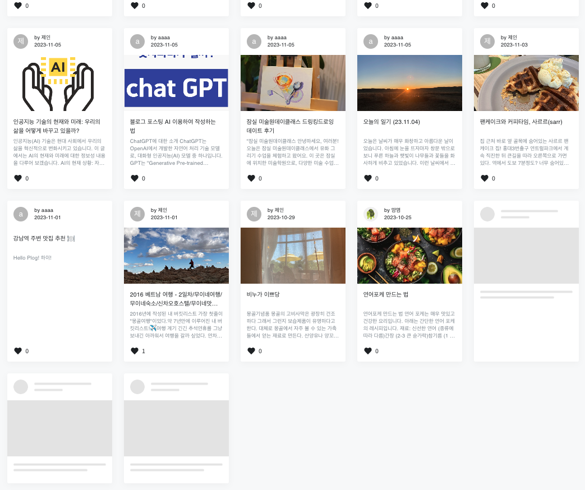

`UI`는 User Interface로, 눈에 보이는 '디자인'적인 요소의 총칭입니다. 즉, 사용자가 서비스를 사용할 때 마주하는 디자인 (ex. 폰트, 컬러, 레이아웃, 간격, 애니메이션 효과 등)을 의미합니다.
`UX`는 User Experience으로, UI의 디자인적 요소들을 바탕으로 만들어진 서비스를 사용하는 사용자가 겪는 경험과 감정 등을 의미합니다. 서비스를 사용하는 유저가 편리하도록 UI를 디자인해하여, 더 나은 사용자 경험을 제공하는 것이 목적입니다.

## 이 글을 쓰게 된 이유

물론 개발자는 코딩을 (잘)해야 하는 직업이지만 서비스를 만들어 제공하는 역할이기도 합니다. 서비스는 사용자가 쉽고 편안하게 사용할 수 있어야 규모가 커질 수 있고, 시장에서 살아남을 수 있습니다.
사용성이 떨어지는 프로덕트라면, 개발자를 포함한 프로덕트를 개발하는 모든 사람들은 성능 최적화 작업 및 사용성 개선 작업을 다시 해야할 것입니다. 
그래야 지속적으로 우리 프로덕트를 찾는 새로운 사용자가 늘고, 기존 사용자의 리텐션까지 방어할 수 있기 떄문입니다.

Plog 프로젝트는 백엔드 개발자 2명, 프론트엔드 개발자 1명 이렇게 총 3명이서 개발을 진행했습니다. 따라서 직무가 정해진 회사와 달리 한사람이 여러개의 역할을 수행해야 하는 환경이었습니다. 
저는 자연스럽게 제게 익숙하고 관심있는 디자인을 겸하게 되었습니다. (물론 이 디자인에는 UI와 UX가 함께 내포되어 있습니다.)

이름부터 프론트엔드인 만큼,사용자와 가장 가까이 있는 개발자입니다. 그래서 더욱 사용자 관점에서 생각하는 것이 필요합니다.  

프로젝트를 진행함에 있어 개인적으로 초기에 가장 신경썼던 부분은 서비스의 `컨셉`과 사용자 `행동 flow`를 고려하는 것이었습니다.
구현해야할 기능과 범위는 정리가 되었으나 화면으로 어떻게, 예쁘고 깔끔하게 구현할 수 있는지에 많은 시간을 쏟았습니다. 비슷한 사이트를 조사하고, 레퍼런스 이미지를 찾고 나름의 BI도 구축해보려고 노력했습니다.

서비스를 만들기 위한 설계도를 그리는 것과, 서비스를 만들면서 작아서 눈에 띄지 않지만 그 이미지, 아이콘, 컬러를 선택하기까지 고민했던 시간들에 대해
여정이 끝나가는 지금 증거를 남겨놓기 위해 문서를 작성하였습니다. 

 

## 간단하게 알아보는  Plog로 알아보는 UX심리학

### Plog 헤더 톺아보기

Plog의 헤더의 구성요소는 로고, 다크모드 설정, 검색화면, 로그인버튼으로 이루어져있습니다. 자세한 설명이 없어도 태양 아이콘으로 지금 `라이트모드` 상태이고 해당 버튼으로 테마의 전환이 가능하다는 것, 돋보기 아이콘을 클릭하면 무언가를 검색할 수 있다는 것을 알 수 있습니다.
당연히 로그인 버튼은 로그인을 할 때 클릭하면 된다는 것도 사용자는 쉽게 알 수 있습니다. 

이렇게 사용자가 알 수 있는 이유는 이런 구조로 되어 있는 사이트가 일반적이고, 과거에 이러한 아이콘을 자주 보았기 때문일 것입니다. 

**제이콥의 법칙**  

사용자는 새로운 경험을 이해하기 위해 기존 경험을 활용한다는 관점입니다. 즉, 새로운 웹사이트나 서비스를 이용하더라도 기존에 이용했던 경험을 기반으로 UI를 이해한다는 원리입니다.
통상적으로 사용하는 아이콘, 일반적인 위치에 있는 메뉴들이 그 예시입니다.  

사용자에게 익숙한 경험을 제공한다면 사용자는 우리 시스템에 더욱 집중할 수 있을 것이고, 반대로 특이한 관습을 적용하면 사용자는 불만과 혼란을 느껴 작업을 포기하고 떠날 확률이 커집니다.

### Plog 회원가입 스테퍼

회원가입 시 계정정보를 비롯하여 블로그 개설을 위한 많은 양의 정보를 사용자에게 입력받아야 헀습니다.   
이 정보들을 한 폐이지에서 입력받는 것으로 처리하게 되면 회원가입 버튼까지의 거리가 너무 멀었으며 사용자가 임의의 순서로 정보를 입력하게 되면 저희가 예상하는 동작을 할 수 없었습니다.
따라서 3단계로 구분하여 사용자의 동작 순서를 유도하고 스크롤을 하지 않더라도 비슷한 구역에서 클릭할 수 있도록 하였습니다. 

**피츠의 법칙**  

버튼이나 링크와 같은 대상의 크기와 위치가 사용자의 작업 효율성에 어떻게 영향을 미치는지를 설명하는 법칙입니다.   

움직임이 더 멀리 이동하거나, 대상의 크기가 더 작을수록 작업에 소요되는 시간이 증가합니다. 즉, 대상의 크기가 커질수록 거리의 영향이 상대적으로 작아진다는 것을 의미합니다.따라서 서비스는 사용자가 자주 클릭하거나 사용하는 요소들을 충분한 크기로 제공하고, 사용자의 자연스러운 움직임을 고려하여 인터페이스를 설계해야합니다.

**'피츠의 법칙' 또 다른 예) Plog 메인 포스팅 선택**

Plog 메인 페이지에서는 포스팅 간 충분한 간격을 확보하여 타겟이 아닌 포스팅을 클릭하지 않게 하였습니다. 
> 구글 머테리얼 디자인 가이드라인에서는 “대상이 서로 너무 가까워서 발생하는 입력 오류를 줄이는 방법에 대해 터치 대상 간의 거리를 최소 8dp이상 확보해서 정보 밀도와 사용성을 적정 수준으로 유지하라” 라고 권고한다.

### 스켈레톤 스크린

Plog 메인 페이지에서는 포스팅을 로드할 때 포스팅 카드 형태와 동일한 스켈레톤 UI를 보여주고 있습니다. 이렇게 뼈대 화면을 보여주는 것만으로도 사용자는 앞으로 로딩될 콘텐츠 형태가 무엇인지 예상할 수 있습니다. 
또한 사용자는 무언가 동작하고 있는 중임을 인지할 수 있기 때문에 속도가 조금 느려도 견디는 시간이 늘어나며, 실제 로딩 속도보다 사용자는 좀 더 빠르게 로딩되었다고 느낄 수 있습니다.

지금은 정보의 양이 많지않아 로딩속도가 빠른 편이나, 포스팅 갯수가 늘어나게 되면 사용자가 답답하게 느낄 것을 고려하여 스켈레톤 UI를 도입하였습니다. 

**도허티 임계**  

사용자의 작업 효율과 관련된 개념으로, 사용자가 컴퓨터 시스템과 상호 작용할 때 작업 속도와 오류율 간의 관계를 나타냅니다. 0.4초를 초과하면 사용자의 주의가 분산되기 시작하므로 시스템의 피드백 시간은 0.4초 미만을 추천합니다. 

- 시스템이 사용자의 입력에 너무 느리게 반응하면 사용자의 작업 효율이 저하되고, 사용자 경험이 나빠집니다.
- 반대로 사용자가 익숙하지 않은 환경에서 예상치 못한 빠른 반응 역시 실수를 야기할 수 있습니다.

### Plog의 탈퇴 버튼 컬러

Plog에서는 전체적으로 그린계열인 `#12b886`가 메인 포인트 컬러이며 부정적인 경고나 주의가 필요한 색은 레드계열의 `#ff5b5b`를 사용하고 있습니다. Plog의 마이페이지에서도 탈퇴 버튼을 제외한 나머지 버튼은 포인트 컬러로 이루어져있습니다. 
탈퇴 버튼만 사용자에게 알려주기 위해 눈에 띄고 위험해 보이는 `#ff5b5b` 컬러를 사용하였습니다. 

**폰 레스토프 효과**  
사용자는 비슷한 사물 여러 개가 있을 때, 차이가 뚜렷한 하나의 사물만 기억한다는 법칙입니다.

인간은 패턴 처리 능력이나 다른 사물들 간의 차이를 인지하는 시각 인지 능력을 갖고 있습니다. 그런데 디지털 인터페이스를 접할 때는 시각적으로 대비되는 요소에 더 쉽게 주의를 빼앗긴다고 합니다.
이 현상이 일어나기 위해서는 일관성 있는 정보 중에 특이한 정보를 넣어야합니다. 비슷한 버튼 컬러를 유지하고 있다가 강조가 필요한 부분에만 특정 컬러를 다르게 하는 것이 그 예입니다.
